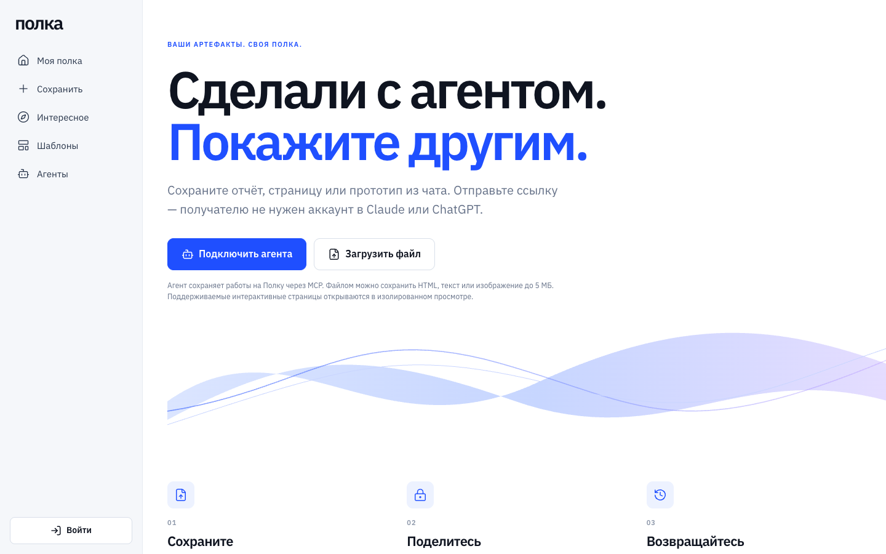
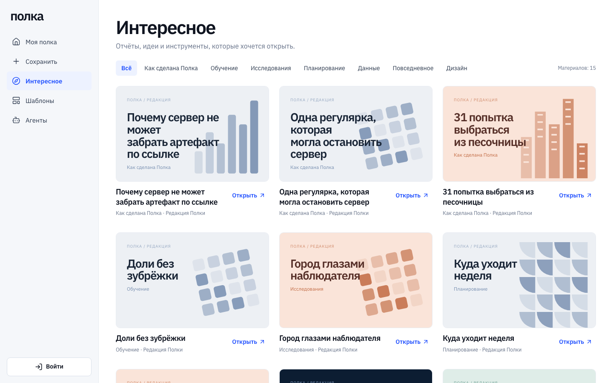
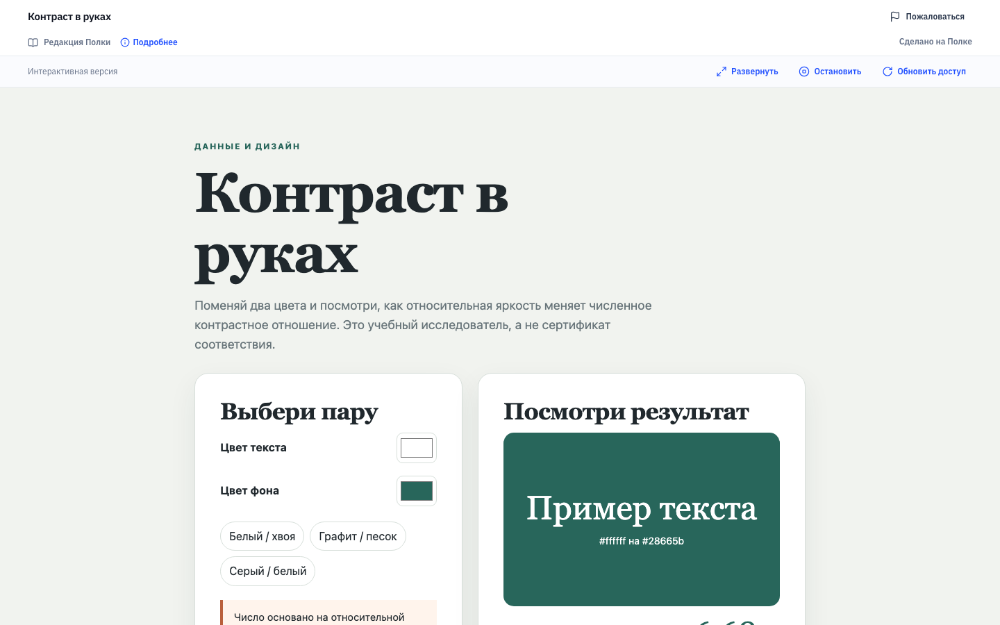

# Полка

**Сделали с агентом — покажите другим.**

[English](README_EN.md) · [Демо: polochka.app](https://polochka.app) · [Интересное](https://polochka.app/discover) · [Документация](docs/README.md)

Полка хранит отчёты, страницы, прототипы и другие артефакты, которые вы сделали с Claude, ChatGPT, Claude Code или Codex, вне истории чата. У каждой работы есть версии и понятная ссылка. Получателю не нужен аккаунт в Claude или ChatGPT, а ссылку можно отозвать в любой момент.

- **Агент кладёт результат сам.** В Claude.ai и ChatGPT Полка подключается как коннектор: вы пишете «сохрани на Полку» и получаете ссылку в ответе (с Claude.ai проверено вручную, с ChatGPT — ещё нет, см. [состояние](docs/status.md)). Claude Code и Codex подключаются одной командой, без токена; другие MCP-клиенты — по токену, скрипты и CI — через HTTP API.
- **Интерактивные страницы работают у получателя.** React/JSX-артефакты из чата собираются в одну самодостаточную страницу: библиотеки встроены, сети нет. Страница открывается в песочнице на отдельном домене (`polochka.page`).
- **Точные версии.** Каждое сохранение неизменяемо и имеет SHA-256. Ссылка показывает ту версию, которую вы опубликовали, а не последний черновик.
- **Ссылки с отзывом.** Можно выбрать срок действия ссылки (1, 7 или 30 дней), отозвать её, получить жалобу от получателя. Приватные работы не попадают в каталог и поисковые индексы.
- **Полка и шаблоны.** Есть папки, поиск, корзина и восстановление, а также библиотеки шаблонов для команды: роли, приглашения, журнал. Агент читает шаблон нужной версии и делает по нему новую работу.

| Главная | Интересное | Материал по ссылке |
|---|---|---|
|  |  |  |

> **Статус: prerelease.** Последний тег — `v0.1.0-rc.4`, изменения после него перечислены в [CHANGELOG](CHANGELOG.md). Hosted-пилот работает на https://polochka.app, аккаунты выдаёт оператор. API, схема БД и интерфейс ещё могут меняться. Что сделано и что нет: [docs/status.md](docs/status.md).

## Четыре способа сохранить работу

| Откуда | Как | Подробно |
|---|---|---|
| Claude.ai, ChatGPT | Коннектор `https://polochka.app/mcp` со входом через OAuth 2.1. Модель вызывает `polka_publish` и возвращает ссылку | [Коннектор](docs/MCP_CONNECTOR.md) |
| Claude Code, Codex | Одна команда (`codex mcp add polka --url https://polochka.app/mcp`), вход и «Разрешить» в браузере — без токена | [Подключение агентов](docs/connect-agents.md) |
| Другие MCP-клиенты | Токен со страницы «Агенты», Streamable HTTP на `/mcp` | [Подключение агентов](docs/connect-agents.md) |
| Скрипты, CI, внутренние агенты | `POST /api/v1/publish` или CLI `scripts/polka-publish.mjs` без зависимостей | [HTTP API](docs/PUBLISH_API.md) |
| Вручную | Загрузка файла (HTML, текст, PNG/JPEG/WebP до 5 МБ) или «Вставить код» на странице «Сохранить» | [FAQ](docs/faq.md) |

Ссылку на артефакт Claude или ChatGPT вставить нельзя: сервер не может забрать его сам, и Полка объясняет почему ([FAQ](docs/faq.md#почему-нельзя-вставить-ссылку-на-артефакт-claude-или-chatgpt)).

## Быстрый запуск

Нужны Node.js ≥ 22.16, npm и запущенный Docker.

```bash
git clone https://github.com/artkruglov/polka.git && cd polka
npm ci
npm run local:setup              # .env с уникальными локальными секретами
npm run infra:up                 # PostgreSQL 16 + MinIO, только 127.0.0.1
npm run db:migrate
npm run storage:bootstrap-local  # versioned bucket и проверка его возможностей
npm run account:create -- demo --generate   # логин и пароль в .local/demo-account.txt
npm run build
npm run dev                      # http://127.0.0.1:4390
```

Интерактивный просмотр, вход по коду и отдельные наборы тестов описаны в [docs/local-development.md](docs/local-development.md).

## Проверки

```bash
npm run check          # слои frontend + TypeScript
npm run build
npm test               # временные БД и bucket, после прогона удаляются
npm test -- --live     # наборы с включённым локальным viewer
```

## Ограничения

- **Страница до 5 МБ, без сети.** Всё нужное должно быть внутри одного HTML или пакета: стили, картинки и шрифты в `data:`. Внешние скрипты, `fetch` и формы у получателя не работают.
- **Интерактивный режим требует отдельного домена для viewer.** Без него (`HTML_LIVE_MODE=disabled`) получатель видит статичную страницу без скриптов.
- **Ссылки Claude/ChatGPT не импортируются.** Нужно сохранить работу через коннектор, скачать файл или вставить код.
- **Скачанные копии нельзя отозвать.** Отзыв закрывает ссылку, но не удаляет то, что получатель уже скачал.
- **Аккаунты выдаёт оператор.** Вход по паролю. Вход по почте работает только при настроенном SMTP. SSO/SCIM нет.
- **Импорт по URL** (`URL_IMPORT_ENABLED`) и **удаление аккаунта** (`ACCOUNT_DELETION_ENABLED`) по умолчанию выключены.

Подробнее: [docs/faq.md](docs/faq.md).

## Своя установка

Поставка состоит из одного Docker-образа и внешних PostgreSQL и versioned S3. Образ собирается из исходников (`docker build`), опубликованного образа пока нет. Интерактивный viewer должен работать на отдельном registrable domain. Рекомендуемый путь — [deploy/hosted/README.md](deploy/hosted/README.md) (одна VM с Caddy, как на polochka.app). [deploy/BASE.md](deploy/BASE.md), [deploy/RESTORE.md](deploy/RESTORE.md) и [deploy/VIEWER_STAGING.md](deploy/VIEWER_STAGING.md) — черновики для опытных операторов. Как устроена система: [docs/architecture.md](docs/architecture.md).

## Документация

[Карта документов](docs/README.md) · [Архитектура](docs/architecture.md) · [Подключение агентов](docs/connect-agents.md) · [FAQ](docs/faq.md) · [Состояние](docs/status.md) · [Дорожная карта](docs/roadmap.md) · [Изменения](CHANGELOG.md)

## Участие и безопасность

См. [CONTRIBUTING.md](CONTRIBUTING.md) и [CODE_OF_CONDUCT.md](CODE_OF_CONDUCT.md). Об уязвимостях сообщайте приватно по инструкции из [SECURITY.md](SECURITY.md).

## Лицензия

[Apache-2.0](LICENSE), см. также [NOTICE](NOTICE) и [THIRD_PARTY_NOTICES.md](THIRD_PARTY_NOTICES.md). Проект вырос из опыта [Lanka](https://github.com/artkruglov/lanka), подробнее в [ACKNOWLEDGEMENTS.md](ACKNOWLEDGEMENTS.md).
