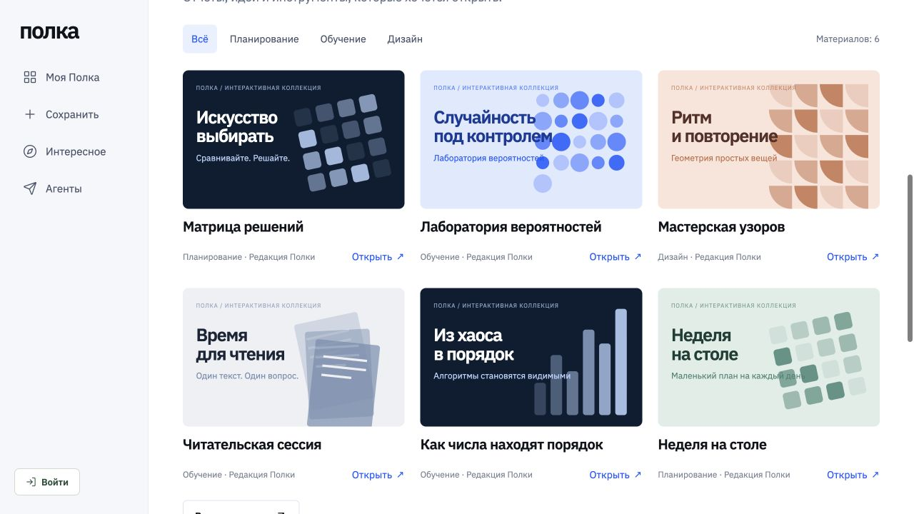
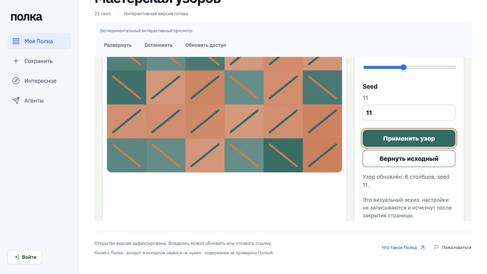
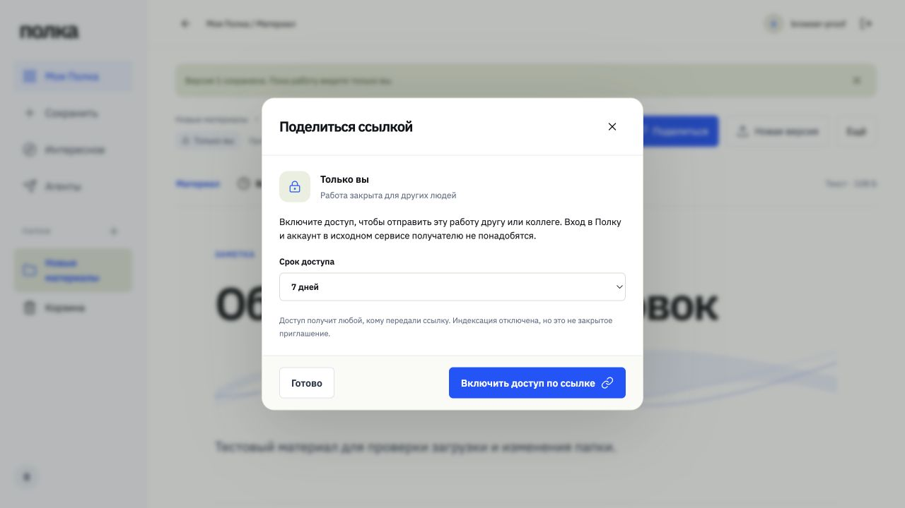
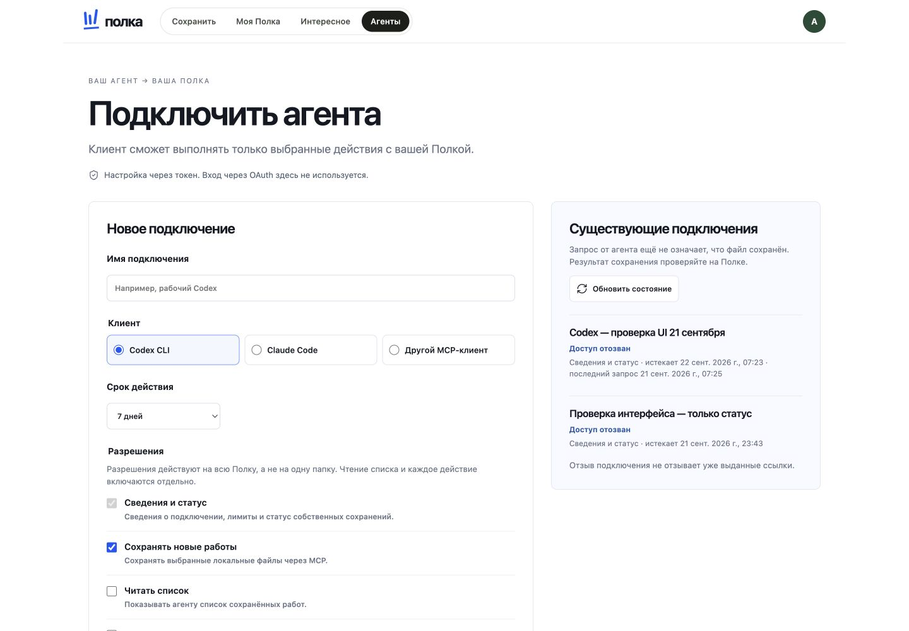

# Полка

**Сделали с агентом — покажите другим.**

Полка хранит отчёты, страницы и другие артефакты, созданные ИИ-агентами (Claude Code, Codex и др.), вне истории чата. Материал получает версии и понятную ссылку. Получателю не нужен аккаунт в Claude или ChatGPT, а доступ можно в любой момент отозвать.

- **Агент кладёт результат сам.** Через MCP агент сохраняет файлы, создаёт новые версии и включает ссылку. Загрузка файла вручную остаётся запасным путём.
- **Точные версии.** Каждое сохранение неизменяемо, у каждого есть SHA-256. Ссылка показывает ту версию, которую вы опубликовали, а не последний черновик.
- **Отзываемые ссылки.** Можно задать срок действия, отозвать ссылку и получить жалобу получателя. Приватные материалы не попадают в каталог и индексы.
- **Шаблоны для команды.** В библиотеке роли reader/curator/admin, приглашения и журнал. Агент читает шаблон нужной версии и делает по нему новую работу.
- **Интерактивный HTML** (экспериментально) открывается на отдельном origin в песочнице.

> **Статус: prerelease `0.1.0-rc.1`.** Всё перечисленное проверено локально и автотестами. Облачная версия ещё не запущена. Ограничения перечислены [ниже](#ограничения).

| Каталог | Интерактивный просмотр |
|---|---|
|  |  |
| **Ссылка с отзывом** | **Подключение агента** |
|  |  |

## Быстрый запуск

Нужны Node.js ≥ 22.16, npm и Docker.

```bash
git clone https://github.com/artkruglov/polka.git && cd polka
npm ci
npm run local:setup            # .env с уникальными локальными секретами
npm run infra:up               # PostgreSQL 16 + MinIO (только 127.0.0.1)
npm run db:migrate
npm run storage:bootstrap-local
npm run account:create -- demo --generate
npm run build
npm run dev                    # http://127.0.0.1:4390
```

Подробности, вход по коду и интерактивный режим описаны в [docs/LOCAL_DEVELOPMENT.md](docs/LOCAL_DEVELOPMENT.md).

## Подключить агента (MCP)

В разделе **Агенты** выберите клиент и разрешения и получите токен. MCP-endpoint работает через Streamable HTTP по адресу `<APP_ORIGIN>/mcp`, авторизация — bearer-токен с ограниченными scope.

```bash
# Codex CLI (пример; точную команду показывает мастер в интерфейсе)
codex mcp add polka --url http://127.0.0.1:4390/mcp --bearer-token-env-var POLKA_MCP_TOKEN
```

Инструменты: `polka_context`, `polka_capture`, `polka_status`, `polka_revise`, `polka_share`, `polka_revoke_share`, `polka_list`, `polka_list_templates`, `polka_read_source` и другие. Проверено с Codex CLI. Другие клиенты — по [матрице](docs/MCP_ONBOARDING_SPEC.md). OAuth пока не поддержан.

## Проверки

```bash
npm run check   # слои frontend + TypeScript
npm run build
npm test        # 240+ интеграционных тестов в отдельной временной БД и bucket
```

## Ограничения

- **Облачной версии пока нет.** Выкладка на отдельные домены app/viewer, SMTP, резервное копирование и мониторинг ещё не приняты. См. [docs/LAUNCH.md](docs/LAUNCH.md).
- **Интерактивный HTML экспериментальный.** Скрипты работают в песочнице на отдельном origin, но страница может перейти по внешней ссылке внутри своего фрейма. Не используйте этот режим для конфиденциальных данных.
- **Импорт по ссылке** (`URL_IMPORT_ENABLED`) выключен по умолчанию и работает только для standalone HTML. Импорт чатов Claude/ChatGPT не поддерживается.
- **Скачанные копии нельзя отозвать.** Приглашения в библиотеку пересылаются вручную. SSO/SCIM нет.
- **Удаление аккаунта** — экспериментальная функция, работает только на loopback.

Полный список — [docs/STATUS.md](docs/STATUS.md).

## Self-host

Базовая поставка: один Docker-образ, закреплённый по digest, и внешние PostgreSQL и versioned S3. В составе миграции, проверка хранилища, приложение и maintenance-воркер — см. [deploy/BASE.md](deploy/BASE.md) и [docs/SELF_HOST_BASE_SPEC.md](docs/SELF_HOST_BASE_SPEC.md). За reverse proxy задайте `TRUST_PROXY`, иначе лимиты попыток входа будут общими для всех клиентов. Восстановление из резервной копии описано в [deploy/RESTORE.md](deploy/RESTORE.md).

## Документация

[Продукт](docs/PRODUCT.md) · [Архитектура](docs/ARCHITECTURE.md) · [Состояние](docs/STATUS.md) · [Дорожная карта](docs/ROADMAP.md) · [Карта документов](docs/README.md)

## Участие и безопасность

См. [CONTRIBUTING.md](CONTRIBUTING.md). Об уязвимостях сообщайте приватно по инструкции из [SECURITY.md](SECURITY.md).

Проект вырос из опыта [Lanka](https://github.com/artkruglov/lanka) — [благодарности](ACKNOWLEDGEMENTS.md). Лицензия [Apache-2.0](LICENSE). Шрифт IBM Plex Sans распространяется по [OFL](apps/web/public/fonts/OFL-IBMPlexSans.txt).
