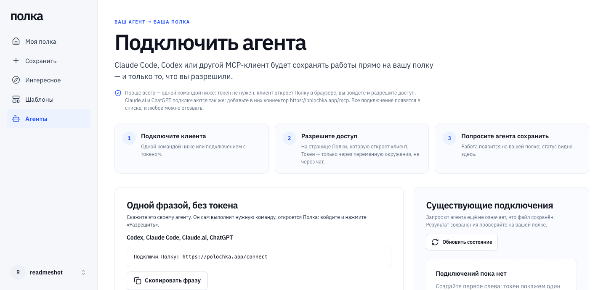
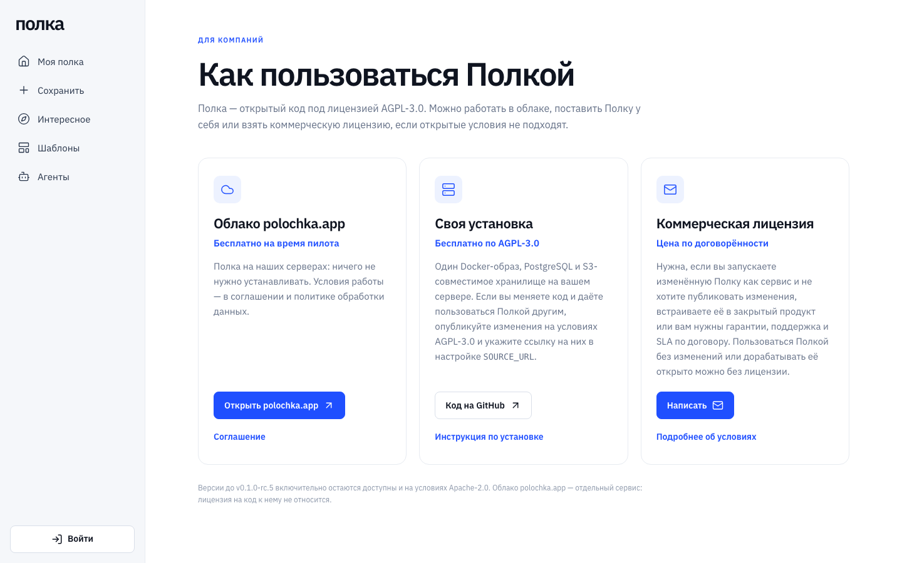
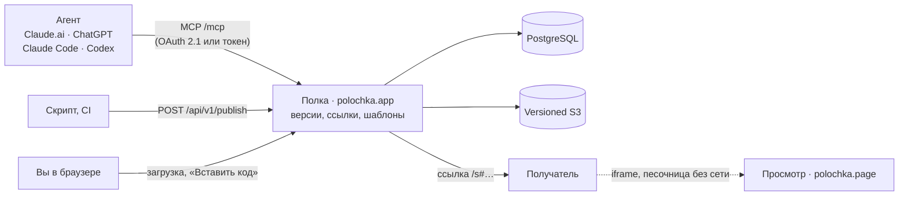

<p align="center">
  <a href="https://polochka.app">
    <picture>
      <source media="(prefers-color-scheme: dark)" srcset="docs/assets/logo-dark.svg">
      
    </picture>
  </a>
</p>

<h3 align="center">Сделали с агентом — покажите другим.</h3>

<p align="center">
  Полка хранит отчёты, страницы и прототипы, сделанные с Claude, ChatGPT, Claude&nbsp;Code или Codex,<br>
  и открывает их по ссылке: получателю не нужен аккаунт в Claude или ChatGPT.
</p>

<p align="center">
  <a href="https://polochka.app"><b>polochka.app</b></a> ·
  <a href="https://polochka.app/discover">Интересное</a> ·
  <a href="docs/README.md">Документация</a> ·
  <a href="https://polochka.app/enterprise">Для компаний</a> ·
  <a href="README_EN.md">English</a>
</p>

<p align="center">
  <a href="LICENSE"></a>
  <a href="COMMERCIAL.md"></a>
  <a href="https://github.com/artkruglov/polka/tags"></a>
  <a href="docs/status.md"></a>
  <a href="docs/connect-agents.md"></a>
  <a href="https://polochka.app/llms.txt"></a>
</p>

<p align="center">
  <a href="https://polochka.app"></a>
</p>

## Попробовать за минуту

Скажите своему агенту — Codex, Claude Code, Claude.ai или ChatGPT:

```text
Подключи Полку: https://polochka.app/connect
```

Агент сам выполнит одну команду, откроется Полка: войдите или создайте полку по почте и нажмите «Разрешить». Дальше просто просите агента сохранить работу на Полку — в ответе будет ссылка.

## Что умеет

<table>
  <tr>
    <td width="33%" valign="top">
      <h4>Агент кладёт результат сам</h4>
      В Claude.ai и ChatGPT Полка — коннектор: «сохрани на Полку», и ссылка в ответе. Claude Code и Codex подключаются одной командой без токена, другие MCP-клиенты — по токену, скрипты и CI — через HTTP API.
    </td>
    <td width="33%" valign="top">
      <h4>Интерактив у получателя</h4>
      React/JSX-артефакты из чата собираются в одну самодостаточную страницу: библиотеки встроены, сети нет. Страница открывается в песочнице на отдельном домене <code>polochka.page</code>.
    </td>
    <td width="33%" valign="top">
      <h4>Точные версии</h4>
      Каждое сохранение неизменяемо и имеет SHA-256. Ссылка показывает ту версию, которую вы опубликовали, а не последний черновик.
    </td>
  </tr>
  <tr>
    <td valign="top">
      <h4>Ссылки с отзывом</h4>
      Срок 1, 7 или 30 дней, отзыв в любой момент, жалоба от получателя. Приватные работы не попадают в каталог и поисковые индексы.
    </td>
    <td valign="top">
      <h4>Полка и шаблоны</h4>
      Папки, поиск, корзина и восстановление. Библиотеки шаблонов для команды: роли, приглашения, журнал. Агент читает шаблон нужной версии и делает по нему новую работу.
    </td>
    <td valign="top">
      <h4>Данные в России</h4>
      polochka.app работает в Yandex Cloud: база, файлы, резервные копии и письма хранятся и обрабатываются в России (<a href="docs/legal/privacy.md">политика</a>). Или поставьте Полку у себя.
    </td>
  </tr>
</table>

## Как это выглядит

<table>
  <tr>
    <td width="50%"><a href="https://polochka.app/discover"></a><br><sub><b>Получатель ссылки.</b> Интерактивная страница работает в песочнице, без аккаунта.</sub></td>
    <td width="50%"><br><sub><b>Агенты.</b> Одна фраза или одна команда; все подключения видны и отзываются.</sub></td>
  </tr>
  <tr>
    <td><a href="https://polochka.app/discover"></a><br><sub><b>Интересное.</b> Интерактивные материалы Редакции Полки.</sub></td>
    <td><a href="https://polochka.app/pricing"></a><br><sub><b>Для компаний.</b> Облако, своя установка или коммерческая лицензия.</sub></td>
  </tr>
</table>

## Как это работает



Агент передаёт код работы сам — Полка ничего не забирает из чата. Каждое сохранение становится неизменяемой версией; ссылка привязана к версии. Чужой HTML считается враждебным: интерактивная страница открывается на отдельном домене, без cookies, API Полки и сети. Подробно: [архитектура](docs/architecture.md), [модель угроз](SECURITY.md#модель-угроз-вкратце).

## Четыре способа сохранить работу

| Откуда | Как | Подробно |
|---|---|---|
| Claude.ai, ChatGPT | Коннектор `https://polochka.app/mcp` со входом через OAuth 2.1. Модель вызывает `polka_publish` и возвращает ссылку | [Коннектор](docs/MCP_CONNECTOR.md) |
| Claude Code, Codex | Одна команда (`codex mcp add polka --url https://polochka.app/mcp`), вход и «Разрешить» в браузере — без токена | [Подключение агентов](docs/connect-agents.md) |
| Другие MCP-клиенты | Токен со страницы «Агенты», Streamable HTTP на `/mcp` | [Подключение агентов](docs/connect-agents.md) |
| Скрипты, CI, внутренние агенты | `POST /api/v1/publish` или CLI `scripts/polka-publish.mjs` без зависимостей | [HTTP API](docs/PUBLISH_API.md) |
| Вручную | Загрузка файла (HTML, текст, PNG/JPEG/WebP до 5 МБ) или «Вставить код» на странице «Сохранить» | [FAQ](docs/faq.md) |

С Claude.ai сохранение и ссылка проверены вручную, с ChatGPT — ещё нет ([состояние](docs/status.md)). Ссылку на артефакт Claude или ChatGPT вставить нельзя: сервер не может забрать его сам, и Полка объясняет почему ([FAQ](docs/faq.md#почему-нельзя-вставить-ссылку-на-артефакт-claude-или-chatgpt)).

**Для разработчиков агентов:** скилл — `npx skills add artkruglov/polka`, справка для агентов — [/llms.txt](https://polochka.app/llms.txt), HTTP API — [/openapi.json](https://polochka.app/openapi.json).

## Быстрый запуск

Нужны Node.js ≥ 22.16, npm и запущенный Docker.

```bash
git clone https://github.com/artkruglov/polka.git && cd polka
npm ci
npm run local:setup              # .env с уникальными локальными секретами
npm run infra:up                 # PostgreSQL 16 + MinIO, только 127.0.0.1
npm run db:migrate
npm run storage:bootstrap-local  # versioned bucket и проверка его возможностей
npm run account:create -- demo --generate   # логин и пароль в .local/demo-account.txt
npm run build
npm run dev                      # http://127.0.0.1:4390
```

Интерактивный просмотр, вход по коду и отдельные наборы тестов описаны в [docs/local-development.md](docs/local-development.md).

<details>
<summary><b>Проверки</b></summary>

```bash
npm run check          # слои frontend + TypeScript
npm run build
npm test               # временные БД и bucket, после прогона удаляются
npm test -- --live     # наборы с включённым локальным viewer
npm run verify         # всё перед push: облачного CI нет, проверки локальные
```

</details>

## Своя установка

Поставка состоит из одного Docker-образа и внешних PostgreSQL и versioned S3. Образ собирается из исходников (`docker build`), опубликованного образа пока нет. Интерактивный viewer должен работать на отдельном registrable domain. Рекомендуемый путь — [deploy/hosted/README.md](deploy/hosted/README.md) (одна VM с Caddy, как на polochka.app). [deploy/BASE.md](deploy/BASE.md), [deploy/RESTORE.md](deploy/RESTORE.md) и [deploy/VIEWER_STAGING.md](deploy/VIEWER_STAGING.md) — черновики для опытных операторов. Как устроена система: [docs/architecture.md](docs/architecture.md).

## Для компаний

| | Облако polochka.app | Своя установка | Коммерческая лицензия |
|---|---|---|---|
| Цена | Бесплатно на время пилота | Бесплатно по AGPL-3.0 | По договорённости |
| Где данные | Yandex Cloud, Россия | На ваших серверах | На ваших серверах |
| Свои изменения кода | — | Даёте пользоваться изменённой Полкой — публикуете их по AGPL-3.0 | Можно не публиковать |
| Поддержка и SLA | — | — | По договору |

Подробнее — на странице [«Для компаний»](https://polochka.app/enterprise) и в [COMMERCIAL.md](COMMERCIAL.md). Вход через OpenID Connect (IdP компании), Яндекс ID и VK ID и доступ к библиотеке шаблонов по домену почты уже есть; SAML, SCIM и командных аккаунтов пока нет ([дорожная карта](docs/roadmap.md)).

## Ограничения

- **Страница до 5 МБ, без сети.** Всё нужное должно быть внутри одного HTML или пакета: стили, картинки и шрифты в `data:`. Внешние скрипты, `fetch` и формы у получателя не работают.
- **Интерактивный режим требует отдельного домена для viewer.** Без него (`HTML_LIVE_MODE=disabled`) получатель видит статичную страницу без скриптов.
- **Ссылки Claude/ChatGPT не импортируются.** Нужно сохранить работу через коннектор, скачать файл или вставить код.
- **Скачанные копии нельзя отозвать.** Отзыв закрывает ссылку, но не удаляет то, что получатель уже скачал.
- **Вход — по коду из письма** (нужен SMTP), по паролю от оператора, через Яндекс ID, VK ID или IdP компании по OpenID Connect ([SIGN_IN_PROVIDERS](docs/specs/SIGN_IN_PROVIDERS.md)). Регистрацию можно открыть, ограничить списком адресов, почтовыми доменами или суточным потолком. SAML и SCIM нет.
- **Импорт по URL** (`URL_IMPORT_ENABLED`) и **удаление аккаунта** (`ACCOUNT_DELETION_ENABLED`) по умолчанию выключены.

Подробнее: [docs/faq.md](docs/faq.md).

## Статус

> [!NOTE]
> **Первый релиз — `v0.1.0`** ([CHANGELOG](CHANGELOG.md)). Hosted-пилот работает на https://polochka.app; регистрация по почте открыта, до 50 новых полок в сутки. API, схема БД и интерфейс ещё могут меняться.

Что сделано и что нет — [docs/status.md](docs/status.md); что дальше — [docs/roadmap.md](docs/roadmap.md): расширение браузера «Сохранить на Полку», эксплуатация пилота (мониторинг, алерты, проверка восстановления), позже — Telegram-бот, публикации авторов, командные аккаунты и SSO.

## Документация

[Карта документов](docs/README.md) · [Архитектура](docs/architecture.md) · [Подключение агентов](docs/connect-agents.md) · [Коннектор](docs/MCP_CONNECTOR.md) · [HTTP API](docs/PUBLISH_API.md) · [FAQ](docs/faq.md) · [Состояние](docs/status.md) · [Дорожная карта](docs/roadmap.md) · [Изменения](CHANGELOG.md)

## Участие

Issues и pull requests принимаются на русском и на английском. Как запустить проект, какие проверки нужны и какие правила действуют — в [CONTRIBUTING.md](CONTRIBUTING.md). Pull requests принимаются по [CLA](CLA.md): достаточно один раз написать в описании «Я принимаю CLA (CLA.md)». Участники следуют [кодексу поведения](CODE_OF_CONDUCT.md). Где задать вопрос — [SUPPORT.md](SUPPORT.md).

## Безопасность

Об уязвимостях сообщайте приватно через [GitHub Security Advisories](https://github.com/artkruglov/polka/security/advisories/new), не в публичном issue. Порядок и модель угроз — в [SECURITY.md](SECURITY.md).

## Лицензия

[GNU AGPL-3.0](LICENSE) или [коммерческая лицензия](COMMERCIAL.md) (двойное лицензирование). **С версии 0.1.0 — AGPL-3.0; версии до v0.1.0-rc.5 включительно — Apache-2.0**, и для них это не меняется.

Пользоваться Полкой без изменений, в том числе как сервисом для своей команды, и дорабатывать её открыто можно бесплатно по AGPL-3.0. Кто даёт пользоваться изменённой Полкой по сети, должен предложить пользователям её исходный код: укажите ссылку на него в настройке `SOURCE_URL` ([deploy/hosted](deploy/hosted/README.md#исходный-код-изменённой-версии)). Коммерческая лицензия нужна, чтобы не публиковать свои изменения, встроить Полку в закрытый продукт или получить поддержку и SLA; подробности в [COMMERCIAL.md](COMMERCIAL.md).

См. также [NOTICE](NOTICE) и [THIRD_PARTY_NOTICES.md](THIRD_PARTY_NOTICES.md). Проект вырос из опыта [Lanka](https://github.com/artkruglov/lanka), подробнее в [ACKNOWLEDGEMENTS.md](ACKNOWLEDGEMENTS.md).

<p align="center">
  <a href="https://star-history.com/#artkruglov/polka&Date">
    <picture>
      <source media="(prefers-color-scheme: dark)" srcset="https://api.star-history.com/svg?repos=artkruglov/polka&type=Date&theme=dark">
      
    </picture>
  </a>
</p>
