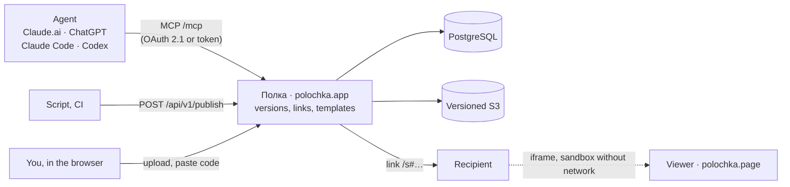

<p align="center">
  <a href="https://polochka.app">
    <picture>
      <source media="(prefers-color-scheme: dark)" srcset="docs/assets/logo-dark.svg">
      
    </picture>
  </a>
</p>

<h3 align="center">Made it with an agent? Show it to others.</h3>

<p align="center">
  Полка ("the shelf") keeps the reports, pages and prototypes you made with Claude, ChatGPT, Claude&nbsp;Code or Codex,<br>
  and opens them by link. Recipients don't need a Claude or ChatGPT account.
</p>

<p align="center">
  <a href="https://polochka.app"><b>polochka.app</b></a> ·
  <a href="https://polochka.app/discover">Catalogue</a> ·
  <a href="docs/README.md">Docs (Russian)</a> ·
  <a href="https://polochka.app/enterprise">For companies</a> ·
  <a href="README.md">Русский</a>
</p>

<p align="center">
  <a href="LICENSE"></a>
  <a href="COMMERCIAL.md"></a>
  <a href="https://github.com/artkruglov/polka/tags"></a>
  <a href="docs/status.md"></a>
  <a href="docs/connect-agents.md"></a>
  <a href="https://polochka.app/llms.txt"></a>
</p>

<p align="center">
  <a href="https://polochka.app"></a>
</p>

The interface and most documentation are in Russian. Identifiers, commands and API fields are in English.

## Try it in a minute

Tell your agent (Codex, Claude Code, Claude.ai or ChatGPT):

```text
Connect Полка: https://polochka.app/connect
```

The agent runs one command and Полка opens: sign in or create a shelf with your e-mail and press Allow. From then on, ask the agent to save your work to Полка; the reply contains a link.

## Features

<table>
  <tr>
    <td width="33%" valign="top">
      <h4>The agent saves it for you</h4>
      In Claude.ai and ChatGPT, Полка is a connector: say "save this to Полка" and the reply contains a link. Claude Code and Codex connect with one command and no token; other MCP clients use a token; scripts and CI use the HTTP API.
    </td>
    <td width="33%" valign="top">
      <h4>Interactive for recipients</h4>
      React/JSX chat artifacts are compiled into one self-contained page, with libraries bundled in and no network access. The page opens in a sandbox on a separate domain, <code>polochka.page</code>.
    </td>
    <td width="33%" valign="top">
      <h4>Exact versions</h4>
      Every save is immutable and has a SHA-256. A link shows the version you published, not your latest draft.
    </td>
  </tr>
  <tr>
    <td valign="top">
      <h4>Revocable links</h4>
      Links last 1, 7 or 30 days, can be revoked at any time, and recipients can report them. Private works stay out of the catalogue and search indexes.
    </td>
    <td valign="top">
      <h4>Shelf and templates</h4>
      Folders, search, trash and restore. Team template libraries have roles, invitations and an audit log. An agent reads a pinned template version and builds new work from it.
    </td>
    <td valign="top">
      <h4>Data stays in Russia</h4>
      polochka.app runs on Yandex Cloud: the database, files, backups and e-mail are stored and processed in Russia (<a href="docs/legal/privacy.md">privacy policy</a>, Russian). Or run Полка yourself.
    </td>
  </tr>
</table>

## What it looks like

<table>
  <tr>
    <td width="50%"><a href="https://polochka.app/discover"></a><br><sub><b>The recipient.</b> An interactive page runs in a sandbox, no account needed.</sub></td>
    <td width="50%"><br><sub><b>Agents.</b> One phrase or one command; every connection is listed and revocable.</sub></td>
  </tr>
  <tr>
    <td><a href="https://polochka.app/discover"></a><br><sub><b>Catalogue.</b> Interactive pieces from the Полка editors.</sub></td>
    <td><a href="https://polochka.app/pricing"></a><br><sub><b>For companies.</b> Cloud, self-hosting or a commercial license.</sub></td>
  </tr>
</table>

## How it works



The agent hands over the work's code itself; Полка doesn't pull anything out of the chat. Every save becomes an immutable version, and a link is bound to a version. Foreign HTML is treated as hostile: an interactive page opens on a separate domain, with no access to cookies, Полка's API or the network. More: [architecture](docs/architecture.md) (Russian), [threat model](SECURITY.md#модель-угроз-вкратце).

## Four ways to save a work

| From | How | Details |
|---|---|---|
| Claude.ai, ChatGPT | Connector `https://polochka.app/mcp` with OAuth 2.1 sign-in. The model calls `polka_publish` and returns a link | [Connector](docs/MCP_CONNECTOR.md) |
| Claude Code, Codex | One command (`codex mcp add polka --url https://polochka.app/mcp`), then sign in and allow in the browser; no token | [Connecting agents](docs/connect-agents.md) |
| Other MCP clients | Token from the «Агенты» (Agents) page, Streamable HTTP at `/mcp` | [Connecting agents](docs/connect-agents.md) |
| Scripts, CI, in-house agents | `POST /api/v1/publish` or the dependency-free CLI `scripts/polka-publish.mjs` | [HTTP API](docs/PUBLISH_API.md) |
| By hand | Upload a file (HTML, text, PNG/JPEG/WebP up to 5 MB), or paste code on the «Сохранить» (Save) page | [FAQ](docs/faq.md) |

Saving and the link were checked by hand with Claude.ai, not yet with ChatGPT ([status](docs/status.md)). You can't paste a link to a Claude or ChatGPT artifact: Полка's server can't fetch it (the sites require a login and sit behind Cloudflare), so the app tells you to use the connector, download the file or paste the code instead.

**For agent developers:** install the skill with `npx skills add artkruglov/polka`; agent reference at [/llms.txt](https://polochka.app/llms.txt), HTTP API at [/openapi.json](https://polochka.app/openapi.json).

## Quick start

You need Node.js ≥ 22.16, npm and a running Docker.

```bash
git clone https://github.com/artkruglov/polka.git && cd polka
npm ci
npm run local:setup              # .env with unique local secrets
npm run infra:up                 # PostgreSQL 16 + MinIO, bound to 127.0.0.1
npm run db:migrate
npm run storage:bootstrap-local  # versioned bucket and a capability check
npm run account:create -- demo --generate   # login and password in .local/demo-account.txt
npm run build
npm run dev                      # http://127.0.0.1:4390
```

The interactive viewer, e-mail code sign-in and the separate test suites are covered in [docs/local-development.md](docs/local-development.md).

<details>
<summary><b>Checks</b></summary>

```bash
npm run check          # frontend layers + TypeScript
npm run build
npm test               # throwaway database and bucket, removed afterwards
npm test -- --live     # suites that need the local viewer
npm run verify         # everything before a push: there is no hosted CI
```

</details>

## Self-hosting

A deployment is one Docker image plus external PostgreSQL and versioned S3 storage. You build the image from source (`docker build`); no published image exists yet. The interactive viewer must run on a separate registrable domain. The recommended path is [deploy/hosted/README.md](deploy/hosted/README.md): a single VM behind Caddy, which is how polochka.app runs. [deploy/BASE.md](deploy/BASE.md), [deploy/RESTORE.md](deploy/RESTORE.md) and [deploy/VIEWER_STAGING.md](deploy/VIEWER_STAGING.md) are drafts for experienced operators. For how the parts fit together, see [docs/architecture.md](docs/architecture.md).

## For companies

| | polochka.app cloud | Self-hosted | Commercial license |
|---|---|---|---|
| Price | Free during the pilot | Free under the AGPL-3.0 | By agreement |
| Where the data lives | Yandex Cloud, Russia | Your servers | Your servers |
| Your code changes | — | If people use your modified Полка, publish them under the AGPL-3.0 | May stay private |
| Support and SLA | — | — | By contract |

More on the [For companies](https://polochka.app/enterprise) page and in [COMMERCIAL.md](COMMERCIAL.md). There are no team accounts or SSO/SCIM yet ([roadmap](docs/roadmap.md)).

## Limitations

- **Pages are capped at 5 MB and have no network.** Everything must be inside one HTML page or bundle, with styles, images and fonts as `data:` URIs. External scripts, `fetch` and forms don't work for recipients.
- **Interactive mode needs a separate viewer domain.** Without one (`HTML_LIVE_MODE=disabled`), recipients see a static page with scripts off.
- **Claude/ChatGPT links can't be imported.** Save through the connector, download the file or paste the code.
- **Downloaded copies can't be revoked.** Revoking a link closes it, but it can't delete what a recipient already downloaded.
- **Sign-in is by e-mailed code** (SMTP required) or by an operator-issued password. Sign-up can be open, limited to listed addresses, or capped per day. There's no SSO/SCIM.
- **URL import** (`URL_IMPORT_ENABLED`) and **account deletion** (`ACCOUNT_DELETION_ENABLED`) are off by default.

More: [docs/faq.md](docs/faq.md) (Russian).

## Status

> [!NOTE]
> **Prerelease.** The latest tag is `v0.1.0-rc.5`; changes since then are listed in the [CHANGELOG](CHANGELOG.md). A hosted pilot runs at https://polochka.app; e-mail sign-up is open, up to 50 new shelves a day. The API, database schema and UI may still change.

What works and what doesn't: [docs/status.md](docs/status.md) (Russian). Next, per the [roadmap](docs/roadmap.md): a "Save to Полка" browser extension and running the pilot (monitoring, alerts, a restore drill); later a Telegram bot, author publications, team accounts and SSO.

## Documentation

In Russian: [Document map](docs/README.md) · [Architecture](docs/architecture.md) · [Connecting agents](docs/connect-agents.md) · [Connector](docs/MCP_CONNECTOR.md) · [HTTP API](docs/PUBLISH_API.md) · [FAQ](docs/faq.md) · [Status](docs/status.md) · [Roadmap](docs/roadmap.md) · [Changes](CHANGELOG.md)

## Contributing

Issues and pull requests are welcome in Russian or English. How to run the project, which checks to run and the house rules are in [CONTRIBUTING.md](CONTRIBUTING.md). Pull requests are accepted under the [CLA](CLA.md): write "I accept the CLA (CLA.md)" in the description once. Participants follow the [code of conduct](CODE_OF_CONDUCT.md). Where to ask questions: [SUPPORT.md](SUPPORT.md).

## Security

Report vulnerabilities privately through [GitHub Security Advisories](https://github.com/artkruglov/polka/security/advisories/new), not in a public issue. The process and the threat model are in [SECURITY.md](SECURITY.md).

## License

[GNU AGPL-3.0](LICENSE) or a [commercial license](COMMERCIAL.md) (dual licensing). **From version 0.1.0 on, Полка is AGPL-3.0; releases up to and including v0.1.0-rc.5 remain Apache-2.0**, and that does not change.

Running Полка unmodified, including as a service for your team, and modifying it in the open are free under the AGPL-3.0. If you let people use a modified Полка over a network, you must offer them its source: set `SOURCE_URL` to it ([deploy/hosted](deploy/hosted/README.md#исходный-код-изменённой-версии)). A commercial license is for keeping your changes private, embedding Полка in a proprietary product, or getting support and an SLA; see [COMMERCIAL.md](COMMERCIAL.md).

See also [NOTICE](NOTICE) and [THIRD_PARTY_NOTICES.md](THIRD_PARTY_NOTICES.md). The project grew out of [Lanka](https://github.com/artkruglov/lanka); see [ACKNOWLEDGEMENTS.md](ACKNOWLEDGEMENTS.md).

<p align="center">
  <a href="https://star-history.com/#artkruglov/polka&Date">
    <picture>
      <source media="(prefers-color-scheme: dark)" srcset="https://api.star-history.com/svg?repos=artkruglov/polka&type=Date&theme=dark">
      
    </picture>
  </a>
</p>
