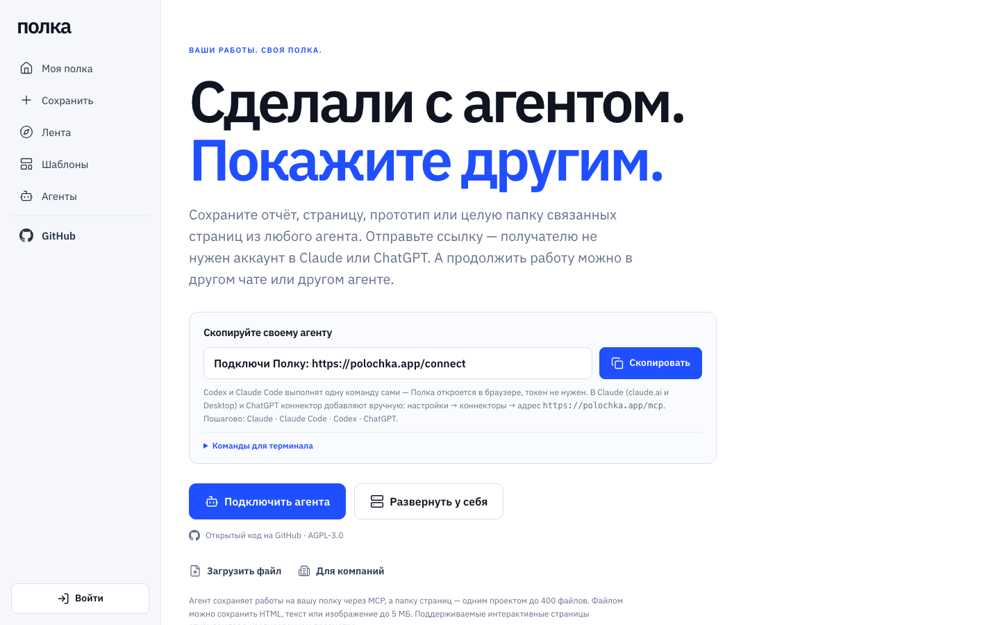
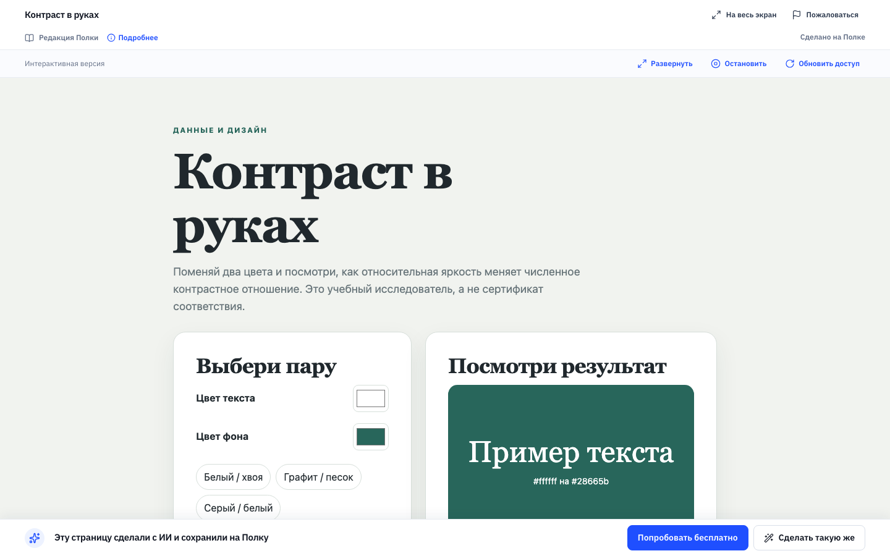
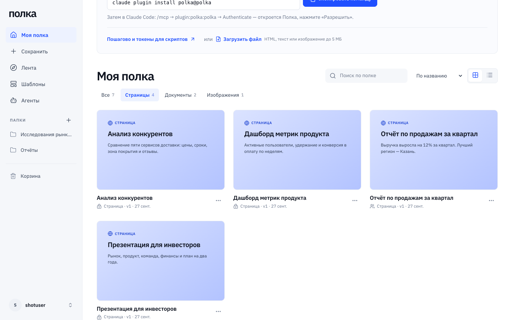
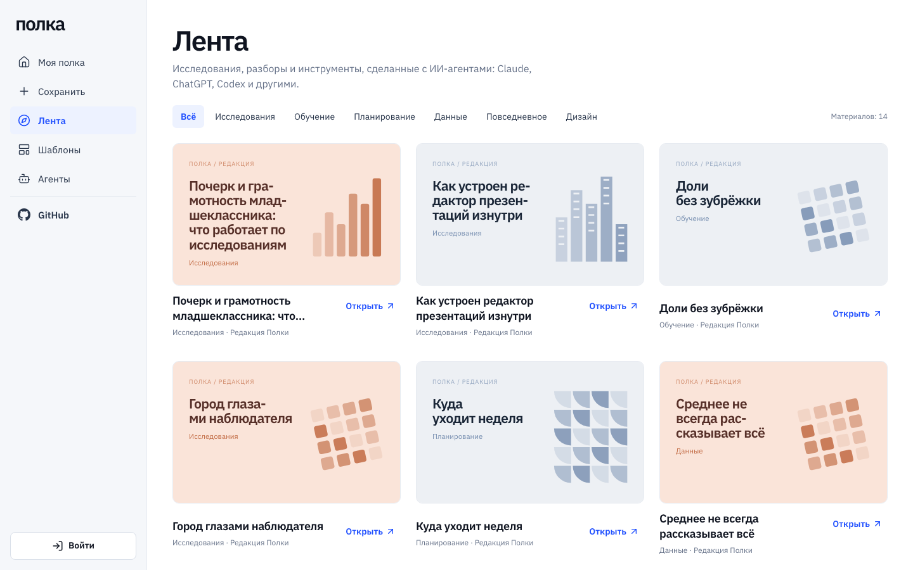
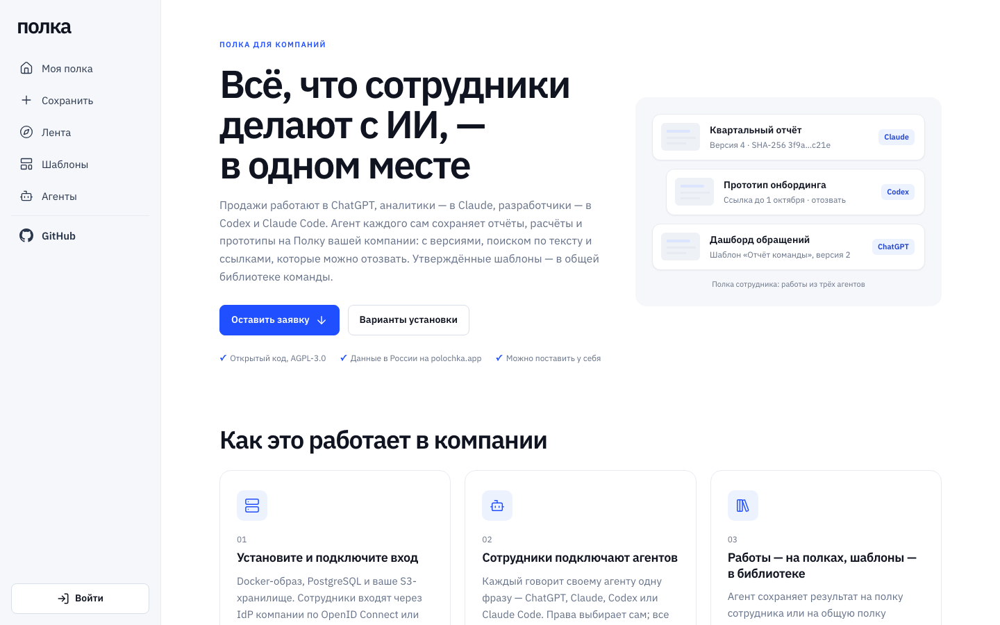
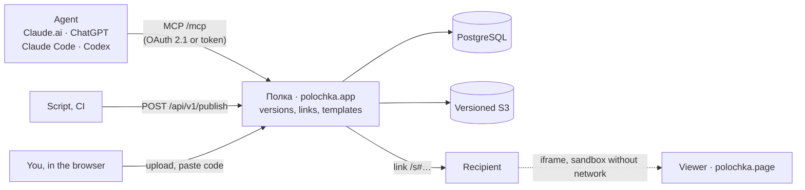

<p align="center">
  <a href="https://polochka.app">
    <picture>
      <source media="(prefers-color-scheme: dark)" srcset="docs/assets/logo-dark.svg">
      
    </picture>
  </a>
</p>

<h3 align="center">Put your AI work on the shelf.</h3>

<p align="center">
  One place for everything people make with AI agents — Claude, ChatGPT, Claude&nbsp;Code, Codex.<br>
  An agent puts the work on Полка ("the shelf"): it opens by link, the team discusses it, another agent picks it up.
</p>

<p align="center">
  <a href="https://polochka.app"><b>polochka.app</b></a> ·
  <a href="https://polochka.app/discover">Catalogue</a> ·
  <a href="docs/README.md">Docs (Russian)</a> ·
  <a href="https://polochka.app/enterprise">For companies</a> ·
  <a href="README.md">Русский</a>
</p>

<p align="center">
  <a href="https://github.com/artkruglov/polka/actions/workflows/verify.yml"></a>
  <a href="LICENSE"></a>
  <a href="https://github.com/artkruglov/polka/releases/latest"></a>
  <a href="docs/status.md"></a>
  <a href="docs/connect-agents.md"></a>
</p>

<p align="center">
  <a href="https://polochka.app"></a>
</p>

- **A shelf for your agents' work.** A page, a prototype, a dashboard or a whole project folder — the agent saves it in one sentence. It opens by link without an account and runs in a sandbox; every edit is a new immutable version; another chat or agent finds the work by its text and continues.
- **Memory of agent sessions.** On your own installation, Claude Code and Codex sessions go to the shelf: what the agent did, which commands it ran, which pull request it led to. Secrets are redacted on the machine ([AGENT_SESSIONS](docs/specs/AGENT_SESSIONS.md), Russian).
- **For companies.** Self-hosted on one VM, department shelves with roles, sign-in through your IdP. The commercial edition adds an agent control centre for security teams: secrets, addresses and MCP servers, dangerous commands, spend ([COMMERCIAL.md](COMMERCIAL.md)).

The interface and most documentation are in Russian. Code, identifiers, commands, API fields and contributor docs are in English.

## Get started

Your agent saves the work to Полка. Connect it once; from then on say "save this to Полка" in the chat and the reply contains a link.

**Claude** (claude.ai and Claude Desktop): Settings → Connectors → **Add custom connector**, URL

```text
https://polochka.app/mcp
```

→ Add → Connect → Allow in Полка.

**Claude Code**: the plugin installs the MCP server and the Полка skills in one command.

```sh
claude plugin marketplace add artkruglov/polka-plugin && claude plugin install polka@polka
```

Then in Claude Code: `/mcp` → `plugin:polka:polka` → Authenticate.

**Codex**: the same plugin for Codex.

```sh
codex plugin marketplace add artkruglov/polka-plugin && codex plugin add polka@polka
codex mcp login polka
```

**Another MCP client** (Cursor, Gemini CLI, Windsurf…): the remote server `https://polochka.app/mcp` (Streamable HTTP, OAuth sign-in) plus the skill `npx skills add artkruglov/polka-plugin`.

Each time Полка opens: sign in to your shelf (or start without signing up) and press Allow; no token or password passes through the agent. Or tell a terminal agent: `Connect Полка: https://polochka.app/connect`. You can still upload a file from your computer without an agent. Details: [connecting agents](docs/connect-agents.md) (Russian).

## Features

<table>
  <tr>
    <td width="33%" valign="top">
      <h4>The agent saves it for you</h4>
      In Claude (claude.ai and Desktop), Полка is a connector: say "save this to Полка" and the reply contains a link. ChatGPT connects to the same address, but saving from it hasn't been checked yet. Claude Code and Codex install the plugin with one command and no token; other MCP clients use the <code>/mcp</code> address; scripts and CI use the HTTP API.
    </td>
    <td width="33%" valign="top">
      <h4>Interactive for recipients</h4>
      React/JSX chat artifacts are compiled into one self-contained page, with libraries bundled in and no network access. The page opens in a sandbox on a separate domain, <code>polochka.page</code>.
    </td>
    <td width="33%" valign="top">
      <h4>Exact versions</h4>
      Every save is immutable and has a SHA-256. A link shows the version you published, not your latest draft.
    </td>
  </tr>
  <tr>
    <td valign="top">
      <h4>Revocable links</h4>
      Links last 1, 7 or 30 days, can be revoked at any time, and recipients can report them. Private works stay out of the catalogue and search indexes.
    </td>
    <td valign="top">
      <h4>Shelf, folders and search</h4>
      Covers with the heading and the opening lines, full-text search across works, trash. The agent sorts the shelf into folders itself ("sort my shelf") and saves new work into the fitting folder. Team template libraries.
    </td>
    <td valign="top">
      <h4>Data stays in Russia</h4>
      polochka.app runs on Yandex Cloud: the database, files, backups and e-mail are stored and processed in Russia (<a href="docs/legal/privacy.md">privacy policy</a>, Russian). Or run Полка yourself.
    </td>
  </tr>
  <tr>
    <td valign="top">
      <h4>Projects</h4>
      A folder of linked pages — HTML, Markdown and React components — becomes one work: a file tree, links between pages that work, and one link for the whole project.
    </td>
    <td valign="top">
      <h4>Department shelves</h4>
      A department gets its own shelf: members and roles, the agent picks the shelf when it connects, links and discussions, a company admin page. Turned on with <code>TEAM_SHELVES=on</code>; off on polochka.app until a pilot.
    </td>
    <td valign="top">
      <h4>Calm moderation</h4>
      Rules and models check every link. A prototype with a sign-in screen or a research page with hundreds of sources isn't held; recipients see a warning only when a page asks for a password, a code or card details.
    </td>
  </tr>
</table>

## What it looks like

<table>
  <tr>
    <td width="50%"><a href="https://polochka.app/discover"></a><br><sub><b>The recipient.</b> An interactive page runs in a sandbox, no account needed.</sub></td>
    <td width="50%"><br><sub><b>The shelf.</b> Folders, covers with the heading and opening lines, search and sorting across the whole shelf.</sub></td>
  </tr>
  <tr>
    <td><a href="https://polochka.app/discover"></a><br><sub><b>Лента (Feed).</b> Interactive pieces from the Полка editors.</sub></td>
    <td><a href="https://polochka.app/pricing"></a><br><sub><b>For companies.</b> Cloud, self-hosting or a commercial license.</sub></td>
  </tr>
</table>

## How it works


```mermaid
flowchart LR
  A["Agent<br/>Claude.ai · ChatGPT<br/>Claude Code · Codex"] -- "MCP /mcp<br/>(OAuth 2.1 or token)" --> P
  S["Script, CI"] -- "POST /api/v1/publish" --> P
  U["You, in the browser"] -- "upload, paste code" --> P
  P["Полка · polochka.app<br/>versions, links, templates"] --> DB[("PostgreSQL")]
  P --> S3[("Versioned S3")]
  P -- "link /s#…" --> R["Recipient"]
  R -. "iframe, sandbox without network" .-> V["Viewer · polochka.page"]
```

The agent hands over the work's code itself; Полка doesn't pull anything out of the chat. Every save becomes an immutable version, and a link is bound to a version. Foreign HTML is treated as hostile: an interactive page opens on a separate domain, with no access to cookies, Полка's API or the network. More: [architecture](docs/architecture.md) (Russian), [threat model](SECURITY.md#модель-угроз-вкратце).

## Five ways to save a work

| From | How | Details |
|---|---|---|
| Claude (claude.ai, Claude Desktop), ChatGPT (being checked) | Connector `https://polochka.app/mcp` with OAuth 2.1 sign-in. The model calls `polka_publish` and returns a link | [Connector](docs/MCP_CONNECTOR.md) |
| Claude Code, Codex | The Полка plugin in one command: MCP server and skills. Sign in and allow in the browser; no token | [Connecting agents](docs/connect-agents.md#плагин-полки-для-claude-code-и-codex) |
| Other MCP clients | Token from the «Агенты» (Agents) page, Streamable HTTP at `/mcp` | [Connecting agents](docs/connect-agents.md) |
| Scripts, CI, in-house agents | `POST /api/v1/publish` or the dependency-free CLI `scripts/polka-publish.mjs` | [HTTP API](docs/PUBLISH_API.md) |
| By hand | Upload a file (HTML, text, PNG/JPEG/WebP up to 5 MB), or paste code on the «Сохранить» (Save) page | [FAQ](docs/faq.md) |

Saving and the link were checked by hand with Claude.ai, not yet with ChatGPT ([status](docs/status.md)). There is no saving by a link to a Claude or ChatGPT artifact: Полка's server can't fetch it (the sites require a login and sit behind Cloudflare), so the agent hands over the work instead.

**For agent developers:** the Claude Code and Codex plugin (`.claude-plugin/`, `.codex-plugin/`, `.mcp.json`, `skills/`) lives here and installs from its light copy [artkruglov/polka-plugin](https://github.com/artkruglov/polka-plugin), built by `scripts/plugin-repo.mjs`; the skill alone installs with `npx skills add artkruglov/polka-plugin`; agent reference at [/llms.txt](https://polochka.app/llms.txt), HTTP API at [/openapi.json](https://polochka.app/openapi.json).

## A workspace for agents

A project work is a folder with versions: an agent takes it, edits it and saves the next version, and people open it by link without an account. See [POSITIONING](docs/specs/POSITIONING.md) (Russian), [AGENT_WORKSPACE](docs/specs/AGENT_WORKSPACE.md) and [PUBLISH_API](docs/PUBLISH_API.md).

- **The folder over MCP, no network needed:** `polka_list_files`, `polka_read_file`, `polka_change_files` (add, replace, remove files; the server copies the rest); over HTTP `GET /api/v1/works/:id/file`, `POST /api/v1/works/:id/changes`; from a terminal `polka pull/push`.

- **Accepted version and an owner** per work (the work menu, «Принятая версия»). Marking a version does not move any link, and a new version does not clear the mark.
- **Agents read the shelf:** `GET /api/v1/works` (text search with ranking, `since` for what changed), `GET /api/v1/events` (a change feed to poll), `polka_list` with the same parameters; the shelf's «how we do things here» note arrives in `polka_context`.
- **Link mode:** an unattended agent (a service account) does not move a pinned link until a curator switches it to follow new versions; an agent with your own token works as before.
- **On your own installation** (`TEAM_SHELVES=on`, `SERVICE_ACCOUNTS=on`): search across department shelves, service accounts with a responsible person, and short task tokens for cron and CI.

## Quick start

You need Node.js ≥ 22.16, npm and a running Docker.

```bash
git clone https://github.com/artkruglov/polka.git && cd polka
npm ci
npm run local:setup              # .env with unique secrets and the local interactive viewer (HTML_LIVE_MODE=local)
npm run infra:up                 # PostgreSQL 16 + MinIO, bound to 127.0.0.1; the first run builds MinIO from source, ~10 min
npm run db:migrate
npm run storage:bootstrap-local  # versioned bucket and a capability check
npm run account:create -- demo --generate   # login and password in .local/demo-account.txt
npm run build
npm run dev                      # http://127.0.0.1:4390
```

`local:setup` prints the same sequence at the end. If the default ports are taken (or this is a second clone), choose your own when `.env` is created: `POLKA_LOCAL_PROJECT=polka-two POLKA_LOCAL_PG_PORT=55432 POLKA_LOCAL_S3_PORT=9138 PORT=4490 VIEWER_PORT=4491 npm run local:setup`.

> [!WARNING]
> If `db:migrate` fails with an authentication error, volumes from an earlier install with an old password are still there. Reset, deleting the local data: `docker compose --env-file=.env -f deploy/compose.local.yml down -v`, then start again from `npm run infra:up` ([details](docs/local-development.md), Russian).

The interactive viewer, e-mail code sign-in and the separate test suites are covered in [docs/local-development.md](docs/local-development.md).

<details>
<summary><b>Checks</b></summary>

```bash
npm run check          # frontend layers + TypeScript
npm run build
npm test               # throwaway database and bucket, removed afterwards
npm test -- --live     # suites that need the local viewer
npm run verify         # everything before a push; GitHub Actions runs the same on every pull request
```

</details>

## Self-hosting

A deployment is one Docker image plus external PostgreSQL and versioned S3 storage. You build the image from source (`docker build`); no published image exists yet. The interactive viewer must run on a separate registrable domain. The recommended path is [deploy/hosted/README.md](deploy/hosted/README.md): a single VM behind Caddy, which is how polochka.app runs. [deploy/BASE.md](deploy/BASE.md), [deploy/RESTORE.md](deploy/RESTORE.md) and [deploy/VIEWER_STAGING.md](deploy/VIEWER_STAGING.md) are drafts for experienced operators. For how the parts fit together, see [docs/architecture.md](docs/architecture.md).

## For companies

| | polochka.app cloud | Self-hosted (open core) | Commercial edition (not in this repository) |
|---|---|---|---|
| Price | Free during the pilot | Free under the AGPL-3.0 | By agreement |
| Where the data lives | Yandex Cloud, Russia | Your servers | Your servers |
| What's included | The open core; department shelves are off until a pilot (`TEAM_SHELVES=off`) | The whole open core: department shelves, roles, agents per shelf, company admin, sign-in through an IdP | The core plus a closed extension for organisations: an agent control centre (employees' sessions, secrets, addresses and MCP, dangerous commands, spend), employee-only links, a link policy, an agent limited to a folder, an agents' journal exported to a SIEM, Jira and Bitrix24 comments, export of accepted versions; next — SAML and SCIM, offline installation |
| Your code changes | — | If people use your modified Полка, publish them under the AGPL-3.0 | May stay private |
| Support and SLA | — | — | By contract |

More on the [For companies](https://polochka.app/enterprise) page and in [COMMERCIAL.md](COMMERCIAL.md). Sign-in through a company IdP (OpenID Connect), Yandex ID, VK ID and Google, and template-library access by e-mail domain already work; there are no team accounts, SAML or SCIM yet ([roadmap](docs/roadmap.md)).

## Limitations

- **Pages are capped at 5 MB and have no network.** Everything must be inside one HTML page or bundle, with styles, images and fonts as `data:` URIs. External scripts, `fetch` and forms don't work for recipients.
- **Interactive mode needs a separate viewer domain.** Without one (`HTML_LIVE_MODE=disabled`), recipients see a static page with scripts off.
- **Claude/ChatGPT links can't be imported.** Save through the connector, download the file or paste the code.
- **Downloaded copies can't be revoked.** Revoking a link closes it, but it can't delete what a recipient already downloaded.
- **Sign-in is by e-mailed code** (SMTP required), by an operator-issued password, or through Yandex ID, VK ID, Google or a company IdP over OpenID Connect ([SIGN_IN_PROVIDERS](docs/specs/SIGN_IN_PROVIDERS.md), Russian). Sign-up can be open, limited to listed addresses or mail domains, or capped per day. There's no SAML or SCIM.
- **URL import** (`URL_IMPORT_ENABLED`, experimental, server and MCP only; the web app no longer offers it) and **account deletion** (`ACCOUNT_DELETION_ENABLED`) are off by default.

More: [docs/faq.md](docs/faq.md) (Russian).

## Status

> [!NOTE]
> **Current release — `v0.12.1`** ([CHANGELOG](CHANGELOG.md)). A hosted pilot runs at https://polochka.app; e-mail sign-up is open to any address, up to 50 new shelves a day. The API, database schema and UI may still change.

What works and what doesn't: [docs/status.md](docs/status.md) (Russian). Next, per the [roadmap](docs/roadmap.md): running the pilot (a restore drill, an upgrade guide), publishing the browser extension and checking the ChatGPT connector, then variants of a work, a shelf snapshot by date and `polka pull/push`; later a Telegram bot, SAML and SCIM.

## Documentation

In Russian: [Document map](docs/README.md) · [Architecture](docs/architecture.md) · [Connecting agents](docs/connect-agents.md) · [Connector](docs/MCP_CONNECTOR.md) · [HTTP API](docs/PUBLISH_API.md) · [FAQ](docs/faq.md) · [Status](docs/status.md) · [Roadmap](docs/roadmap.md) · [Changes](CHANGELOG.md)

## Contributing

Issues and pull requests are welcome in Russian or English. How to run the project, which checks to run and the house rules are in [CONTRIBUTING.md](CONTRIBUTING.md). Pull requests are accepted under the [CLA](CLA.md): write "I accept the CLA (CLA.md)" in the description once. Participants follow the [code of conduct](CODE_OF_CONDUCT.md). Where to ask questions: [SUPPORT.md](SUPPORT.md).

## Security

Report vulnerabilities privately through [GitHub Security Advisories](https://github.com/artkruglov/polka/security/advisories/new), not in a public issue. The process and the threat model are in [SECURITY.md](SECURITY.md).

## License

[GNU AGPL-3.0](LICENSE) or a [commercial license](COMMERCIAL.md) (dual licensing). **From version 0.1.0 on, Полка is AGPL-3.0; releases up to and including v0.1.0-rc.5 remain Apache-2.0**, and that does not change.

Running Полка unmodified, including as a service for your team, and modifying it in the open are free under the AGPL-3.0. If you let people use a modified Полка over a network, you must offer them its source: set `SOURCE_URL` to it ([deploy/hosted](deploy/hosted/README.md#исходный-код-изменённой-версии)). A commercial license is for keeping your changes private, embedding Полка in a proprietary product, or getting support and an SLA; see [COMMERCIAL.md](COMMERCIAL.md).

See also [NOTICE](NOTICE) and [THIRD_PARTY_NOTICES.md](THIRD_PARTY_NOTICES.md). The project grew out of [Lanka](https://github.com/artkruglov/lanka); see [ACKNOWLEDGEMENTS.md](ACKNOWLEDGEMENTS.md).

<p align="center">
  <a href="https://star-history.com/#artkruglov/polka&Date">
    <picture>
      <source media="(prefers-color-scheme: dark)" srcset="https://api.star-history.com/svg?repos=artkruglov/polka&type=Date&theme=dark">
      
    </picture>
  </a>
</p>
