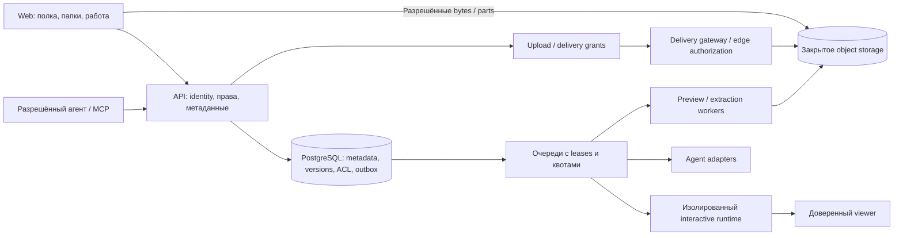

# Архитектура: хранение и доставка отдельно от исполнения

Решение для новой реализации, 13 сентября 2026. Код ещё не написан. Дизайн опирается на [F01–F24](REQUIREMENTS.md), исходные PRD и проверку зависимостей Lanka. Выбор S3 API ниже не означает выбор AWS как облака или разрешение отправлять туда данные компании.

## 1. Состав системы

Frontend — React/TypeScript с отдельной сборкой и новым UI-kit. API — один модульный сервис, PostgreSQL — метаданные и транзакции. Бинарные файлы с первого выпуска — закрытое S3-compatible object storage через небольшой BlobStore port. Background workers отделены процессом/контейнером. Kubernetes, Kafka и распределённые микросервисы не обязательны для начала. Кеш/реестр можно вынести позднее по измерению; источник истины не переносится в Redis.

Hosted и self-hosted используют одну реализацию с разными endpoints/политиками. Внутренняя установка использует своё object storage, IdP, delivery endpoint и разрешённых агентов. Сам сервис не синхронизирует содержимое двух установок; перенос явный. API/DB не должны находиться на ноутбуке владельца для работы читательской ссылки.

## 2. Модель данных

| Сущность | Обязательные поля/свойства |
|---|---|
| Identity / Session | provider+subject, user ID, expiry/revocation; session не является membership |
| Tenant | personal/organization, policy version, owning identity/organization; граница всех данных |
| Workspace / Membership | tenant ID, workspace ID, active subject, role; default workspace создаётся без формы настройки |
| Node / Folder | tenant/workspace, parent folder, name, kind, deletedAt, inheritance/access version; запрет циклов |
| Artifact | node ID, owning tenant, createdBy, current revision; creator и владелец компании разделены |
| Revision / BundleMember | immutable parent/base, media/profile, manifest и file refs, hash, author, origin, pinned dependency IDs |
| Blob | tenant-scoped immutable object key/version, checksum, bytes, content type, scan/validation state; не публичный URL |
| UploadSession | owner/tenant/destination, quota reservation, staging keys/parts, expected size/hash, expiry, state, request receipt |
| ShareLink / Grant | digest непрогнозируемого token, exact revision, audience, allowed operations, expiry, revokedAt, policy version |
| Draft / Receipt / Outbox | guest proof server-side, generation/digest/expiry; idempotency fingerprint и атомарный результат/событие |
| Job / Run / Event | actor/scope, version/policy input, lease/fencing, quota, status, correlation, cancelledAt; bounded traces |
| AuditEvent | actor/delegation/run, action, target/version, outcome/time; отдельная политика хранения от analytics |
| Следующие сущности | CommentAnchor, Proposal, Approval, ReleaseManifest, DataSnapshot/Source, DesignPackageRelease, Collection/Bookmark/Reaction |

Все внешние ссылки, индексы и кеш-ключи учитывают tenant и текущую access/policy version. Foreign keys не допускают соединения workspace/parent/blob другого tenant. Общая дедупликация между tenants не используется в M1: она усложняет права, удаление и может раскрывать наличие файла. Версионные blobs внутри tenant могут переиспользоваться по проверенным references.

Новая БД не требует старых таблиц Lanka. Новые writers не пишут в legacy; старые writers не знают о новой DB. При явном импорте назначаются новые права и provenance. Сохранность прежней системы проверяется отдельно.

## 3. Загрузка и неизменяемость

1. `beginUpload`: сервер проверяет identity, назначение, тип/размер, policy и резервирует квоту. Создаёт staging session и ограниченные upload grants. Байты не передаются в JSON base64 через основной API.
2. Клиент передаёт файл или части прямо в разрешённое хранилище. Перезапуск страницы восстанавливает upload ID/статус, но не обещает сохранить File handle без доступной поддержки браузера; при необходимости человек повторно выбирает тот же файл, совпадение проверяется.
3. `finalizeUpload`: сервер проверяет текущие права, размер, checksum, завершённость и профиль безопасности. Недопустимый файл остаётся недоступным для чтения/публикации.
4. Версия закрепляется на immutable final key или exact object version, к которому у upload grant нет записи. Только затем DB-транзакция публикует receipt/revision и outbox. Если commit не прошёл, orphan object убирается; если ответ потерян, повтор возвращает прежнюю квитанцию.
5. Worker из outbox создаёт нужные обложки/preview. Файл сохранён и preview готов — разные состояния. Явно отменённые/просроченные sessions освобождают multipart uploads и квоту после reconciliation.

Presigned URL может использоваться повторно и перезаписать тот же ключ до истечения срока. Поэтому схема «проверили staging → сохранили ссылку на него» недостаточна. AWS описывает эти свойства и проверку checksums; конкретный S3-compatible поставщик проходит те же contract tests. [S3 presigned URLs](https://docs.aws.amazon.com/AmazonS3/latest/userguide/using-presigned-url.html).

Multipart позволяет повторять отдельные части и продолжать загрузку. Finalize и abort остаются серверными действиями; ETag multipart не приравниваем к полному SHA-256. Для одиночного PUT нужен version-pinned либо conditional promotion, исключающий гонку перезаписи; выбранный provider обязан подтвердить поддержку. [S3 multipart](https://docs.aws.amazon.com/AmazonS3/latest/userguide/mpuoverview.html).

## 4. Быстрые ссылки и выдача данных

Постоянная ссылка вида `/s/<непрогнозируемый token>` принадлежит Полке и не является сырым S3 URL. Минимум 128 бит случайности; удобство не достигается угадываемым счётчиком. Resolver проверяет audience/expiry/revocation/policy, затем выдаёт короткий grant конкретному revision/profile. Ссылка переживает перезапуск worker и смену места хранения.

Файл или обложка выдаются delivery layer/object storage с Range, ETag/conditional requests и авторизацией. Внутренние bytes не проходят через общий application server, если политика не требует строгого streaming gateway. Доступ к bucket закрыт, обход delivery layer не разрешён. CDN для закрытых данных должен проверять grant и на cache hit; кеширование разрешённых байтов не кеширует разрешение пользователя. [CloudFront signed URLs](https://docs.aws.amazon.com/AmazonCloudFront/latest/DeveloperGuide/private-content-signed-urls.html).

Отзыв немедленно запрещает новые grants. Уже выданный direct URL действует в пределах его срока; начатая перед истечением передача может продолжаться. Строгий корпоративный отзыв требует gateway, проверок во время передачи и измеренного SLA, а не только короткой подписи. Уже полученные байты удалить у адресата нельзя. [Поведение истечения S3 URL](https://docs.aws.amazon.com/AmazonS3/latest/userguide/using-presigned-url.html).

Публикация неизвестного HTML допускает только принятый профиль просмотра. Для обычного проверенного файла ссылка может показать оригинал/доступный viewer, пока дополнительная обложка готовится. Для ещё невалидированного executable bundle публичный grant не создаётся. Боты мессенджера не видят private title/thumbnail; публичный unfurl берётся из безопасных метаданных, без исполнения авторского JS.

## 5. Три профиля просмотра — ключевой эксперимент M0

| Профиль | Как работает | Ограничение |
|---|---|---|
| Документ / статический результат | Проверенный PDF/image/file download или заранее подготовленный inert preview; bytes через delivery/cache | Статичность обозначена; screenshot не выдаётся за работающий прототип |
| Известный рецепт | Доверенный version-pinned компонент продукта + валидированные данные, без загрузки произвольного кода автора | Можно быстро редактировать/читать без Chromium на зрителя; это не разрешение выполнить любую библиотеку из архива |
| Произвольный HTML/CSS/JS | Проверенная сборка и networkless runtime; доверенный viewer получает разрешённые кадры/события | Отдельные квоты/очередь/стоимость, ограниченная параллельность; потеря сессии не равна потере сохранённого источника |

Нельзя считать весь HTML безопасным после антивируса, подписи автора или проверки моделью. Отдельный origin и iframe sandbox снижают риски, но сами по себе не доказывают полное отсутствие исходящих каналов; прежние проверки Lanka уже показали проблему браузерной сетевой изоляции. MDN отдельно предупреждает о комбинации scripts/same-origin и рекомендует отдельный origin для чужого содержимого. [MDN iframe](https://developer.mozilla.org/en-US/docs/Web/HTML/Reference/Elements/iframe).

До большого UI-кода проверить: самостоятельный просмотр обычного файла не выделяет runtime; доверенный отчёт интерактивен и доступен с клавиатуры; произвольный пакет не получает секреты/сеть приложения. Если свободный интерактивный HTML экономически не выдерживает целевой поток, изменить явно поддержанный профиль/лимит, а не незаметно уплощать результат или ослаблять изоляцию. Архитектура хранения не зависит от итогового выбора исполнительного профиля.

## 6. Связь, совместная работа и агенты

Каталог действий, контракт ошибок/повторов и локальное подключение описаны в [API_AND_AGENTS](API_AND_AGENTS.md).

Server events по SSE с cursor/replay и polling fallback передают изменения метаданных, версии, jobs и комментарии. WebSocket добавляется только для сценария, которому нужна двусторонняя низкая задержка. Нельзя считать открытый socket сохранением; UI получает committed revision receipt. Количество подписок/буфер/replay ограничены. При account switch кеши и подписки очищаются; поздние события старой версии не меняют новую.

Первый совместный редактор использует CAS и предложения. CRDT одновременного редактирования текста — отдельная измеряемая задача, не обязательный фундамент всего файлового сервиса. Агент читает точные files/revisions и отправляет patch/candidate через те же application services. Run pin-ит skill/model/recipe/policy, хранит события независимо от ноутбука, имеет scoped identity и лимиты. MCP — действия/контекст; зеркалирование произвольного внешнего чата требует отдельного адаптера и явного разрешения на историю.

## 7. Корпоративный слой с первого дня

Tenant boundary, ownership, audit envelope, immutable revisions, actor types, classification и policy checks заложены в M0. UI SSO/admin, группы/SCIM, расширенные approvals и Brand Library появляются M4. Это предотвращает позднюю переделку данных без принуждения личного пользователя проходить enterprise onboarding.

Политика действует до external share/model/image request и при повторе после изменения доступа. Offboarding закрывает identity/delegations/run leases, но не удаляет корпоративный artifact. Private prompts, sources и внутренние комментарии не входят в общий читательский результат. Восстановление backup не должно оживлять отозванные grants/disabled identities без reconciliation. Аудит и events не записывают секреты и полные signed URLs.

## 8. Нагрузка и измерения

Это целевые тестовые профили, не уже достигнутые SLA. Для первого reference environment: документированный сервер/сеть; файлы 1/10/100 MiB; каталоги 10/1 000/10 000 элементов; 1/10/50 одновременных metadata клиентов и отдельный поток читателей. Для HTML profile — независимые 1/4/8 runtime requests с понятной насыщаемостью, не обещание восьми одновременно работающих контейнеров.

Начальные цели для согласования/измерения: p95 metadata API ≤500 ms, первая видимая страница полки p75 ≤2 s, share resolver p95 ≤300 ms, первый полезный обычный preview p75 ≤2.5 s в целевой сети; в эти числа входит доступ, а не только чтение кеша. Для чужого JS отдельно измерить warm/cold first frame, input latency, RAM/CPU/egress и стоимость просмотра. Cancel acknowledgement цель ≤2 s; завершение тяжёлой работы может занять больше и отражается отдельно.

Файловую полосу измерять относительно прямой передачи того же объекта, без обещания «любой файл за секунду». Проверить мобильный/корпоративный proxy, обрыв, retry, Range и истёкший grant. Byte-range и параллельные запросы — известные механизмы оптимизации, но их реальный выигрыш зависит от профиля. [S3 performance guidelines](https://docs.aws.amazon.com/us_en/AmazonS3/latest/userguide/optimizing-performance-guidelines.html).

Масштабируемые слои: API replicas с общими сессиями/DB; delivery/cache по полосе; workers по длине очереди и бюджету; runtime с registry/routing/admission/fencing. Глобальные tenant/actor квоты обязательны перед несколькими coordinator. PostgreSQL connection pools и query/index budgets ограничены. Большая компания означает профиль активных пользователей/размеров/просмотров, а не автоматически тысячи Chromium.

## 9. Поставка и открытые решения

Базовая поставка: app/API, PostgreSQL, object storage adapter, worker и reverse proxy; runtime отделён от app и его секретов. Нужны backup/restore для DB+objects, retention/GC, совместимые image digests, миграции и операционные инструкции. CDN не обязателен для внутренней сети. Контроль RPO/RTO и места данных — у оператора конкретной установки.

До допуска выбрать: реальный S3-compatible backend с versioning/checksum/conditional semantics, провайдер личного входа, адреса app/delivery/runtime, регион/сети пользователей, лимиты, бюджет и сроки хранения. Это параметры deployment, не жёсткая зависимость архитектуры от одной компании. Не покупать домен/инфраструктуру и не заявлять доступность в России без проверки целевых маршрутов.
