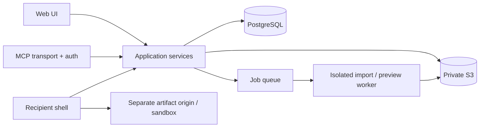

> Актуализация 21.09.2026: текущая цель и порядок работ — [IMPLEMENTATION_GOAL](IMPLEMENTATION_GOAL.md). URL-import остаётся демо; начата слоистая миграция фронтенда. Старые отметки ниже не означают завершённую пользовательскую приёмку.

# Архитектура Полки

Статус: текущий фундамент + целевые изменения MVP. Не начинать новый rewrite.

## Переиспользуем

React/Vite, Fastify, PostgreSQL, S3 adapter, transactional uploads/receipts, SHA-256, immutable revisions, CAS обновление, tenant-filtered чтение, share resolver/grants/revoke, quota reservations и reconciliation. Метаданные в DB, содержимое в object storage. Сейчас tenant принадлежит одному account; membership в БД отсутствует.

## Разделяем ответственность

Application services извлекаются из HTTP handlers без переписывания работающих транзакций. Web использует session/CSRF, MCP — отдельный проверенный bearer/OAuth transport. Не ослаблять глобальный Origin-check ради MCP: разделить маршруты и auth contexts. Общие checks tenant/scope/idempotency остаются на service boundary.

## Новые данные MVP

- verified identity и login challenges: email, expiry, hashed one-time code, consumed state, rate limits; существующие operator accounts мигрируют без потери tenant.
- agent_connections: tenant, client, scopes, expiry, revoked_at, last_seen; credentials только хеши/проверяемые токены, UI не хранит провайдерский API key.
- manifests: revision, entrypoint, файлы с hashes/MIME/bytes, runtime profile, source URL без секретов, attribution/license, completeness.
- jobs: state, attempt, idempotency, progress, error, bounded retry, cancellation. Начать с DB-очереди; отдельный worker, без новой распределённой системы до измерений.
- Audit расширяется actor_type, on_behalf_of, connection_id, basis; содержимое prompts и share tokens не логируется.
- Publications, reactions, bookmarks, moderation — C1. PublicSnapshot ссылается на точную revision и отдельное решение о публикации. Likes уникальны по actor+publication; demo actors исключены из метрик.

## HTML

Текущий профиль — CSP scriptless/networkless, это сохраняется до приёмки нового. Цель — самостоятельный HTML/CSS/JS и локальные ресурсы bundle, без доступа к API/кукам Полки и без произвольного egress. Отдельный registrable domain для недоверенного содержимого, sandbox без allow-same-origin и top-navigation, ограниченная CSP, исходящие соединения запрещены; выдача файла/ресурса повторно авторизуется. Нельзя просто добавить allow-scripts к текущей странице и объявить безопасность готовой.

Без allow-same-origin возможны ограничения modules/storage: профиль и упаковщик выбираются на корпусе, а не обещают произвольный React/npm. Shared persistence, секретные API и серверные функции чужих приложений не входят в runtime MVP. CPU-loop/huge DOM и phishing проверяются отдельно; CSP сама по себе не решает все риски. Тяжёлое создание thumbnail — в ограниченном worker, не в обычном request handler.

## Импорт

Публичный URL → adapter → fetch с allowlist/проверкой redirects/DNS/private ranges, timeout/size cap → зависимости → manifest → классификация → preview → receipt. Нет импорта cookies, закрытых аккаунтов и обхода входа. HTML из X-поста не считается bundle; screenshot не считается интерактивной копией. Импорт испытывается с инфраструктуры будущего cloud: источник тоже может быть недоступен серверу. Fallback честно предлагает MCP/file. ZIP требует ограничения распакованного размера, числа файлов, глубины, traversal и symlinks.

## Разрешения и ссылки

Private по умолчанию. Unlisted URL разрешён владельцу или агенту с ограниченным share scope. Возврат shareUrl агенту — часть авторизованного сценария, заменяет старый тотальный запрет. Выдача токена в инструментальный ответ не означает согласие отправить его третьим лицам. Обновление версии ссылки — отдельная операция с CAS. Не ставим private/unlisted за долгоживущий публичный CDN cache; отзыв не может удалить уже скачанную копию.

## Масштабирование и поставки

Один модульный backend, отдельные worker и viewer, stateless API replicas, ограниченные DB pools. Managed PostgreSQL/Object Storage для hosted; PostgreSQL/S3-compatible adapter для self-hosted. Kubernetes не нужен первой beta. Подробности и проверяемые ресурсы — [LAUNCH](LAUNCH.md). Cloud vendor не должен проникать в доменные контракты.

Первый локальный live-срез: [LIVE_VIEWER_SPEC](LIVE_VIEWER_SPEC.md). Он не заменяет целевую hosted-изоляцию; guards не позволяют включить его за пределами loopback.
