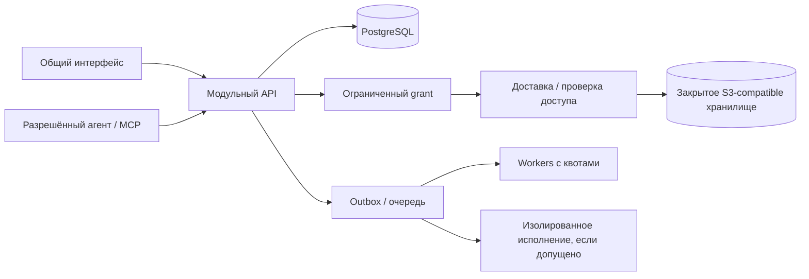

# От интерфейса к самостоятельному продукту

Решение 13 сентября 2026. Относится к P01/P04/P07/P08/P18/P19/P23. Развивает [архитектуру](ARCHITECTURE.md), не заменяет требования к правам, исполнению HTML и восстановлению.

## Что уже есть и чего пока нет

Есть новый [интерактивный макет](design/polka-interface.html), отдельные токены, демонстрационная модель и браузерная проверка путей. Нет продуктового сервера, настоящего входа, загрузки, постоянного хранилища, общей сессии агента и корпоративной поставки. Отдельный локальный HTTP-сервер макета не является hosted-версией Полки.

Следующее решение — реализовать один законченный путь в новом репозитории Полки: вход → собственный файл → просмотр → осознанный доступ → получение другим человеком → новая версия по тому же адресу. M2 с созданием отчёта и M3 с агентом не блокируют этот первый допущенный сценарий.

## Что делает интерфейс полезным

| Работа пользователя | Решение в интерфейсе | Проверка перед выпуском |
|---|---|---|
| J01 Принести результат агента | Одно действие «Добавить работу», необязательная папка, понятные этапы сохранения | Реальный файл и receipt; повтор/обрыв/квота; закрытый доступ по умолчанию |
| J04 Найти и открыть | Обложки для узнавания, список для плотной папки, поиск/сортировка, недавние | Большой каталог с cursor; права применяются и к результатам, и к счётчикам |
| J05 Получить ссылку | Содержание занимает основную площадь; вход только по выбранной аудитории | Другой аккаунт, телефон, медленная сеть, отзыв; без исходного агента |
| J06 Исправить отправленное | «Новая версия» рядом с работой; сохранённая и отправленная версии различимы | Save не публикует; переключение через CAS; viewer не смешивает assets двух версий |
| J07 Взять за основу | Отдельное разрешение копии; после него — своя закрытая работа | Исходники и private chat не копируются по одному праву просмотра; M2 |
| J12/J17 Внутренняя работа | То же приложение, выбранная организация и её политика | Настоящий IdP, владение компании, отсутствие обязательного внешнего сервиса; M4 |

Современность выражается в ясной иерархии и предсказуемых действиях: навигация спокойнее содержания, действия находятся в постоянных местах. Это созвучно направлению [обновления Linear 2026](https://linear.app/now/behind-the-latest-design-refresh), но наша компоновка определяется задачами Полки.

## Два уровня прототипирования

**D0: дизайн и состояния.** Текущий макет остаётся дешёвым инструментом сравнения. `ui/tokens.css` содержит визуальные значения, `model.mjs` — демонстрационные переходы, `previews.mjs` — только наши доверенные примеры, `app.mjs` — навигацию и панели. Модель не проверяет настоящую личность и не может стать авторизацией продукта. В ней нет реального срока истечения ссылки или фоновых заданий. Тесты модели — примеры будущего поведения, а не доказательство безопасности.

**D1: продуктовый frontend.** Новый `apps/web` на React/TypeScript с общей системой компонентов. Переносятся принятые токены, формулировки, состояния, fixtures и сценарии тестов. Строковый `innerHTML`-рендерер макета и его глобальное состояние не переносятся в рабочее приложение. React предлагает разбивать интерфейс на компоненты и хранить минимальное состояние с явным владельцем; это подходит для такой границы. [Thinking in React](https://react.dev/learn/thinking-in-react).

D1 и D2 — приёмки одного сквозного среза. Не переписывать весь макет на React до появления работающего договора и сервера загрузки/ссылки: сначала минимум экранов J01/J05/J06, затем остальные поверхности. Иначе получим ещё один красивый макет без сохранения результата.

Vite — кандидат для разработки и сборки frontend; итог — локальные статические ресурсы без обязательного CDN. До фиксации версии проверить поддержанный Node и браузеры, закрепить версии lockfile. [Vite: начало работы](https://vite.dev/guide/). Лендинг и reader могут иметь серверные метаданные; ради этого не нужен второй отдельный продукт.

Общие UI-компоненты сначала живут внутри `apps/web`: Shell, PageHeader, ArtifactCard/Row, Cover, AccessChip, LinkStatus, ArtifactStage, SharePanel, UploadPanel, Versions, EmptyState и Toast. Отдельный npm UI-kit не нужен до второго потребителя. Доступные примитивы диалогов и меню можно взять из [Radix](https://www.radix-ui.com/primitives/docs/overview/introduction), сохраняя собственный визуальный слой; библиотека не заменяет проверку наших формулировок и клавиатуры.

## Граница данных: один договор для макета и сервера

Продуктовый UI получает `PolkaClient`, а не знает адрес S3, SQL или команды локального агента. Сначала зафиксировать OpenAPI/схемы входов и ошибок. HTTP-клиент можно генерировать; серверная проверка входов и прав обязательна независимо от клиентских типов.

| Группа | Договор |
|---|---|
| Каталог | `listShelf(folderId, query, sort, cursor, limit)`, `getArtifact`, `listRevisions`; ограниченные страницы, не весь tenant в браузере |
| Сохранение | `beginUpload`, `finalizeUpload`, `getReceipt`, `abortUpload`; idempotency key, назначенная сервером версия, hash и статус preview |
| Ссылка | `getShare`, `enableLink`, `setOptions`, `revokeLink`, `rotateLink`, `publishRevision(expectedRevisionId)`; явное расширение доступа |
| Получатель | `resolveShare` возвращает ограниченный viewer grant одной revision либо нейтральный отказ; это не owner DTO |
| Возможности | `getCapabilities`: поддержанные форматы, аудитории, операции, лимиты; UI скрывает неготовое, сервер всё равно отклоняет запрещённое |
| Ошибки | Стабильные `conflict`, `forbidden`, `not_found`, `quota`, `unsupported`, `network`, `expired`; retryable и безопасное действие пользователя |

Статус ссылки — производное состояние `none / active / behind / revoked / expired`; указатель версии и разрешение чтения различимы. Форма настроек имеет собственный черновик. Отмена не изменяет права, приглашения или файлы. Ссылка появляется после успешного ответа сервера. Сохранение настроек не снимает отзыв. После включения заново старый адрес не оживает.

Сначала один набор сценариев реализуется через demo adapter нового frontend; затем те же проверки выполняются с HTTP adapter и реальными аккаунтами. Ошибки и задержки задаются тестовым окружением, а не скрытыми кнопками рабочего продукта. Не копировать разрешающее поведение demo adapter в сервер. Проверка S01–S12 отдельно остаётся обязательной.

## Компоновка репозитория

Ниже целевая структура, эти каталоги ещё не означают готовую реализацию:

```text
apps/web/              React UI, routes, components, client adapter
apps/server/           HTTP/API, identity, ACL, artifacts, shares, metadata
apps/worker/           preview/extraction jobs, bounded leases and retries
packages/contracts/    versioned schemas, DTO and error contracts
packages/storage/      small BlobStore adapter and its contract tests
tests/fixtures/        safe files, hostile bundles, large catalog metadata
deploy/                reference Compose, config, migrations, upgrade/restore
docs/design/           research prototype and visual evidence
```

Это модульный монолит с отдельными тяжёлыми процессами. UI/MCP используют один application layer. Не создавать заранее десятки микросервисов, универсальный plugin framework или второй BFF. Runtime произвольного HTML подключается отдельным принятым профилем, а не активируется импортом файла.

## Один продукт: hosted и self-hosted



Образы приложения и протоколы одинаковы. Конфигурация выбирает app/API/delivery/runtime origins, IdP, объектное хранилище, разрешённых агентов и политику исходящей сети. Секреты не попадают в frontend config. Компания не обязана регистрироваться на нашем облачном сервисе, отправлять телеметрию наружу или использовать нашего агента.

Содержимое пользователя не исполняется на origin приложения. Конкретная схема origin, DNS и TLS зависит от принятого viewer: нельзя автоматически требовать wildcard DNS для установки, которая выдаёт только файлы и безопасные кадры. Если выбран per-artifact origin, его DNS/TLS становятся явным условием этого профиля. Выбор S3-compatible реализации тоже проверяется отдельно; конкретный поставщик не объявляется обязательным этим документом.

Reference Compose: приложение, PostgreSQL, выбранный S3-compatible backend, worker; миграции отдельным однократным действием; HTTPS/reverse proxy согласно установке. Данные переживают замену образов. Runtime необязателен, и UI заранее сообщает, какие интерактивные форматы при его отсутствии не поддержаны. Kubernetes — позже при реальном эксплуатационном запросе, не обязательное условие установки.

Личная облачная работа и внутренняя установка не синхронизируются сами. Перенос между ними явный, проверяет права и назначает новое владение. Подмена домена email не создаёт membership. Контент корпоративного tenant остаётся собственностью организации после увольнения автора.

## Где будет масштабироваться нагрузка

| Нагрузка | Как отделяется | Что измерять |
|---|---|---|
| Поиск/папки/версии | Indexed metadata в PostgreSQL, cursor, bounded limit, connection pool | p95/p99 чтения, запросы на действие, память вкладки |
| Большие файлы | Прямая ограниченная загрузка либо policy gateway; байты не в JSON API | Полоса относительно прямой передачи, retry, quota, finalize race |
| Просмотры по ссылке | Immutable bytes через delivery/cache, проверка grant и на cache hit | Всплеск читателей не тормозит автора; время первого полезного кадра |
| Обложки/извлечение | Очередь, идемпотентность, leases, лимит на tenant и общий бюджет | Ожидание, память, повтор, отмена, устаревшие jobs |
| Произвольный JS | Отдельный подтверждённый runtime, admission/backpressure | Стоимость одного сеанса, ограничения сети, конкуренция, восстановление |

Обычному файлу, обложке и доверенному отчёту не нужен браузерный контейнер на каждого читателя. Но произвольный HTML нельзя автоматически объявить безопасным и дешёвым только потому, что он работает в браузере. CSP, noindex и отдельный origin не доказывают отсутствия исходящей сети. Этот эксперимент остаётся отдельным условием допуска P08.

Виртуализация, дополнительные API replicas, общий кеш и multipart вводятся после замеров, с глобальными квотами и проверкой согласованности. Нагрузочные профили и численные цели уже определены в [ARCHITECTURE §8](ARCHITECTURE.md); это цели, не достигнутый SLA.

## Приёмка и поставка в open source

| Срез | Результат | Что нельзя объявлять готовым раньше |
|---|---|---|
| D0, сейчас | Сравнимые экраны и исправленные модельные переходы | Пользовательская приёмка, auth, безопасность, масштаб |
| D1 / P01,P18 | React UI + contracts, demo adapter, loading/error/empty/keyboard/mobile, проверка сценариев | Настоящее сохранение до подключения backend |
| D2 / M0→M1 | HTTP adapter, два аккаунта, storage receipt, viewer, shared link/expiry/revoke/restore; S01–S09 по поддержанному объёму | Confidential sharing до S10; вся продуктовая область до M2–M5 |
| D3 / P23 | Свежая установка по инструкции, upgrade, backup+restore, health/readiness, logs без tokens, воспроизводимый release | Корпоративный допуск до IdP/policy/offboarding и внутренней проверки |
| Внешний выпуск | Репозиторий, лицензия, понятный README, короткое demo, issue templates, tagged images/digests, changelog, проверенные команды | «Production-ready» на основании макета или локального Compose |

Для первого релиза закрепить поддержанные форматы и лимиты, инструкцию для владельца сервера, процедуру сообщений о проблемах, upgrade/rollback и совместимость схемы/worker. Документировать зависимости и их лицензии; секреты и реальные клиентские материалы не включать в примеры. Использовать уже выбранную лицензию проекта, не менять её этим редизайном.

Пользовательская проверка ещё впереди: принести работу, найти её, отправить человеку, заменить версию и отозвать ссылку. Считать ошибки понимания и время до результата, а не только спрашивать «красиво ли». Реальных интервью в текущем проходе нет.
