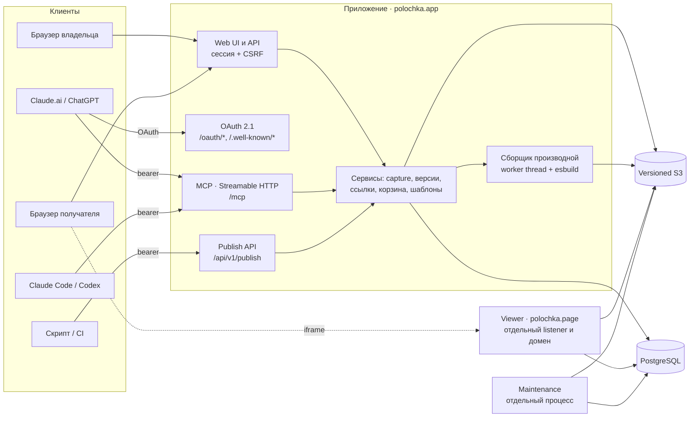

# Архитектура

Как устроена Полка на 22.09.2026: что где работает и где проходят границы доверия. Контракты отдельных частей собраны в [specs/](README.md#спецификации).

## Что где работает

| Часть | Где | Что делает |
|---|---|---|
| Приложение | Один Node.js-процесс (`apps/server/main.ts`), Fastify, порт 4390 | Web UI (React/Vite, собирается в `dist`), JSON API, MCP, OAuth, publish API |
| Viewer | Тот же процесс, второй Fastify listener (порт 4391), свой registrable domain | Отдаёт готовую производную интерактивной страницы только по короткоживущему гранту. Cookies и API Полки ему недоступны |
| Сборщик производной | `worker_threads` внутри приложения, esbuild как дочерний процесс | Превращает сохранённый пакет в один самодостаточный HTML (`bundle-inline`, React runtime) |
| Maintenance | Отдельный процесс (`npm run maintenance:watch`) | Удаляет истёкшие загрузки, сессии, гранты и коды входа. Пользовательские материалы не трогает |
| PostgreSQL | Внешний, миграции в `deploy/migrations/` | Метаданные, версии, ссылки, подключения агентов, OAuth, аудит. У приложения отдельная роль без DDL (`deploy/runtime-grants.sql`) |
| Versioned S3 | Внешний (MinIO локально) | Оригиналы и производные. Чтение идёт по точной версии объекта |

В hosted-установке перед приложением стоит Caddy: он выпускает TLS для обоих доменов и проксирует запросы на loopback. Подробности: [deploy/hosted/README.md](../deploy/hosted/README.md).

## Данные

- **Работа и версии.** Каждая версия неизменяема и хранит manifest (файлы, MIME, размеры, SHA-256) и точные версии объектов S3. Новая версия создаётся через CAS, поэтому параллельное изменение не перезапишет чужое.
- **Изоляция.** Все чтения фильтруются по tenant. Сейчас tenant принадлежит одному аккаунту. Общий доступ к шаблонам даёт membership в библиотеке, а не общий tenant.
- **Ссылки.** Секрет ссылки передаётся во фрагменте (`/s#…`), поэтому не попадает в логи сервера. Ссылка привязана к конкретной версии, у неё есть срок и отзыв. Приватные работы не индексируются.
- **Квоты.** Место резервируется до записи в S3 и сверяется после неё. Для производных есть своя квота.

## Путь страницы к получателю

1. Работа поступает через upload, «Вставить код», MCP (`polka_capture`, `polka_publish`) или `POST /api/v1/publish`. Все пути вызывают один и тот же сервис. Повтор с тем же ключом идемпотентности возвращает тот же результат.
2. Оригинал сохраняется приватно и получает профиль: `static` (показывается без скриптов), `limited` или `unsupported`.
3. Если на установке включён интерактивный просмотр, сборщик создаёт производную: встраивает ресурсы, компилирует JSX/TS и подставляет библиотеки runtime `react-runtime-v1` (React, lucide-react, recharts, lodash, d3, three, papaparse, mathjs, chart.js и Tailwind v4). Любой другой import отклоняет сборку. Контракт: [BUNDLE_INLINE_SPEC](BUNDLE_INLINE_SPEC.md).
4. Получатель открывает ссылку на домене приложения. Страница материала встраивает iframe с viewer-домена, и тот отдаёт производную по гранту.
5. Без интерактивного режима HTML показывается в статичной песочнице: CSP без скриптов и без сети.

## Границы доверия

| Граница | Как защищена |
|---|---|
| Пользовательский HTML ↔ Полка | Отдельный registrable domain, `sandbox` без `allow-same-origin`, строгая CSP без сети, короткоживущий грант на конкретную производную. Контракты: [LIVE_VIEWER_SPEC](LIVE_VIEWER_SPEC.md), [HOSTED_VIEWER_DELTA](HOSTED_VIEWER_DELTA.md) |
| Сборка чужого кода | Worker с кучей 64 МБ, срок сборки 5 с, одна runtime-сборка за раз. У esbuild лимит памяти (`ulimit -d`) и нет доступа к файлам сервера. Размер выхода не больше 8 МиБ |
| Агент ↔ аккаунт | Bearer-токен подключения с узкими scopes (`context`, `capture`, `read`, `share`, `revise`, `manage`, `source:read`). В БД хранятся только хеши. Отзыв на странице «Агенты» действует сразу |
| Чат-приложение ↔ аккаунт | OAuth 2.1: PKCE S256, DCR, resource indicator, ротация refresh-токена с обнаружением повтора, страница согласия с CSRF. См. [MCP_CONNECTOR](MCP_CONNECTOR.md) |
| Браузер ↔ API | Сессионная cookie, CSRF и проверка `Origin`. Машинные маршруты (`/mcp`, `/oauth/token`, `/api/v1/publish`) не читают cookies и отклоняют чужой `Origin` |
| Импорт по URL (выключен по умолчанию) | Только публичные адреса. DNS закрепляется, каждый redirect проверяется, частные диапазоны запрещены, есть лимиты размера и времени. См. [URL_IMPORT_SUPPORT](specs/URL_IMPORT_SUPPORT.md) |

## Код

| Каталог | Что там |
|---|---|
| `apps/server` | Fastify-приложение, viewer, MCP, OAuth, publish API, сборщик, maintenance |
| `apps/web` | React-интерфейс. Слои проверяет `npm run check:layers` ([FRONTEND_COMPONENT_SYSTEM](FRONTEND_COMPONENT_SYSTEM.md)) |
| `packages` | Общие контракты (zod-схемы, лимиты, список библиотек runtime) и каталог миграций |
| `deploy` | Миграции, права ролей БД, compose-файлы, hosted-поставка |
| `scripts` | Миграции, аккаунты, тестовый раннер, CLI публикации, restore и maintenance |
| `content/editorial` | Исходники 12 материалов «Интересного» |
| `tests` | Интеграционные тесты на настоящих PostgreSQL и S3 |
