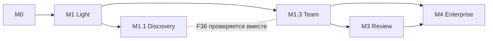

# План реализации Полки

Одна очередь нового продукта; этапы пересобраны 14 сентября 2026 под [рамку сообщества AI-артефактов](#дорожная-карта-с-14-сентября-2026). На 14 сентября 2026 выполнен [первый рабочий срез](LIVE_SLICE_2026-09-13.md): D1/D2 для изображений/текста, статический HTML в sandbox без скриптов и сети, анонимная жалоба по токену и частично P01/P03–P08/P11/P18/P21. Критерии M0/M1 ниже целиком не закрыты; next — расширение P08 (ZIP/runtime), MCP capture, файловая организация и эксплуатация. Старые T/M из Lanka — источники опыта, не статусы Полки. Ответственные — роли будущей работы, не выдуманная нанятая команда. Даты обещаем после первого законченного среза и оценки фактического темпа.

## Дорожная карта с 14 сентября 2026

Production-архитектура и расчёт ёмкости собраны в [плане Opus](../../reviews/2026-09-14-opus-production-plan/review.md), а независимое продуктово-UX ревью — в [Fable review](../../reviews/2026-09-14-fable-production-review/review.md). Для ближайшего релиза принимаются уточнения Fable: HTML/ZIP и MCP capture — гарантированный P0, импорт внешних ссылок — best-effort; экран получателя, базовая защита домена и жалоба по токену — часть P0; Telegram и простая командная Полка — P1a; витрина, лайки и рейтинги — P1b. Эти уточнения имеют приоритет над более ранними формулировками в таблицах ниже.

Каноническая продуктовая рамка — [Fable primary job correction](../../reviews/2026-09-14-fable-primary-job-correction/review.md): «создал в агенте → сохранил на Полке → отправил ссылку → нашёл позже». План первых touchpoints и 50k-гипотеза — [Fable growth/jobs review](../../reviews/2026-09-14-fable-growth-jobs/review.md). Витрина и ремикс вторичны; технические имена этапов и задач ниже не меняются. Этапы ниже заменяют прежнюю последовательность M1+M1.2 / M1.1 / M2 / M3a-b / M4 / M5, которая сохранена в конце раздела с пометками. Номер M1.2 не переиспользуется: capture вошёл в M1.

| Этап | Результат | Зависит от | Условие перехода (go) |
|---|---|---|---|
| **M0 Основа и дорогие риски** | Независимые app/API/DB/storage; tenant/workspace/membership модель (включая `team`); три профиля viewer; ownership; audit envelope с `actor`/`on_behalf_of`/basis; реестр capabilities с режимами `self/ask/deny` в policy envelope; fixtures | — | Чистый запуск без Lanka; обычное чтение не выделяет Chromium; никто не читает чужой tenant; upload→immutable revision доказан; эксперимент E1 по корпусу HTML/ZIP завершён и профиль выбран |
| **M1 Light «Положить и открыть»** | Hosted Light на серверах в России (подписывается «план» до E2), простой вход; принятый viewer HTML/ZIP/file; загрузка файла; MCP `capture` + `inbox.read`; «Входящие от агента»; Моя Полка (работы, минимальные папки); «Только я / По ссылке», обновление ссылки, отзыв; флаг sensitive и предупреждения; редакционная витрина демо (`gallery.read` по демо); агент по поручению: presets «Только сохранять» и «Помощник», `library.organize`, `access.reduce`, dry-run, ActionIntent + ApprovalReceipt для ссылки/обновления ссылки/чтения работы, журнал агента, emergency stop (P34); метрики A1/A2/MCP | M0, P23 baseline; P34 после P07/P11/P25 | Путь «агент или файл → private revision → просмотр → получатель по ссылке» проходит у приглашённых авторов; два реальных MCP-клиента; S01–S09; отрицательные тесты F43/F44/F47/F49 (`deny`-список, нет расширения аудитории без receipt, stale, stop, token не у агента); E10 до выдачи «Помощника»; E2 (доступность из целевых сетей) измерен; E3 дал сигнал «продолжать». Импорт ссылок — отдельный E4, не блокирует |
| **M1.1 Discovery** | PublicationSnapshot и публикация с редактированием; ModerationCase, жалобы, скрытие, апелляция; витрина с работами авторов; Bookmark; Reaction «Полезно»; «Взять за основу» с Origin и «Передать агенту»; `gallery.read` с bundle; dashboard автора; editorial подборки; агент: `bookmark`, `remix.create`, `publication.prepare` (self), `publication.submit`/`share.discovery` (ask), Delegation и preset «Помощник с поручениями» (P35) | M1; S12; назначенный оператор модерации; P08 для публичного runtime; P34 и данные E11 для P35 | J30–J35, J38 (публикация), J40, J41, J42–J44 в объёме M1.1 приняты; E12 до выдачи preset с поручениями; отрицательные тесты private/team/sensitive leaks; цикл «публикация → ремикс → публикация ремикса» у двух независимых авторов; E5–E7 проведены до открытия гостевого трафика шире приглашённых |
| **M1.3 Team (Light)** | Team tenant до ~40 участников; приглашения и membership; Библиотека команды; «В команде»; подборки команды; настройки владельца (агенты: выключены / «Только сохранять» / «Помощник» как потолок, копирование, «По ссылке»); командная граница F36 и ужесточение team-origin F48; `share.team` (ask); исключение участника отзывает подключения, поручения и запросы; минимальный offboarding; формат экспорта F40 | M1 (P02/P03 memberships). От M1.1 не зависит, но при одновременном включении F36 проверяется вместе с публикацией | J37 принят; ноль путей «работа команды → витрина» в UI/API/MCP; исключение участника отзывает доступ и подключения; E8 на 1–3 командах (кандидатов пока нет); экспорт dry run |
| **M3 Review** | Комментарий к revision/якорю внутри команды или компании; ответ; candidate v2 (человек файлом или агент через AgentHandoff + `capture`); агент `comments.read`/`proposal.submit` в scope команды; сравнение; принятие человеком (`review.approve` — `deny` для агента); явное обновление ссылки (`share.retarget` — ask) | M1.3; P14. Запускается только если E8 показал запрос на совместное доведение работ | Comment open/resolved, anchor, reply, CAS и история без редактора и чата; агент не принимает и не публикует |
| **M4 Enterprise** | Self-hosted профиль: OIDC/SSO, роли, egress policy, один внутренний agent adapter, политики агентов поверх того же контракта (потолки по classification, маршрут подтверждения reviewer, разделение обязанностей, Delegation по политике, kill switch `security_admin`), audit UI/export, полный offboarding, «В компании», Библиотека компании, импорт из Light | M1.3; M3 (минимум review); P23 full; P33 | Сквозной сценарий [корпоративного пилота](CORPORATE_PILOT.md) и импорт тестового Light-пакета (E9) без обязательного внешнего шага; RPO/RTO/egress записаны |
| Позже | Следующий период/аудитории, дополнительные адаптеры, рекомендации и то, что в [отложенных решениях](#отложенные-решения) | Данные использования | Повторяемая задача и доказательство пользы |

## Агент по поручению: порядок внедрения

Добавлено 14 сентября 2026 ([Opus review «agent delegation»](../../reviews/2026-09-14-opus-agent-delegation/review.md)); модель — [DOMAIN_MODEL §7](DOMAIN_MODEL.md#7-агент-как-исполнитель-по-поручению), матрица — [AGENT_CAPTURE_AND_IMPORT](AGENT_CAPTURE_AND_IMPORT.md#capabilities-агента-self-ask-deny), требования F43–F49, истории J42–J44. Порядок: сначала серверный контракт и отказ, затем подтверждение, и только после измерения понимания — поручения.

| Этап | Что внедряется | Зависит от | Проверка перехода |
|---|---|---|---|
| **M0** | Реестр capabilities с потолками и `deny`-списком в policy envelope; вычисление effective mode; AuditEvent с `actor`, `on_behalf_of`, capability, mode, basis; правило «token не в ответах агенту» в контракте | P02/P03/P10/P11 | Отрицательный тест: agent actor получает `deny` на `deny`-список при любом payload; audit содержит on_behalf_of |
| **M1** | AgentConnection с presets «Только сохранять» и «Помощник»; self: `capture`, `inbox.read`, `gallery.read` (демо), `library.organize`, `access.reduce`; ask: `share.link`, `share.retarget`, `library.read` (→ AgentHandoff), `access.reduce_other`, `library.trash`; `share.invite` — после S10; dry-run; ActionIntent + ApprovalReceipt + stale/expiry; экраны 6, 11, 12, 13; emergency stop; ужесточение sensitive | M0; P07 (ShareGrant, revoke), P25 (подключения), P18 (экраны), P22 (события) | F43/F44/F46/F47/F49; E10 пройден до включения «Помощника» приглашённым авторам. **Клапан:** если E10 или экраны 11–13 не готовы, M1 выходит только с «Только сохранять» (прежний F37), остальное не блокирует выпуск |
| **M1.1** | self: `bookmark`, `remix.create`, `publication.prepare`, отзыв черновика; ask: `publication.submit` (права подтверждает человек), `share.discovery`, снятие `published`; Delegation и preset «Помощник с поручениями» с лимитами Light | M1 P34; P27/P28/P29/P32; данные E11 | J42–J44 в объёме M1.1; E11 проанализирован; E12 пройден до выдачи preset с поручениями. Без E12 — только разовые подтверждения |
| **M1.3** | Потолок режимов для команды у владельца; ужесточение team-origin; `share.team` (ask); исключение участника отзывает подключения, Delegation и открытые intents; экспорт не переносит подключения и поручения | M1 P34; P31 | S13 + отрицательные тесты: работа команды не подаётся агентом ни через ask, ни через Delegation |
| **M3** | `comments.read`, `proposal.submit` в scope команды/компании; принятие candidate — `deny` для агента; обновление ссылки после принятия — `share.retarget` (ask) | P14; M1.3 | Агент не принимает candidate и не переключает ссылку без подтверждения |
| **M4** | Политики workspace/admin поверх того же контракта: потолки по classification, маршрут подтверждения reviewer, разделение обязанностей, повторный вход SSO, Delegation по политике, сервисные агенты с ответственным principal, kill switch `security_admin`, audit export | P23 full; P35; S11 | Сквозной сценарий [корпоративного пилота](CORPORATE_PILOT.md) с внутренним агентом: запрос «В компании» подтверждает reviewer; финальное утверждение агентом отклонено; остановка workspace измерена |

Зависимости внутри P34: ShareGrant и revoke (P07) → ActionIntent/ApprovalReceipt → экраны 11–12 → журнал (13) и emergency stop. Delegation (P35) опирается на готовые intents, журнал и отзыв; без них поручение нельзя объяснить и остановить.

## Go / no-go эксперименты

Пороги — предлагаемые гипотезы из [PRODUCT_METRICS](PRODUCT_METRICS.md#go--no-go-пороги-предлагаемые-гипотезы); фиксируются до начала. Ни один эксперимент пока не проведён.

| ID | Перед | Эксперимент | Go | No-go → что делаем |
|---|---|---|---|---|
| E1 | M1 | Корпус 30–50 реальных HTML/ZIP от нескольких агентов, включая планировщики, трекеры и калькуляторы; desktop/mobile; браузерный и строгий профили | Заранее принятая доля открывается с рабочими взаимодействиями без доступа к данным приложения; стоимость просмотра известна | Сузить поддержанные форматы и подписать статичный режим; не ослаблять изоляцию |
| E2 | M1 | Открытие собственного домена Light из целевых российских сетей: мобильные операторы, домашние провайдеры, корпоративные прокси | Измеренная доступность и скорость в пределах целевых значений ARCHITECTURE §8 | Менять размещение/доставку; не публиковать утверждения о доступности |
| E3 | M1 → M1.1 | 10–15 приглашённых авторов с агентами используют MCP capture и файл 2–4 недели | A1 без помощи у большинства; повторный capture у значимой части подключений | Если в основном офисные файлы или отказ от подключения — пересмотреть вход до M1.1 |
| E4 | Необязательно | 20–30 реальных публичных ссылок провайдеров | Заранее принятая доля импортируется без JS | Ссылка остаётся распознаванием с переходом к файлу |
| E5 | M1.1 открытие | Наполнение витрины 20–40 реальными работами (редакция + приглашённые авторы с согласием), затем ограниченный гостевой трафик | Полезные открытия заканчиваются закладкой или ремиксом в заметной доле; стоимость модерации выдерживается одним оператором | Витрина остаётся каналом знакомства; социальные функции не расширяются |
| E6 | M1.1 | 5–10 человек берут чужую работу за основу и адаптируют своим агентом | Люди понимают, что скопировано; большинство доходит до новой revision; есть публикации ремиксов | Упростить handoff или ограничить ремикс типами работ со структурой данных |
| E7 | M1.1 | Walkthrough 5 человек с трекером здоровья/расписанием: поделиться и опубликовать | Все правильно называют, кто увидит работу; большинство публикуют версию с демо-данными | Ужесточить путь: запрет публикации sensitive без новой revision |
| E8 | M1.3 → M3/M4 | 1–3 команды 20–40 человек на 4 недели | Еженедельные открытия работ коллег; ноль инцидентов границы; явный запрос на ревью или внутреннюю установку | Не запускать M3; пересмотреть Team как сегмент |
| E9 | M4 | Walkthrough с IT/Security компании-кандидата (не найдена) + импорт тестового Light-пакета | Установка, SSO, agent capture, review, offboarding, миграция проходят без DLP/SCIM программы | Сузить Enterprise-обещание, продолжать Light |
| E10 | M1, до включения «Помощника» | **Понимание автоматических действий.** Кликабельный прототип экранов 6, 11–13 (сценарии `/bring#connections`: ссылка другу, библиотека команды, «Личное», «Разрешить и дальше…»); 8–12 человек, в том числе без технического опыта. Отдельно проверяется понимание слов «Только я», «Одному человеку», «По ссылке», «Показать всем» и того, что «Витрина» — не магазин ([открытые вопросы brand update](../../reviews/2026-09-14-fable-brand-update/review.md#открытые-вопросы)). После согласия с «Помощником» — 12 карточек сценариев: «агент сделает сам / спросит / не сможет»; затем найти запись в журнале и остановить агентов | Все участники правильно относят расширение аудитории и публикацию к «спросит», никто не считает, что агент может сам открыть работу по ссылке или опубликовать; ошибки в «сам» не опасны и в пределах заранее принятой доли; большинство находят «Остановить всех агентов» без подсказки за принятое время; участники объясняют «до → после» своими словами | «Только сохранять» по умолчанию; переписать тексты согласия и запроса; повторить E10 до выдачи «Помощника» |
| E11 | M1 → M1.1 (в ходе E3) | **Усталость от подтверждений.** По подключениям с «Помощником»: запросы в неделю, доля разрешённых, медиана времени решения, доля решений быстрее 3 секунд, доля истёкших без ответа, причины отказов, переходы между presets, случаи остановки | Запросы редки для обычной работы; решения не сводятся к мгновенному «Разрешить» почти всегда; истёкшие не преобладают; ноль расширений аудитории без receipt | Много запросов → схлопывание и группировка, предложить поручения раньше; мгновенные согласия → усилить «до → после», не выпускать поручения; много истёкших → уведомление в Полке, не в чате |
| E12 | M1.1, до preset «Помощник с поручениями» | **Понимание поручений.** 5–8 человек создают Delegation на реальной работе; через неделю по журналу объясняют, что агент сделал по поручению, когда поручение закончится и как его отменить | Большинство правильно называют scope, срок и отмену; никто не ожидает, что поручение распространяется на sensitive или другие работы | Preset с поручениями не выпускается; остаются разовые подтверждения |

## Отложенные решения

Не делаем сейчас. Возврат — только по названному сигналу и отдельным решением владельца.

| Решение | Почему отложено | Что вместо | Сигнал для пересмотра |
|---|---|---|---|
| Встроенный чат с агентом, зеркалирование внешних чатов, runner в UI (P13, J09) | Дорого, дублирует агентов пользователя, не нужен для цикла | MCP capture, AgentHandoff и текст запроса для своего агента | Авторы массово бросают handoff из-за переключения между окнами (E6) |
| Подписки на авторов и темы, уведомления, рассылки | Требуют аудитории, которой нет; риск спама и слежки | «Сохранённое» с отметкой обновления | Устойчивые возвраты к работам одних и тех же авторов после E5 |
| Сложная алгоритмическая лента, рекомендации, рейтинги | Нужны данные и модерация масштаба; оптимизируют время в ленте, а не пользу | «Новое», «Выбор редакции», категории, поиск | Витрина больше, чем редакция успевает курировать, и поиск не справляется |
| Real-time co-editing, CRDT | Не нужен для артефактов, созданных агентом | Версии, candidate v2, явное обновление ссылки | Команды в M3 регулярно конфликтуют правками одной работы |
| Публичные комментарии и обсуждения | Модерационная нагрузка, токсичность, не ядро цикла | Реакция «Полезно», ремикс, жалоба; комментарии только во внутреннем M3 review | Авторы просят обратной связи сверх реакций и ремиксов, модерация выдерживает |
| Сложный редактор (Figma-подобный, рецепт-редактор, прямая правка DOM; F09, P09, J02) | Произвольный HTML нельзя честно редактировать; дорого | Правку делает агент (handoff) или человек новой версией | Узкий повторяемый тип работ, где структура данных известна и ремиксы упираются в правку |
| Полноценное хранилище офисных файлов: preview/редактирование DOCX/XLSX/PPTX, desktop sync | Уводит в «обычный диск»; конкурент — существующие диски | Хранение как файл-оригинал со скачиванием; HTML/ZIP — первый класс | Доля офисных файлов растёт вместе с активацией, а не вместо неё (метрика «Доля HTML/ZIP») |
| Публикация работ команды в витрину | Главный риск случайной утечки в Light | Нет пути в M1.3 (F36) | Команды E8 просят показывать работы наружу и готовы к подтверждению владельцем |
| Публичные пользовательские подборки, профили с подписчиками | Социальный слой до доказательства ядра | Editorial подборки, подборки команды | Авторы и кураторы сами собирают списки ссылок вне Полки |
| Несколько типов реакций, счётчики на карточках, сортировка по популярности | Vanity-сигналы, накрутка | Одна реакция «Полезно», числа на странице работы и в dashboard | — |
| Тарифы, подписка на сервис | Нет данных о ценности | Бесплатный пилот Light с лимитами | После E3/E5/E8 |
| Brand Library, Publisher workflow, design certification, SCIM, DLP (P15, J15, J16) | Корпоративная глубина до доказанного пилота | Минимальный M4 | Требование реального Enterprise-пилота |
| Поштучная настройка capabilities агента в Light | Сложность и ошибки понимания; enterprise-модель в личном продукте | Три presets и Delegation со страницы подтверждения | E10–E12 показывают, что presets систематически не подходят заметной доле авторов |
| Delegation для подачи в витрину, индексации и приглашений в Light | Подтверждение прав на материал и публичность — решение на каждый снимок | Разовое подтверждение | Авторы с частыми обновлениями одной публикации массово подтверждают без изменений (E11) и есть способ сохранить подтверждение прав |
| Передача token ссылки агенту в чат | История чата хранится у провайдера и пересылается; ссылка — bearer-секрет | Копирование ссылки человеком в Полке | Появится способ выдать ссылку, не записываемую в историю чата, и пользователи бросают сценарий из-за копирования (E11) |
| Реакции и жалобы от имени агента | Искажают сигнал пользы и модерацию | `deny` | Не планируется |
| Смена бренда «Полка» | Глагол «положи на Полку» уже встроен в сценарий агента; нет данных, что имя мешает; смена стоит доверия первых авторов | Снимаем риск «хранилища» текстом: «Чем это не диск» ([brand update](../../reviews/2026-09-14-fable-brand-update/review.md)) | E3/E5 показывают, что имя читается как диск или мешает запоминанию |
| Основной CTA «Смотреть работы» первым | Первая фраза продукта — действие автора, а не просмотр | «Положить работу» первым, «Смотреть работы» вторым | Гости в E5 массово уходят с `/bring`, потому что hosted Light ещё не запущен |

## Прежние выпуски (до 14 сентября 2026)

> **Superseded.** Сохранено для трассировки. Соответствие: M1+M1.2 → M1 Light; M1.1 авторская витрина → M1.1 Discovery (лайки → «Полезно», copy перенесён сюда); M2 → редактор deferred, копия → M1.1; M3a → M3 review; M3b → агентская v2 через AgentHandoff в M3, отдельный runner deferred; M4 → M4 Enterprise, командная часть для hosted → M1.3; M5 → «Позже».

| Этап | Результат | Условие перехода |
|---|---|---|
| M0 Основа и дорогие риски | Независимые app/API/DB/storage; три профиля viewer; право и ownership; исходные fixtures | Чистый запуск без Lanka; обычное чтение не выделяет Chromium; никто не читает чужой tenant; upload→immutable version контракт доказан |
| M1 + M1.2 Принести и отправить | Принятый viewer для HTML/ZIP/file, загрузка файла, `artifact.capture` через API/MCP, private snapshot, provenance, owner/unlisted share, обновление ссылки и отзыв | Один законченный путь «агент/файл → immutable revision → явное открытие доступа → получатель». Импорт внешних ссылок проходит отдельный go/no-go; до него ссылка ведёт к честному fallback на файл |
| M1.1 Авторская витрина | Пользователи подают исследования/проекты; после небольшой модерации работы видны на главной; закладки/лайки | Приняты P08 и внешний M1/P23, оператор очереди, S12: согласие, approved snapshot, права, снятие, жалобы и no private leaks. Copy/M2 не блокирует |
| M2 Создание и улучшение | B: красивый отчёт из примера, свои данные/правка; разрешённая copy | Автор делает собственный результат; source edit/CAS, guest draft/claim, mobile/a11y и полезная копия приняты |
| M3a/M3b Review и агентская v2 | Человек оставляет comment на revision, автор видит diff и создаёт candidate; затем разрешённый агент читает открытые замечания и сохраняет v2 | Comment/open-resolved, anchor, reply, CAS и история проходят без редактора и встроенного чата; agent capture идемпотентен и не получает approve/publish |
| M4 Корпоративный пилот | Внутренняя поставка, SSO/роли/политики, offboarding, audit, разрешённый agent capture и version-scoped review/comments | Оператор и выбранная команда проходят сквозной сценарий «агент → private revision → внутренняя ссылка → замечание → новая версия → offboarding»; нет обязательного внешнего шага; RPO/RTO/egress и поддержка записаны. Детали — [корпоративный пилот](CORPORATE_PILOT.md) |
| M5 Расширение по использованию | Следующий период/аудитории, подборки/сигналы, источники/адаптеры, масштаб | Есть повторяемая задача и доказательство пользы; не добавляем всё ради количества функций |

Первый внешний выпуск — ограниченный M1+M1.2 «принести и отправить» с эксплуатационным допуском и [редакционной витриной живых демо](DEMO_LIBRARY.md); M2 его не блокирует. Витрина содержит наши разрешённые примеры, а не публикации работ пользователей. Импорт по ссылке не является обязательным обещанием до go/no-go на реальных провайдерах. M3a/M3b добавляет минимальное review, потому что корпоративный пилот без замечаний и версий остаётся диском со ссылками. Внешняя доступность сервиса не означает индексируемые работы: в M1 пользовательские материалы не добавляются в каталог, ответы содержат noindex. Ранний пилот пользовательских публикаций — M1.1 с полным применимым допуском S12; внешняя индексация требует отдельного согласия; лендинг может индексироваться раньше. Внутренний пилот требует соответствующих S11/P23, без обязательной внешней пробы.

Сценарии S01–S12 — в [SHARING_AND_DISCOVERY](SHARING_AND_DISCOVERY.md). [Интерфейс](INTERFACES.md) и [кликабельный прототип](../../design/polka-interface.html) показывают состояния, а не готовую авторизацию. Из обсуждения Opus приняты упрощение первого среза и явное обновление ссылки; исполнение приватного HTML с сетью не разрешено автоматически.

## Задачи с зависимостями и приёмкой

[Переход от прототипа к продукту](PROTOTYPE_TO_PRODUCT.md) уточняет P01/P07/P08/P18/P23: UI и typed client contract → HTTP adapter и настоящие аккаунты/storage → воспроизводимая поставка. [Редизайн с Opus 5](DESIGN_REVIEW_2026-09-13.md) — проверка D0; он не закрывает M0/M1 и не добавляет отдельную параллельную продуктовую ветку.

### Текущее исполнение

- Выполнено в локальном срезе: независимый React/API bootstrap и миграции; личные аккаунты; immutable blobs/receipt/retry; quota; плоские папки/search/pages; live share, явное publish, expiry/revoke; atomic audit outbox; bounded abandoned-upload reconciliation.
- 15 интеграционных проверок прошли на настоящих PostgreSQL/S3; визуальная проверка desktop/mobile — в отчёте среза.
- Не считать закрытыми полные P02/P03/P04/P05/P06/P07/P08/P12/P18/P19/P23: organizational/workspace scopes, IdP, восстановление, дерево/корзина, Range/CDN, HTML-runtime/ZIP и нагрузочная/операторская приёмки ещё впереди.
- Следующая зависимость, открывающая основной пользовательский сценарий: расширение P08 и MCP capture. Базовый статический HTML-viewer и отказ для unsupported-профиля уже проверены; у текущего хранения нет зависимости от DeckDoc или scene renderer.

### P01. Независимый bootstrap
F01; разработка. Создать минимальные frontend/API/test/build/config, собственные миграции. Переносить только нужные модули с source hash/license/test. Зависимости: нет.
Готово: новый checkout запускается без Lanka, legacy imports запрещены автоматической проверкой; нет скрытой зависимости от старого runtimeRoot/DB/локального агента. README содержит проверенную команду, а не будущую.

### P02. Tenant, workspace, artifact и folder
F02/F06; backend. Разделить personal/organization security boundary, createdBy и owning tenant, default workspace, версии и folder tree. Зависимость: P01.
Готово: FK/queries не связывают чужие tenants; папка не образует цикл, перенос проверяет права; уход автора не означает удаление организации. Конкурентные изменения дерева имеют версионную проверку.

### P03. Identity и права
F03/F13; backend + product. Реальный личный вход, server session, membership, effective roles и capabilities; interface корпоративного IdP. Зависимость: P02.
Готово: два аккаунта изолированы, logout/revoke/account switch действуют, expired code/повтор ограничены; no arbitrary tenant in payload. Полноценный SSO/SCIM включать только с реальной интеграцией P23.

Следующий закрытый share-срез M1: подтверждённые invited identities, scoped/expiring одноразовый invite, wrong-account/replay/revoke. S02/S10 обязательны до показа работающего режима «Приглашённые».

### P04. BlobStore и immutable ArtifactStore
F04; backend. Выбрать поддержанный storage profile, checksum/version pin, DB receipt, outbox и orphan reconciliation. Зависимость: P02/P03.
Готово: bytes/hash не меняются после receipt, staging grant не перезаписывает final blob, падение между storage и DB не теряет согласованность. Пройден тест concrete S3 backend, не только mock.

### P05. Надёжная загрузка
F05; full stack. Сначала ограниченная одиночная загрузка файла/поддержанного ZIP, кандидат входа «Вставить HTML», reservations, finalize/abort и progress. Лимит и direct/proxy route выбрать на корпусе; multipart/resume — расширение по замерам. Зависимость: P04.
Готово: повтор/обрыв/finalize race/expiry/quota не создают дубликат; exact final bytes проверены по hash и содержимому до read grant. Не обещать продолжение после reload, пока его нет. Для multipart parts/resume/очистка проверяются отдельно.

### P06. Полка и папки
F06; frontend + backend. Empty state, list/cards, breadcrumbs, CRUD/move/trash/restore, pagination. Зависимость: P02/P05.
Готово: новая сессия открывает свои работы, M1 move не меняет аудиторию; на 10 000 synthetic metadata элементов нет загрузки всех обложек/узлов сразу. Наследование ACL и пересчёт при move — отдельная приёмка M4; массовые операции после одиночных транзакций.

### P07. Постоянная ссылка и grants
F03/F07; backend + UX. Resolver, live published pointer/pinned snapshot, audience/expiry/revoke, download/copy, unfurl policy. Аудитория и discovery разделены по SHARING_AND_DISCOVERY. Зависимость: P03/P04 и минимальный audience deny P10; полная классификация M4 не блокирует личный owner/unlisted.
Готово: S01–S08 — delivery paths/боты/noindex/cache/Range/TTL, отсутствие token в логах/referrer, явное update target без смешивания revisions. S10 — приглашения отдельным срезом M1; S11 — company M4; S12 — moderated public/отдельный index opt-in M1.1. Исходники/чат не раскрываются читателю.

### P08. Viewer и дешёвая доставка
F08/F19; platform + UX. Эксперимент с тремя профилями в M0, затем реализация принятого набора для заявленных форматов M1; весь набор не блокирует первый выпуск. File/raster/PDF/known recipe выдаются подходящим безопасным способом; arbitrary JS — отдельный networkless runtime. Неподдержанный интерактивный формат обозначается до загрузки. Зависимость: P04/P07 для живого end-to-end.
Готово: ordinary viewer без контейнера на читателя; CDN/gateway/Range и cache authorization проверены; незнакомый HTML не получает origin/сеть app; profile limits и стоимость известны. Не продолжать массовый rollout произвольного JS без этого решения.

### P09. Красивый рецепт и собственная правка
**Deferred 2026-09-14** — см. [отложенные решения](#отложенные-решения). F09/F15/F18; frontend + design. Один version-pinned report, guest draft/claim, изменения текста/чисел/источника, CAS и Undo. Зависимость: P03/P04/P08.
Готово: собственный полный отчёт сохраняется/открывается после restart; null/zero/units и длинные данные корректны; изменение черновика при входе/двух вкладках не теряется. Пять прежних entry-тестов — материал для переноса, не новая приёмка.

### P10. Классификация и policy enforcement
F10; backend/platform. В M0 — policy envelope и deny boundaries, до external share — проверка audience; M3 — model/image/provider routes. Зависимости: P02/P03.
Готово: inputs повышают classification, downgrade требует права, client/agent не обходят запрет; внутренние fonts/deps/telemetry не создают скрытый egress. Это policy enforcement, не обещание универсального автоматического DLP.

### P11. Аудит
F11; backend. Actor/delegation/run/target envelope и atomic outbox сразу; admin view/export позднее. Зависимость: P02.
Готово: сохранение/публикация/отзыв/agent mutation имеют правильного actor, replay не удваивает событие; audit/analytics/prompts разделены и не содержат credentials/grant URLs.

### P12. Жизненный цикл и offboarding
F12; backend/operations. Soft delete/restore/GC/references, expiry drafts/uploads, receipt reconciliation; корпоративное владение после отключения. Зависимость: P02/P04/P07.
Готово: удалённое не получает новых grants, а ранее выданные прекращают доступ в пределах принятого TTL/revoke SLA (для строгого профиля — gateway); GC не удаляет живой shared blob; disabled employee не продолжает run, компания сохраняет работу; backup retention/hold не путается с UI-корзиной.

### P13. Настоящий агент в интерфейсе
**Deferred 2026-09-14** (runner/чат в UI); ранний сценарий закрывает P29 AgentHandoff. F13; agent integration. Один разрешённый adapter с events, questions, scopes, budget, cancel/recovery и полезным результатом. Зависимость: P03/P04/P10/P11/P20.
Готово: создать/исправить тестовый материал через реальную модель; потеря связи не запускает повторное платное действие; слабый агент может использовать понятный файл/recipe guide. Другой adapter — отдельная проверка, без обещания «любой».

### P14. Review и утверждение
F14; full stack. Anchored comments, base/current/candidate, content+visual diff, whole candidate accept сначала; independent partial groups позднее. Зависимость: P09/P11.
Готово: ручная правка не теряется от старого proposal; исчезнувший anchor помечен; comment не закрывается от одного ответа агента. M4: required approvals и Publisher enforced, agent denied через UI/API/MCP, новая revision не наследует approve.

### P15. Design packages
**Deferred 2026-09-14** после M4. F15; design/platform. Curated recipe M2; M4 tenant library, assets/fonts, guide, fixtures и human certification. Зависимости: P08/P09/P10.
Готово: version pin, две различные design systems для corporate certification, long text/data corpus, explicit migration report; certified update не меняет опубликованное.

### P16. Источники и изображения
F16; backend/agent. Recipe data first; затем immutable snapshots, bounded extraction с anchors/status, разрешённые formats/OCR/connectors и image generation. Зависимости: P04/P10/P13 для модели.
Готово: число/asset имеют источник/hash/дату/права, parser/version и частичная ошибка видны; источники не становятся инструкциями, macros не исполняются; publish использует выбранный blob, не regeneration.

### P17. Следующий период, аудитория и копия
F17; full stack. Модель provenance в M1; copy — ремикс P29 в M1.1 (было M2); удобный повтор отчёта и audience variant по usage. Для модели нужны P02/P04; для копии M2 — P07/P09 и исходные данные рецепта P16; полный source extraction не блокирует эту копию. Расширенные варианты позднее используют соответствующие готовые части P16.
Готово: новый owner/tenant/default rights, source/data/content delta, старый выпуск неизменен; источники и private context не копируются без права; повтор не создаёт две работы.

### P18. UX и доступность
F18; design/frontend. Сквозная задача всех выпусков: экраны из INTERFACES, критические ошибки, mobile/keyboard, обложки и visual quality. Зависимость: работающий соответствующий срез.
Готово: фактические viewport/шаги/скриншоты; J01/J05/J06 и S09 в M1, J02 в M2. Владелец различает аудиторию/поиск/черновик/версию по ссылке; получатель понимает необходимость входа без утечки названия. Прототип проверяет навигацию/формулировки, backend-права проверяются отдельно.

### P19. Скорость, стоимость и ёмкость
F19; platform. Reference environment, обычные reads отдельно от uploads/builds/interactive, mixed load/failure/revoke, global quotas и backpressure. Зависимость: P05/P07/P08.
Готово: SLO/профиль/предел записаны, обычный read не стартует compute, вспышка share traffic не блокирует авторов; добавление replica не умножает разрешённую квоту. Измерены cold/warm paths и целевые сети.

### P20. Контекст и действия MCP
F20; backend/agent. Опубликовать версионный contract discovery, каталог/папки, capabilities/recipes, scoped files/versions, uploads/patch/jobs/comments из [API_AND_AGENTS](API_AND_AGENTS.md). Зависимость: P02/P03/P04.
Готово: агент понимает разрешённый профиль и следующий шаг; UI/MCP один application layer; actual endpoint tested. Нет public-publish у agent actor; файловая проекция не обход ACL.

### P21. Поиск и кеши
F21; backend/frontend. Metadata search M1, FTS/vector по потребности; indexed tenant scope, access-version invalidation и stable pagination. Зависимость: P02/P03/P06.
Готово: move/revoke/offboarding не оставляют доступ через search/cache/thumbnail/count; затраты запроса измерены на synthetic large tenant, private title не появляется в autocomplete.

### P22. Полезные сигналы и распространение
Сначала [витрина примеров](DEMO_LIBRARY.md): M1 — шесть живых демо; M1.1 — [пользовательские публикации с отбором](COMMUNITY_PUBLICATION.md), закладки, реакция «Полезно» и «взять за основу» (P27–P29); M1.3 — библиотека команды (P31); подписки, обсуждение и рекомендации — [отложены](#отложенные-решения). Viewer каждого примера должен быть принят P08.
F22/F41/F42; product/full stack. События и определения — [PRODUCT_METRICS](PRODUCT_METRICS.md): activation A1/A2, MCP capture, полезные открытия, bookmark/remix, доля HTML/ZIP, приватность и модерация. Зависимости: P07/P11.
Готово: viewer/copy/like не смешиваются, бот не считается полезным получателем, private collection не открывает элементы; настоящая повторная работа отделена от просмотров демо.

### P23. Поставка и корпоративный допуск
F23; operations. Reproducible images/config, backup/restore/upgrade, provider compatibility, logging/help; затем real IdP, admin/audit, egress, offboarding и операторский приёмочный лист. Зависимости: применимые M0–M3 и P12/P19.
Готово: другой оператор ставит на чистую среду без машины автора, восстанавливает данные, измеряет RPO/RTO; фактический внутренний routing и отключённые внешние providers доказаны. Apache/core не закрываются paywall; поддержка оговаривается отдельно.

### P24. Наследие, форматы и release truth
F01/F24; разработка/product. Отбирать старые идеи/fixtures, сохранять авторство/лицензии, переносимый пакет и capability matrix. Зависимости: постоянно.
Готово: никакой legacy bootstrap в новом app; old data не изменены; supported import/export совпадает с проверками; GitHub release/readme не обещают нереализованные функции. Новый repo versioning не выдаёт v0.10.0 Lanka за релиз Полки.

### P25. Агентский capture и импорт по ссылке
F25/F27; backend + MCP + UX. Реализовать один `artifact.capture` для inline/package/поддержанного URL, pairing/scoped identity, idempotency и receipt; добавить UI «Вставить ссылку» с preview/commit/status. Destination/title/folder — hints с default private. Зависимости: P03/P04/P10/P11/P20.
Готово: два реальных MCP-клиента сохраняют работу одной командой; потерянный ответ/повтор не создают дубль; отключённый connector показывает ожидание; обычная загрузка не требует агента; результат содержит artifact/revision/link/provenance и понятное состояние preview.

### P26. Provider adapters и безопасный fetch
F26/F28; backend/security. Первый allowlisted adapter для публичного Artifact URL и один прямой file URL; preview не сохраняет bytes, commit фиксирует immutable snapshot. Проверить HTTPS, redirect/DNS/IP SSRF, лимиты, decompression, cookies/Authorization/Referer, P08 и external link fallback. Закрытая Work/Enterprise ссылка должна получать отказ без утечки. Зависимости: P08/P10/P25.
Готово: публичный тестовый snapshot импортируется; private IP/redirect/слишком большой/JS-only источник блокируется или получает честный unsupported; исходный URL/hash/provider/version видны владельцу; новая внешняя версия не подменяет прошлую; egress policy компании соблюдается.

### P27. PublicationSnapshot и публичная проекция
F32/F41; backend + UX. Отдельная таблица snapshot с manifest hash и публичными метаданными, состояния из [DOMAIN_MODEL](DOMAIN_MODEL.md#4-состояния), публичный reader `/p/<snapshot>`, выдача витрины («Новое», «Выбор редакции», категории, поиск), sitemap/OG только для `published`, invalidation при withdraw/hide, агрегаты dashboard. Зависимости: P04/P07/P08/P11/P21.
Готово: витрина, поиск, OG, sitemap и профиль не читают Artifact/ShareGrant (проверка на уровне запросов); правка исходника не меняет snapshot; withdraw/hide закрывают новые открытия и кеш в пределах TTL; GC не удаляет blobs опубликованного снимка; метрики исключают автора и ботов.

### P28. Bookmark и Reaction
F33; full stack. Уникальные пары, идемпотентный toggle «Полезно», «Сохранённое» с отметкой обновления, сохранённое намерение гостя. Зависимости: P03/P27.
Готово: гонка двух запросов и повтор не удваивают; автор не реагирует на своё; снятый снимок в «Сохранённом» — заглушка без содержания; agent actor получает отказ.

### P29. Remix, Origin и AgentHandoff
F34/F43 (прежде F37); backend + MCP + UX. Экран «что скопируется», копия публичного bundle в личный tenant, immutable Origin, агрегат «Взяли за основу», AgentHandoff с текстом запроса, `inbox.read` для переданной revision, `capture` новой revision в переданный artifact, `gallery.read` с bundle при `remix_allowed`. Зависимости: P20/P25/P27.
Готово: копируются только файлы снимка; исходный автор не получает доступа к ремиксу; `view_only` отклоняется UI/API/MCP; handoff не открывает остальную библиотеку; снятие источника оставляет ремиксы с «Исходная работа недоступна»; повтор не создаёт дубль молча.

### P30. Чувствительность и подготовка к публикации
F35; full stack. Флаг sensitive (автор, категория, подсказка агента только вверх), предупреждение для «По ссылке», пошаговый экран публикации с повторным вводом метаданных, путь «Передать агенту: версия с демо-данными», флаг в ModerationCase. Зависимости: P02/P07; публикационная часть — P27/P29/P32.
Готово: агент не понижает флаг; sensitive без предупреждения не получает ShareGrant `link`; мессенджер видит общую обложку; E7 проведён; тексты не обещают проверку содержания.

### P31. Команда в Light
F31/F36/F39; full stack. Team tenant, приглашения, membership owner/member, лимит участников, Библиотека команды, «В команде», подборки команды, настройки владельца, отключение агентов в команде, минимальный offboarding. Зависимости: P02/P03/P07/P21.
Готово: не-участник не получает ни bytes, ни metadata; исключение отзывает сессии в команде, ShareGrant участника на работы команды и AgentConnection; работы остаются команде; ни одного пути team → PublicationSnapshot (UI/API/MCP, включая Origin `team_artifact`); поиск и счётчики соблюдают membership.

### P32. ModerationCase и жалобы
F38; full stack + операции. Очередь submission/report/appeal/auto_flag, изолированный preview target snapshot, решения с причиной и CAS, временное скрытие по срочным категориям, апелляция, rate limit жалоб гостя, audit, назначенный оператор и регламент. Зависимости: P08/P11/P27.
Готово: модератор не видит других revisions/metadata/ShareGrant; устаревшее решение отклоняется; повторная жалоба не создаёт новых cases; время скрытия срочных жалоб измерено; подача закрыта до назначения оператора и S12.

### P33. Экспорт и импорт Light → Enterprise
F40; backend + операции. Формат подписанного пакета, экспорт владельцем команды (M1.3), импорт в Enterprise с сопоставлением SSO, продолжателем и отчётом о непереносимом (M4). Зависимости: P31/P12/P23.
Готово: повторный импорт идемпотентен; повреждённый пакет отклоняется до записи; классификация применяется до показа; отчёт перечисляет ShareGrant, AgentConnection, Delegation, связи с витриной и личные работы; синхронизации нет; E9 проведён на тестовом пакете.

### P34. Агент по поручению: режимы, подтверждение, журнал, остановка
F43/F44/F46/F47/F48/F49; backend + MCP + UX. Реестр capabilities и вычисление effective mode; presets «Только сохранять» и «Помощник»; `library.organize`, `access.reduce`, `access.reduce_other`, `library.trash`, `library.read` → AgentHandoff; `dryRun` для всех мутаций агента; ActionIntent с fingerprint, stale, expiry, схлопыванием и лимитом частоты; ApprovalReceipt; ответ `executed | pending_approval | denied`; AuditEvent с on_behalf_of и basis; экраны 6, 11–13; emergency stop и операторский выключатель; ужесточение sensitive. M1.1-часть: `bookmark`, `remix.create`, `publication.prepare`, `publication.submit` через экран 7. Зависимости: P03/P07/P10/P11/P18/P20/P25; M1.1-часть — P27/P28/P29; E10.
Готово: `deny`-список отклоняется при любом preset/payload/клиенте; ни одно расширение аудитории не выполняется без ApprovalReceipt на совпадающий fingerprint; изменённая revision делает intent `stale`; агент не подтверждает intents и не меняет свои права; поиск тестовых tokens в ответах MCP, событиях, audit, журнале и логах даёт ноль; после emergency stop новые вызовы отклоняются, открытые intents отменены, незавершённая мутация не коммитится (задержка измерена); sensitive-запрос всегда с предупреждением; E10 проведён.

### P35. Ограниченные поручения и политики
F45/F48; backend + UX, затем platform. Light M1.1: Delegation (scope, лимиты, срок, счётчики), «Разрешить и дальше…», preset «Помощник с поручениями», журнал «по поручению», отмена. M1.3: потолок режимов владельца команды, отзыв при исключении участника. M4: потолки по classification, маршрут подтверждения reviewer, разделение обязанностей, повторный вход SSO, сервисные агенты с principal, kill switch `security_admin`, audit export. Зависимости: P34; E11/E12; M1.3 — P31; M4 — P23/S11.
Готово: истёкшая/исчерпанная/отозванная Delegation не выполняет действие; Delegation не действует на sensitive/team-origin и не существует для `publication.submit`/`share.discovery`; пауза подключения отзывает поручения, backup restore их не возвращает; исключённый участник теряет подключения и поручения в команде; Enterprise-политика понижает, но не повышает `deny`; reviewer-маршрут не позволяет доверителю подтвердить собственный запрос, если политика требует разделения; E12 проведён.

## Порядок ближайшей разработки

Редакция 14 сентября 2026. Прежний порядок ниже сохранён для трассировки.

1. **M0:** P01/P02/P03/P04 с минимальными P10/P11 (team tenant, реестр capabilities с режимами и audit on_behalf_of в модели сразу); E1 для P08; P19 spike.
2. **M1 ядро:** P05/P06 (минимально)/P07 + принятый P08 → файл/HTML открывается у получателя; S01–S09.
3. **M1 агент и Light:** P20/P25 (`capture`, `inbox.read`), флаг sensitive из P30, демо-витрина, P23 baseline на хостинге в России, E2; события P22 для A1/A2/MCP. Параллельно — прототип экранов 6, 11–13 и E10.
4. **M1 агент по поручению:** P34 (M1-часть) после P07/P25; «Помощник» включается только после E10, иначе выпуск с «Только сохранять».
5. **M1 Light выпуск** приглашённым авторам → E3 и E11 на тех же подключениях. E4 (импорт ссылок) — параллельно и необязательно.
6. **M1.1:** оператор модерации и S12 → P27 → P32 → публикационная часть P30 → P28 → P29 → M1.1-часть P34 → E5–E7 → E12 → P35 (Light) → расширение гостевого трафика.
7. **M1.3:** P31 можно начать после шага 5 параллельно с шагом 6; командная часть P35; экспорт P33; E8.
8. **M3:** P14 только при сигнале E8; агентские `comments.read`/`proposal.submit` по P34.
9. **M4:** S11/F29/F30/полный P23 + Enterprise-часть P35 + импорт P33 → E9.

### Прежний порядок (superseded)

1. P01/P02/P03/P04 с минимальными P10/P11; spike P08/P19. Это одна рабочая основа, а не отдельные неделями живущие прототипы.
2. P05/P06/P07 → обычный файл в папке и ссылка, restart/revoke/restore; проверить P12/P18/P21.
3. Принятый HTML-путь P08 + S01–S09 + P19 → файл/HTML открывается у получателя, работает owner/unlisted share и явное обновление ссылки. M2 не блокирует этот путь.
4. P20/P25 → единый `artifact.capture` application contract, API и MCP wrapper: private revision, receipt, provenance, «От агента» и scoped capabilities. Агент не публикует.
5. P14/P18 → M3a: человеческое review immutable revision — comment/anchor, reply, candidate v2, diff и явное принятие. Редактор и runner не требуются.
6. P13/P25 → M3b: агент читает разрешённые открытые замечания и сохраняет v2; повтор/отмена/reconnect не создают дубль.
7. P26 → отдельный go/no-go для импорта публичных ссылок. До положительного эксперимента ссылка распознаётся и ведёт к загрузке файла; это не универсальный прокси.
8. S11/F29/F30/расширенный P23 → узкий корпоративный пилот: SSO/ACL/egress/offboarding/audit и один внутренний adapter. P15/P16/Publisher/SCIM и M1.1/M5 идут после доказательства этого пути.

Техническая цель завершается доказательствами пути; установка репозитория, прохождение unit tests и объём документации не означают завершение продукта. Публикация домена, расходы и маркетинговые рассылки выполняются отдельными явно порученными действиями.
