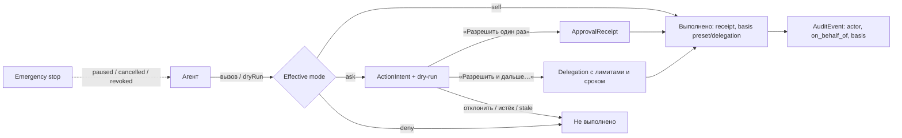

# Доменная модель: пространства, снимки, реакции и ремиксы

Редакция 14 сентября 2026, [Opus review «community frame»](../../reviews/2026-09-14-opus-community-frame/review.md); модель агента уточнена [Opus review «agent delegation»](../../reviews/2026-09-14-opus-agent-delegation/review.md) — [§7](#7-агент-как-исполнитель-по-поручению). Названия сущностей здесь технические; их пользовательские имена закреплены [словарём](../../reviews/2026-09-14-fable-brand-update/review.md#словарь): Artifact — «работа» или конкретный тип; ShareGrant `owner/invited/link/team/company` — «Только я / Одному человеку / По ссылке / Команде / В компании»; PublicationSnapshot `published` — «Показано всем · снимок vN»; Remix/Origin — «Взять за основу / Основано на…»; Bookmark — «Сохранить»; Reaction `useful` — «Полезно»; AgentConnection с preset — «Агент действует по вашему поручению: Сам / С подтверждением / Никогда». Целевой контракт, не реализованная схема: в [локальном срезе](LIVE_SLICE_2026-09-13.md) есть только личные аккаунты, файлы, папки, версии и ссылки. Требования — [F31–F42](REQUIREMENTS.md#сообщество-артефактов-f31f42), физическое хранение и grants — [ARCHITECTURE](ARCHITECTURE.md), режимы доступа — [SHARING_AND_DISCOVERY](SHARING_AND_DISCOVERY.md).

## 1. Три пространства и две поставки

Полка различает **где лежит работа** и **кто её видит**. Это разные оси, и ни одно действие не переносит работу между пространствами молча.

| Пространство | Что в нём | Владелец данных | Кто видит по умолчанию | Как попасть наружу |
|---|---|---|---|---|
| **Моя Полка** (личная библиотека) | Свои работы, «Входящие от агента», «Сохранённое», «Мои публикации» | Personal tenant пользователя | Только владелец | ShareGrant (ссылка) или отдельный PublicationSnapshot |
| **Библиотека команды** (Light, M1.3) | Работы команды 20–40 человек, подборки команды | Organization tenant команды | Участники команды (Membership) | ShareGrant внутри команды; в публичную витрину — **нет пути** в M1.3 |
| **Витрина** (публичная) | Только PublicationSnapshot в состоянии `published` + редакционные демо | Автор остаётся владельцем исходника; проекция принадлежит сервису | Все, включая гостей | Это и есть «наружу»; индексация — отдельное согласие |
| **Библиотека компании** (Enterprise, M4) | Работы и подборки внутри self-hosted установки | Tenant компании | По ACL/SSO компании | Внешняя публикация только по политике компании; публичная витрина сервиса не подключена по умолчанию |

```mermaid
flowchart LR
  AG[Агент пользователя] -- capture --> IN[Входящие от агента]
  IN --> MY[Моя Полка: Artifact → Revision]
  MY -- ShareGrant --> RD[Получатель по ссылке]
  MY -- «Предложить в витрину» --> PS[PublicationSnapshot]
  PS -- ModerationCase --> VIT[Витрина]
  VIT -- Bookmark / Reaction --> MY
  VIT -- «Взять за основу» --> RMX[Новый Artifact с Origin]
  RMX --> MY
  RMX -- «Передать агенту» --> AG
  TEAM[Библиотека команды] -. нет пути в M1.3 .-> PS
```

**Light** — hosted-поставка: личные аккаунты и команды 20–40 человек, серверы в России (решение владельца и план; провайдер, маршруты, «без VPN» и соответствие законодательству о персональных данных ещё не проверены и не заявляются), простой вход без SSO. **Enterprise** — self-hosted поставка того же application contract внутри контура компании: SSO, внутренние агенты, egress policy, аудит, offboarding; «данные никогда не покидают контур» не обещается до проверки egress. Установки не синхронизируются; перенос — явная миграция ([J39](PRODUCT_AND_STORIES.md#j39-миграция-light--enterprise)).

## 2. Сущности

Сущности из [ARCHITECTURE §2](ARCHITECTURE.md#2-модель-данных) (Identity, Blob, UploadSession, Job, AuditEvent) сохраняются. Ниже — объекты продуктовой рамки. «Отдельный объект» означает собственный ID, жизненный цикл и проверку прав; «свойство/ребро» — запись, которая не существует без родителя.

| Сущность | Вид | Ключевые поля | Инварианты и приватность |
|---|---|---|---|
| **Tenant** | Отдельный объект | `kind = personal \| team \| organization`, deployment (`light \| enterprise`), policy version | Граница данных. Foreign keys не соединяют объекты разных tenants. `team` существует только в Light, `organization` — в Enterprise |
| **Workspace** | Отдельный объект | tenant, name, default flag, agent policy (`allowed \| disabled`) | Личный tenant получает один workspace без формы настройки. Папки внутри workspace организуют, но не выдают права в Light |
| **Membership** | Отдельный объект | tenant/workspace, identity, role (`owner \| member`; Enterprise добавляет `admin`, `security_admin`, `auditor`, `reviewer`), state, invitedBy | Ссылка или email-домен не создают membership. Отключение membership отзывает сессии, ShareGrant, выданные этим участником ссылкам на работы команды, и AgentConnection в этом tenant |
| **Artifact** | Отдельный объект | owning tenant, createdBy, workspace, folder, title, kind (`html \| zip \| pdf \| image \| file`), category, **sensitivity**, current revision, origin | Новая работа owner-only. Owning tenant ≠ createdBy: уход автора не удаляет работу команды |
| **Revision** | Отдельный объект, immutable | artifact, parent, manifest hash, blobs, author actor (`human \| agent_connection`), viewer profile, created via (`upload \| capture \| import \| remix`) | Не меняется после receipt. Правка = новая revision. Share pointer и публикация не переключаются от сохранения |
| **Origin** | Ребро, immutable | revision → `public_snapshot \| team_artifact \| import_url \| demo`, source ID + hash, verified flag, display attribution | Хранит, **от чего** сделана работа. Не копирует права и private metadata источника. Origin `team_artifact` блокирует подачу в витрину (F36). Агентский `originRef` проверяется сервером: verified только если источник существует и доступен этому actor |
| **PublicationSnapshot** | Отдельный объект, immutable содержимое | author identity, source artifact + revision + manifest hash, **публичные** title/description/cover/category/tags, remix policy (`remix_allowed \| view_only`), index opt-in, sensitivity at submit, state, version link на предыдущий snapshot | Отдельная публичная копия, а не окно в живую работу. Метаданные вводятся/подтверждаются заново и не берутся из приватного DTO. Blobs закреплены ссылками и не удаляются GC, пока snapshot `published`. Правка исходника не меняет snapshot; обновление = новый snapshot + новый ModerationCase |
| **ModerationCase** | Отдельный объект | kind (`submission \| report \| appeal \| auto_flag`), target snapshot, reporter (может быть гостем), reason category, state, decision, reason text, moderator, policy version, timestamps | Модератор видит только target snapshot и данные заявки, не библиотеку и не другие revisions. Решение привязано к manifest hash через CAS. Все переходы пишут AuditEvent |
| **Bookmark** | Отдельный объект (лёгкий) | identity, target (`publication_snapshot \| team_artifact`), createdAt | Уникальная пара. Не копия и не доступ: при чтении права проверяются заново; снятая работа показывается нейтральной заглушкой |
| **Reaction** | Отдельный объект (лёгкий) | identity, publication snapshot, type (единственный: `useful` — «Полезно»), createdAt | Одна на пару identity × snapshot; повтор — идемпотентный toggle. Только для `published`. Автор не ставит себе. Не влияет на порядок витрины в M1.1 |
| **Remix** | Не отдельный тип: Artifact, у первой revision которого Origin `public_snapshot`/`team_artifact` | — | Копируется только публичный bundle snapshot (или разрешённая командная работа внутри той же команды). Новый владелец, private по умолчанию. Счётчик ремиксов источника — агрегат; личности авторов неопубликованных ремиксов не раскрываются |
| **Collection** | Отдельный объект | owner (identity или tenant), visibility (`private \| team \| editorial`), ordered refs, title | Ссылки, не копии и не права. Элемент без доступа не показывается. `editorial` создают только модераторы/редакция для витрины (M1.1). Публичные пользовательские подборки отложены |
| **AgentConnection** | Отдельный объект | principal identity (доверитель), tenant + workspace (одно пространство на подключение), client label, **preset** (`save_only \| assistant \| assistant_with_delegations`; Enterprise — policy profile), policy version, token digest, state, createdAt, lastUsedAt, pausedAt, revokedAt | Создаётся человеком через экран согласия, токен не показывается в чате. Повышение preset — только человеком в UI с повторным согласием; понижение действует сразу. Пауза и отзыв мгновенно запрещают новые вызовы. Действия агента пишутся с actor `agent_connection` и `on_behalf_of` = principal |
| **Capability** | Перечисление + effective mode | ID, группа, **потолок режима** в поставке (`self \| ask \| deny`), признак «делегируется», правила ужесточения. Каталог и матрица — [AGENT_CAPTURE_AND_IMPORT](AGENT_CAPTURE_AND_IMPORT.md#capabilities-агента-self-ask-deny) | Effective mode вычисляется сервером на каждом вызове по [§7.2](#72-вычисление-режима). Режим `deny` из [неизменяемого списка](#73-что-агенту-запрещено-всегда) не поднимается ни preset, ни Delegation, ни политикой workspace. *Superseded 2026-09-14:* фиксированный набор Light `capture`/`inbox.read`/`gallery.read` стал preset «Только сохранять» |
| **Delegation** | Отдельный объект | principal, connection, capability, scope (artifact \| folder \| workspace), limits (макс. аудитория, макс. срок создаваемой ссылки, число действий в день/всего, исключения sensitive/team-origin), expiresAt (обязателен), createdBy human, created via (`approval_screen \| connection_screen \| admin_policy`), state, usage counters | Ограниченное поручение: переводит `ask` в `self` только для делегируемой capability, в scope и лимитах. Не создаётся и не продлевается агентом. Не переживает AgentConnection, паузу или emergency stop. Не действует на объекты, для которых ужесточение запрещает делегирование |
| **ActionIntent** | Отдельный объект | connection, on_behalf_of, capability, target (object + revision), параметры (audience, expiry, metadata), **dry-run результат** (аудитория до/после, предупреждения, основание режима, кто подтверждает), fingerprint (target revision + параметры + policy version), requestId, state, expiresAt | Запрос агента на действие в режиме `ask`. Подтверждение привязано к fingerprint: изменилась revision, параметры или политика — intent `stale`, нужен новый. Не содержит token ссылки. Повтор тем же `requestId` возвращает тот же intent |
| **ApprovalReceipt** | Отдельный объект, immutable | intent, approver identity, decision (`approved \| rejected`), fingerprint, версия показанного dry-run, способ (сессия UI, повторный вход для sensitive/Enterprise), delegation (если создана «Разрешить и дальше»), policy version, time | Доказательство человеческого решения. Выполнение действия ссылается на receipt; без receipt или активной Delegation сервер не расширяет аудиторию по вызову агента. Агент получает статус и ID, но не может создать receipt |
| **AgentHandoff** | Ребро | connection, artifact + revision, scope (`read \| read_and_capture`), createdBy human, basis (прямое «Передать агенту» \| ApprovalReceipt на `library.read`), expiresAt, revokedAt | Человек явно «передаёт агенту» одну работу или подтверждает запрос агента на чтение. Даёт чтение этой revision и (при `read_and_capture`) `capture` новой revision в этот artifact. Не открывает остальную библиотеку. Истекает, отзывается человеком и emergency stop |
| **ShareGrant** | Отдельный объект | artifact, audience (`owner \| link \| invited \| team \| company`), target mode (`published_pointer \| pinned`), revision, generation, operations, expiry, revokedAt | Прежнее ShareLink/Grant. Не является публикацией: не попадает в витрину, каталог, sitemap; noindex. «Закрыть весь внешний доступ» отзывает и ShareGrant, и PublicationSnapshot |
| **ViewEvent** | Агрегируемое событие | target, viewer class (`author \| member \| link_recipient \| guest \| bot`), day bucket | Для dashboard автора и метрик. Не содержит identity гостя, token, содержание. Боты и автор исключены из счётчиков |

## 3. Чувствительность

`sensitivity = normal | sensitive`; в Enterprise дополнительно действует classification компании (F10). `sensitive` выставляется:

- автором вручную;
- автоматически по выбранной категории: здоровье, расписание и местоположение, финансы, дети, данные других людей;
- подсказкой агента в `capture` — агент может **повысить**, но не понизить чувствительность.

Понижение делает только владелец с подтверждением; действие пишется в audit; для агента `sensitivity.lower` — `deny` всегда. Sensitive также ужесточает режимы агента ([§7.4](#74-ужесточение-sensitive-team-origin-classification)). Автоматическое распознавание персональных данных в произвольном HTML не обещается: это не DLP.

Поведение `sensitive`: работа остаётся owner-only; «По ссылке» требует отдельного предупреждения; обложка в мессенджерах всегда общая; подача в витрину проходит [J38](PRODUCT_AND_STORIES.md#j38-приватный-чувствительный-артефакт): предупреждение → новая «очищенная» revision (обычно пересобранная агентом на демо-данных) → повторный ввод публичных метаданных → обязательная ручная модерация с флагом → index opt-in выключен и недоступен до публикации.

## 4. Состояния

**PublicationSnapshot:** `draft → submitted → checking → in_review → published | needs_changes`; `draft/submitted/in_review → withdrawn` (автор); `published → withdrawn` (автор) `| hidden` (модератор) `→ restored` только через новый ModerationCase `appeal`. Повторный старый approval не оживляет снимок.

**ModerationCase:** `open → in_review → resolved(approved | needs_changes | hidden | no_action) → [appeal → in_review]`. Срочные категории жалоб (персональные данные, вредоносное поведение, фишинг) допускают немедленное временное скрытие до решения.

**AgentConnection:** `pending_consent → active ⇄ paused → revoked`; `paused` — после emergency stop или паузы человеком/администратором, возврат в `active` только человеком (Delegation и AgentHandoff при этом не восстанавливаются); отключение membership или workspace agent policy переводит в `revoked`.

**ActionIntent:** `pending_approval → approved → executed | failed`; `pending_approval → rejected | expired | cancelled | stale`; `approved → stale`, если при выполнении fingerprint не совпал. `cancelled` — агентом, человеком или emergency stop. Режим `self` intent не создаёт: операция сразу получает receipt с основанием `preset` или `delegation`.

**Delegation:** `active → expired | exhausted | revoked`. Пауза подключения и emergency stop переводят в `revoked`; продление = новая Delegation человеком.

## 5. Границы приватности (обязательные отрицательные проверки)

1. Никакой объект витрины (карточка, поиск, sitemap, OG, счётчик, профиль автора, editorial Collection) не строится из Artifact/Revision/ShareGrant — только из PublicationSnapshot `published`.
2. Работа команды или работа с Origin `team_artifact` не может стать PublicationSnapshot в M1.3 ни через UI, ни через API, ни через MCP. Это защита от случайной публикации, не DLP: скачанный и заново загруженный файл сервер отличить не обязан.
3. Агент не расширяет аудиторию (ShareGrant `link/invited/team/company`, retarget живой ссылки, подача PublicationSnapshot, index opt-in) без ApprovalReceipt на точный fingerprint или активной Delegation в её лимитах; не создаёт Reaction и ModerationCase; не читает содержимое библиотеки за пределами своих captures, AgentHandoff и Delegation `library.read`. *Superseded 2026-09-14:* прежняя формулировка «агент не создаёт ShareGrant, PublicationSnapshot, Bookmark» — черновик снимка и Bookmark теперь `self` ([§7](#7-агент-как-исполнитель-по-поручению)).
4. Bookmark/Reaction/Collection не выдают доступ; снятый или скрытый snapshot не раскрывается через них.
5. Модератор не видит других revisions, private metadata, ShareGrant, сохранённое и подключения автора.
6. Dashboard автора показывает агрегаты; не раскрывает личности читателей, закладок и авторов неопубликованных ремиксов.
7. Ремикс не наследует private sources, комментарии и metadata источника; исходный автор не получает доступа к ремиксу.
8. В Enterprise `gallery.read` читает только библиотеку компании; обращение к публичной витрине сервиса — внешний egress и по умолчанию запрещено.
9. Token и полный URL ShareGrant не попадают в ответ агенту, ActionIntent, события MCP, AuditEvent, журнал агента и логи. Агент получает grant ID, аудиторию, срок и адрес работы для владельца; ссылку копирует человек в Полке.
10. Агент не может изменить собственные права: preset, capabilities, Delegation, AgentHandoff, подтверждение своего или чужого ActionIntent недоступны actor `agent_connection` через любой транспорт.
11. Каждое действие агента пишет AuditEvent с `actor = agent_connection`, `on_behalf_of`, capability, режимом и основанием (`preset | delegation:<id> | approval:<receipt>`); отказ `deny` пишется без содержимого и без раскрытия объектов вне scope.
12. Dry-run не имеет побочных эффектов, кроме rate limit, и не раскрывает существование объектов вне scope агента.
13. Emergency stop в одном действии человека: все подключения principal в `paused`, все `pending_approval` intents — `cancelled`, все Delegation и AgentHandoff — `revoked`; незавершённые мутации агента отклоняются при commit. Сохранённые работы остаются.
14. Ужесточение (sensitive, team-origin, classification) только понижает режим и никогда не повышает; Delegation не обходит ужесточение.

## 6. Соответствие прежним названиям

| Было | Стало | Статус |
|---|---|---|
| PublicationSubmission ([COMMUNITY_PUBLICATION](COMMUNITY_PUBLICATION.md)) | PublicationSnapshot в состояниях до `published` | Superseded, смысл сохранён |
| Publication | PublicationSnapshot `published` + публичная проекция | Superseded, смысл сохранён |
| ModerationDecision, PublicationReport | Решение и kind внутри ModerationCase | Superseded, смысл сохранён |
| ShareLink / Grant | ShareGrant | Переименование; контракт SHARING_AND_DISCOVERY без изменений |
| Reaction «лайк» | Reaction `useful` — одна реакция «Полезно» | Superseded 2026-09-14 |
| Разрешённая копия M2 | Remix (Origin) в M1.1 без редактора | Перенесено, см. [DELIVERY_PLAN](DELIVERY_PLAN.md) |
| Режим «В компании» M4 для hosted | «В команде» M1.3 Light; «В компании» остаётся Enterprise M4 | Уточнено |
| Фиксированный набор Light `capture`, `inbox.read`, `gallery.read`; «агент сохраняет и читает, но не делится» | Capability с режимом `self \| ask \| deny`; прежний набор = preset «Только сохранять» | Superseded 2026-09-14 ([agent delegation](../../reviews/2026-09-14-opus-agent-delegation/review.md)) |
| Human-only `share.*`, `publication.submit`, `bookmark.*`, `remix.create`, `handoff.create` | `ask` через ActionIntent/ApprovalReceipt или `self`; `deny` остаётся для прав на материал, модерации, реакций, понижения sensitivity, участников, собственных прав и финального утверждения | Superseded 2026-09-14 |
| AgentHandoff только по кнопке человека | Также результат подтверждения запроса агента `library.read` | Расширено |
| «Артефакт», «публичный снимок», «приватно» как подписи интерфейса | «Работа»/тип, «Показано всем · снимок vN», «Только я»; технические имена остаются в модели | Superseded 2026-09-14 ([brand update](../../reviews/2026-09-14-fable-brand-update/review.md)) |

## 7. Агент как исполнитель по поручению

Добавлено 14 сентября 2026 по решению владельца. Агент — **исполнитель по поручению** (delegate) конкретного человека-доверителя (principal). Человек задаёт policy один раз — preset подключения и, при желании, ограниченные поручения — и не обязан подтверждать каждую безопасную операцию. Всё, что расширяет круг людей, видящих работу, требует явного подтверждения или ограниченного поручения. Решения о правах, модерации, участниках и корпоративном утверждении агенту не передаются никогда. Один контракт действует в Light и Enterprise; Enterprise добавляет слои политики, а не другой механизм.



### 7.1. Режимы

| Режим | Что происходит | Где уместен |
|---|---|---|
| `self` | Агент выполняет сам; ответ — receipt с основанием; действие видно в журнале агента; обратимые действия можно отменить из журнала | Сохранение, чтение своего, организация личной библиотеки, подготовка публикации, снижение доступа, отзыв созданной им ссылки |
| `ask` | Сервер создаёт ActionIntent с dry-run и не выполняет действие до ApprovalReceipt; агент получает `pending_approval`, ID и адрес страницы подтверждения в Полке | Расширение аудитории, чтение чужой для агента работы, необратимые изменения |
| `deny` | Сервер отклоняет с кодом причины; ничего не создаётся, кроме записи отказа | [Неизменяемый список](#73-что-агенту-запрещено-всегда) и всё, что закрыто политикой или ужесточением |

Порядок строгости: `deny` < `ask` < `self`. Dry-run доступен для любой capability, в том числе запрещённой: он возвращает режим, причину и предполагаемый эффект без выполнения.

### 7.2. Вычисление режима

```
mode = потолок capability в поставке              # deny-список не выше deny
mode = min(mode, политика workspace)               # владелец команды (M1.3), администратор Enterprise (M4)
mode = min(mode, preset подключения)               # выбор человека
mode = min(mode, ужесточение объекта)              # sensitive, team-origin, classification
если mode == ask и capability делегируется и ужесточение не запрещает делегирование
   и есть активная Delegation (capability, scope, лимиты, срок): mode = self (basis = delegation)
```

Каждый шаг даёт код причины, который возвращается в dry-run и пишется в audit. Клиент, MCP-обёртка или слово в payload режим не меняют.

### 7.3. Что агенту запрещено всегда

Не настраивается preset, Delegation, владельцем команды или администратором Enterprise:

1. Подтверждение прав на материал и условий публикации (`publication.attest_rights`).
2. Модерация и жалобы: `moderation.*`, решения по ModerationCase, `report.create`.
3. Reaction «Полезно» (`reaction.*`) — это суждение человека.
4. Понижение sensitivity и classification (`sensitivity.lower`).
5. Участники и роли: `membership.*`, приглашения в команду/компанию, настройки команды и workspace policy.
6. Изменение собственных прав: `connection.*`, `delegation.*`, `handoff.create`, `intent.approve` (включая подтверждение intents других подключений).
7. Финальное утверждение корпоративной ревизии: `review.approve`, `release.approve/publish`, `design.certify`.
8. Окончательное удаление и аккаунт: `artifact.purge`, `account.*`.
9. Получение token ссылки или чтение работ вне scope.

### 7.4. Ужесточение: sensitive, team-origin, classification

| Условие | Эффект для агента |
|---|---|
| **sensitive** | Расширение аудитории — только `ask` и **не делегируется**; страница подтверждения показывает предупреждение J38; `share.discovery` — `deny`; `publication.submit` — `ask` с условиями J38 (новая revision без личных данных или явное подтверждение человеком). В `library.organize` название sensitive-работы скрыто («Личная работа»), если она не передана через AgentHandoff; `library.read` — `ask`, не делегируется |
| **team-origin** (работа team tenant или Origin `team_artifact`) | `publication.prepare/submit` — `deny` (F36); «По ссылке» — `deny`, если владелец команды не включил, иначе `ask` без делегирования; копия в Мою Полку — `deny`, пока владелец не разрешил, затем `ask`; «В команде» — `ask`; потолок режимов для команды задаёт владелец (агенты выключены / «Только сохранять» / «Помощник») |
| **Enterprise classification** | Администратор задаёт потолок на пару capability × класс; внешняя аудитория для агента по умолчанию `deny`; политика может направить подтверждение reviewer вместо principal и требовать, чтобы подтверждающий не был доверителем (разделение обязанностей); срок и наличие Delegation — по политике; для высоких классов — повторный вход SSO при подтверждении |

### 7.5. Presets Light и политики Enterprise

Light не показывает галочки capabilities: человек выбирает один из трёх presets, матрица доступна в «Подробнее» только для чтения. Точные строки — [матрица](AGENT_CAPTURE_AND_IMPORT.md#capabilities-агента-self-ask-deny).

| Preset | Сам (`self`) | С подтверждением (`ask`) | Поручения |
|---|---|---|---|
| **Только сохранять** (`save_only`) | Сохранять, читать свои квитанции и витрину | — (всё остальное `deny`) | Нет |
| **Помощник** (`assistant`, предлагается по умолчанию при условии E10) | + организовывать Мою Полку, сохранять в «Сохранённое», брать за основу, готовить публикацию, снижать доступ, отзывать созданные им ссылки | Ссылка, приглашение, «Обновить по ссылке», «В команде», подача в витрину, индексация, чтение других работ, корзина | Нет |
| **Помощник с поручениями** (`assistant_with_delegations`, M1.1 после E12) | Как «Помощник» | Как «Помощник» | Человек может создать Delegation для ссылки, обновления ссылки и чтения папки: только личные не-sensitive работы; срок поручения ≤ 30 дней, срок создаваемой ссылки ≤ 7 дней, ≤ 10 расширений аудитории в день (предлагаемые пороги) |

**Enterprise** использует те же capability ID, ActionIntent, ApprovalReceipt, Delegation и AuditEvent. Поверх: политика workspace (потолки по classification), роли `admin` (политика), `security_admin` (kill switch подключений и adapters), `reviewer` (подтверждение intents, которые политика направляет не доверителю), `auditor` (журнал/экспорт); сервисные агенты имеют назначенного ответственного человека как principal. Финальное утверждение корпоративной ревизии остаётся `deny` для любого агента.
