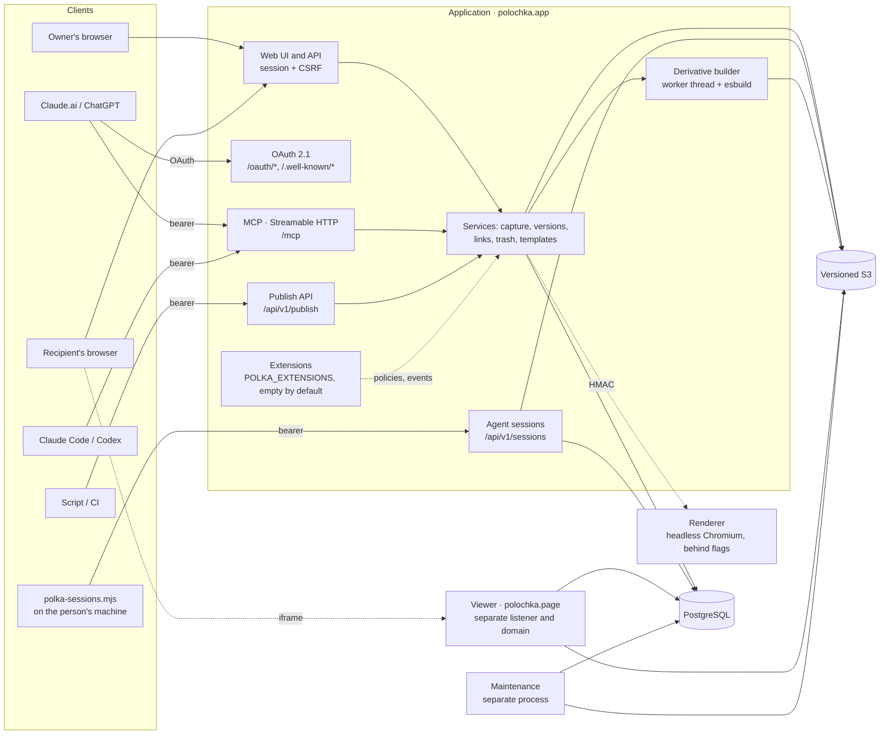

# Architecture

How Полка (Polka) is put together as of 0.12 (October 2026): what runs where and where the trust boundaries are. The contracts of individual parts are in [specs/](../README.md#спецификации) (Russian). Russian version: [docs/architecture.md](../architecture.md).

## Start here: three files

To understand the server, read these first, in this order:

1. [`apps/server/app.ts`](../../apps/server/app.ts): `createApp()` registers every web, OAuth, MCP and publish API route, then agent sessions, then extensions, so it is the map of what the server answers and in which order.
2. [`apps/server/artifacts.ts`](../../apps/server/artifacts.ts): the core service, uploads becoming immutable versions; it defines the `Actor` type and `audit()` that almost every other service imports.
3. [`apps/server/mcp-server.ts`](../../apps/server/mcp-server.ts): the agent surface, where each `polka_*` tool checks its scope and calls the same services as the web UI, which is the "one service per action" rule in practice.

[`apps/server/main.ts`](../../apps/server/main.ts) (about 100 lines) is the entry point: it checks the restore gate, builds the app and starts the second listener for the viewer.

## What runs where

| Part | Where | What it does |
|---|---|---|
| Application | One Node.js process (`apps/server/main.ts`), Fastify, port 4390 | Web UI (React/Vite, built into `dist`), JSON API, MCP, OAuth, publish API, agent sessions |
| Viewer | The same process, a second Fastify listener (port 4391), its own registrable domain | Serves the built derivative of an interactive page, the static view and project files (the project viewer, `/project/<token>/…`: a page tree, Markdown rendered by Полка, HTML in a sandbox with no network), only against a short-lived grant. It has no access to Полка's cookies or API |
| Derivative builder | `worker_threads` inside the application, esbuild as a child process | Turns a saved bundle into one self-contained HTML file (`bundle-inline`, React runtime) |
| Renderer | A separate container (`--profile renderer`) or VM, [deploy/renderer](../../deploy/renderer/README.md); off by default | Headless Chromium with no access to the database, storage or secrets: snapshots of public SPAs for import by link (`RENDERED_IMPORT_ENABLED`) and first-screen snapshots for covers (`COVER_SNAPSHOTS_ENABLED`). The application signs its requests with HMAC; outbound traffic goes only through an egress proxy that refuses private addresses |
| Maintenance | A separate process (`npm run maintenance:watch`) | Removes expired uploads, sessions, grants and sign-in codes. It never touches user material |
| PostgreSQL | External, migrations in `deploy/migrations/` | Metadata, versions, links, agent connections, OAuth, audit. The application has its own role without DDL (`deploy/runtime-grants.sql`) |
| Versioned S3 | External (MinIO locally) | Originals and derivatives. Reads always name an exact object version |

In a hosted installation Caddy sits in front of the application: it issues TLS for both domains and proxies to loopback. Details: [deploy/hosted/README.md](../../deploy/hosted/README.md) (Russian).

## Data

- **Works and versions.** Every version is immutable and stores a manifest (files, MIME types, sizes, SHA-256) and the exact S3 object versions. A new version is created with compare-and-swap, so a concurrent change cannot overwrite someone else's.
- **Isolation.** Every read is filtered by tenant (shelf). A personal shelf (`tenants.kind='personal'`) belongs to one account. A department shelf (`kind='team'`, behind the `TEAM_SHELVES` flag, `off` by default) is a tenant without an owner; access comes from `tenant_members` rows with the roles `reader`, `author`, `curator`, `admin` ([TEAM_SHELVES](../specs/TEAM_SHELVES.md)). An agent connection is bound to one shelf and its role there. Shared access to templates comes from membership in a library, not from a shared tenant.
- **Covers.** A work's card shows a cover the server picks: a text cover (heading and lead from the HTML) or a visual one (a first-screen snapshot from the renderer, only with `COVER_SNAPSHOTS_ENABLED`). Cover facts are stored per version in `revision_covers` ([SHELF_COVERS](../specs/SHELF_COVERS.md)).
- **Projects.** A folder of linked pages (up to 400 files, 48 MiB, plus up to 400 MiB of video) is saved as one bundle version, `project-v1`, and opens in the project viewer on the viewer domain ([PROJECTS](../specs/PROJECTS.md)).
- **Links.** A link's secret travels in the fragment (`/s#…`), so it never reaches server logs. A link is bound to a specific version and has an expiry and revocation. Private works are not indexed.
- **Quotas.** Space is reserved before the write to S3 and reconciled after it. Derivatives have their own quota.
- **Agent sessions** are not works ([AGENT_SESSIONS](../specs/AGENT_SESSIONS.md)). `scripts/polka-sessions.mjs` reads Claude Code and Codex sessions on the person's machine, replaces secrets with keyed fingerprints there, and uploads an index, a secrets report and a shortened transcript. The server (`apps/server/agent-sessions.ts`) keeps them in their own tables (`agent_sessions` and related) and transcripts in storage under `<shelf>/sessions/`, with a separate quota (`AGENT_SESSION_QUOTA_BYTES`, `0` by default, which turns the feature off). Sessions have no versions, are not in shelf search, and a repeated upload replaces the session.

## How a page reaches the recipient

1. A work arrives through an upload, «Вставить код» (paste code), MCP (`polka_capture`, `polka_publish`) or `POST /api/v1/publish`. All paths call the same service. A retry with the same idempotency key returns the same result.
2. The original is stored privately and gets a profile: `static` (shown without scripts), `limited` or `unsupported`.
3. If the installation has the interactive viewer on, the builder makes a derivative: it inlines resources, compiles JSX/TS and supplies the `react-runtime-v1` libraries (React, lucide-react, recharts, lodash, d3, three, papaparse, mathjs, chart.js and Tailwind v4). Any other import fails the build. Contract: [BUNDLE_INLINE_SPEC](../BUNDLE_INLINE_SPEC.md).
4. The recipient opens the link on the application domain. The work's page embeds an iframe from the viewer domain, which serves the derivative against a grant.
5. A page without an interactive version is shown in a static sandbox: a CSP with no scripts and no network. If the viewer is configured, the static view also comes from it (`/static/:token`, a 60-second grant), and the application domain never serves user HTML. Only a single-domain installation serves it from the application domain (`/api/…/document`).
6. External `http(s)` links in the static view are rewritten on the way out to `APP_ORIGIN/away#<token>`. The token is an HMAC of the address and an expiry, keyed with a key derived from `LINK_KEY`. The `/away` page names the address and waits for a click; without a valid signature it opens nothing. The interactive view opens no links: its sandbox has no `allow-popups`.

## Extension points

The core is one application for the cloud and for self-hosting. An extension adds rules and features without changing it ([EXTENSIONS](../specs/EXTENSIONS.md)):

- `POLKA_EXTENSIONS` names packages or module paths, comma-separated. Empty means the core alone, and every hook is a no-op.
- `apps/server/extensions.ts` loads them once at start; `createApp()` registers them after the core routes. The interface is `packages/extension-api/index.ts`.
- Hooks: `register(app, context)` for routes under `/api/ext/<name>/`; policies `linkIssue`, `linkOpen`, `agentScope`, `sessionDelete` (the first refusal wins); `onEvent` after commit (at most once, may be lost); read access through `context.content`, `context.sessions` and `context.auditFeed`. An extension may also ship one web module, served as `/ext/<name>.js`, that adds sections to fixed places in the UI.
- An extension is trusted code in the core's process and sees every shelf of the installation, so only the operator enables it.

The commercial edition for organisations is such an extension, `@polka/enterprise`, from a private repository; it plugs in through `POLKA_EXTENSIONS` and needs a signed licence key. polochka.app runs the core only. See [COMMERCIAL.md](../../COMMERCIAL.md#open-core-and-commercial-edition-summary-in-english).

## Trust boundaries

| Boundary | How it is protected |
|---|---|
| User HTML ↔ Полка | A separate registrable domain for the interactive and static views, `sandbox` without `allow-same-origin`, a strict CSP with no network, a short-lived grant for a specific version. External links in the static view go through the signed `/away` page. Contracts: [LIVE_VIEWER_SPEC](../LIVE_VIEWER_SPEC.md), [HOSTED_VIEWER_DELTA](../HOSTED_VIEWER_DELTA.md) |
| Building foreign code | A worker with a 64 MB heap, a 5 s build deadline, one runtime build at a time per process. esbuild has a memory limit (`ulimit -d`, enforced on Linux only; on macOS only the worker's deadline applies). esbuild loads only the page's files and the allowed libraries (checked in the build plugin). Output is capped at 8 MiB |
| Agent ↔ account | A connection bearer token with scopes (`context`, `read`, `source:read`, `capture`, `revise`, `share`, `manage`, `sessions`; an OAuth connection may also have `sign_in`, a one-time link into a temporary shelf). A developer token is created with the chosen scopes; on the OAuth consent page all requested scopes are ticked by default and the owner can untick any except `context`. `sessions` is separate, off by default and only for a personal shelf. A reader of a department shelf gets no writing scopes. A project upload token (`polka_project_upload`) is a child connection valid for 30 minutes with the audience `/api/v1/projects`. The database stores only hashes. Revocation on the «Агенты» (Agents) page takes effect at once |
| Chat app ↔ account | OAuth 2.1: PKCE S256, dynamic client registration, resource indicators, refresh-token rotation with reuse detection, a consent page with CSRF. See [MCP_CONNECTOR](../MCP_CONNECTOR.md) |
| Browser ↔ API | A session cookie, CSRF and an `Origin` check. Machine routes never read cookies. `/mcp` and `/api/v1/publish` reject a foreign `Origin`; `/oauth/token`, `/oauth/register` and `/oauth/revoke` are server-to-server endpoints without cookies and do not check `Origin` (PKCE and client authentication protect them) |
| Open sign-up ↔ recipients | A new account gets at most 5 open links of 7 days each and no more than `NEW_ACCOUNT_DAILY_LINKS` (10) new links a day. `SHARE_MODERATION` holds a link until review (the page looks like phishing, or the author is new); reports from different recipients pause it. The recipient of such a link gets neither the title nor a grant. The operator decides from an e-mail: the button is a signed token in the fragment of `/moderation#…`, opening it changes nothing, and only a POST acts. See [ABUSE_PROTECTION](../specs/ABUSE_PROTECTION.md) |
| Import by URL (off by default) | Public addresses only. DNS is pinned, every redirect is checked, private ranges are refused, and size and time are limited. See [URL_IMPORT_SUPPORT](../specs/URL_IMPORT_SUPPORT.md) |
| Agent sessions ↔ server | Secrets are replaced on the person's machine before upload, so the server never receives their values; the rules catch known kinds of secrets and telling assignments, not every password. The upload token needs the `sessions` scope and stays in `~/.polka` with mode 600. See [AGENT_SESSIONS](../specs/AGENT_SESSIONS.md) |
| Extensions ↔ core | Trusted code in the same process, enabled only by the operator through `POLKA_EXTENSIONS`. The core's migrations and grant recipes do not change; an extension keeps its tables in its own PostgreSQL schema. See [EXTENSIONS](../specs/EXTENSIONS.md) |

## Code map

| Path | What is there |
|---|---|
| `apps/server` | Fastify application, viewer, MCP, OAuth, publish API, builder, maintenance |
| `apps/server/agent-sessions.ts` | Agent session upload, reading, stats and deletion (`/api/v1/sessions`, `/api/sessions`) |
| `apps/server/extensions.ts` | Loading `POLKA_EXTENSIONS` and calling their policies and events |
| `apps/web` | The React interface. `npm run check:layers` checks its layers ([FRONTEND_COMPONENT_SYSTEM](../FRONTEND_COMPONENT_SYSTEM.md), Russian) |
| `packages` | Shared contracts (zod schemas, limits, the runtime library list), the migration catalogue and the extension API (`packages/extension-api`) |
| `deploy` | Migrations, database role grants, compose files, hosted delivery |
| `scripts` | Migrations, accounts, the test runner, the publish CLI, `polka-sessions.mjs`, restore and maintenance |
| `content/editorial` | Sources of the «Лента» feed pieces (`candidates.json` is the catalogue) |
| `tests` | Integration tests against real PostgreSQL and S3 |
