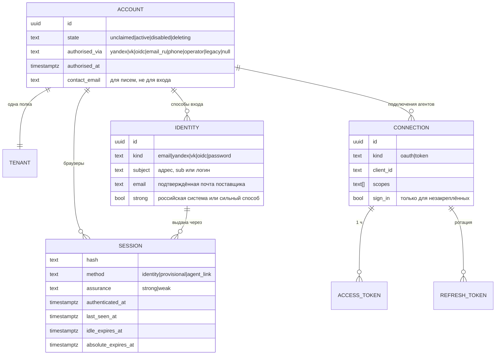

# Ревью аутентификации и авторизации Полки, 24.09.2026

**Что проверено.** `main` @ `019212c`: весь серверный код входа, сессий, OAuth-сервера для агентов, токенов и грантов, веб-страницы входа, согласия и «Агентов», документы. Отдельно, как незавершённая работа, проверена ветка `worktree-agent-a6bc5491dfc5b9cae` (коммит `8b3dabe` и незакоммиченный UI в worktree). В ней временные полки, выбор «у вас уже есть полка», слияние аккаунтов и ссылки для входа, которые выдаёт агент.

**Как проверено.** Код и тесты прочитаны, тесты не запускались. Ссылки вида `файл:строка` указывают на `main`. Пометка **(ветка)** означает `git show worktree-agent-a6bc5491dfc5b9cae:<путь>`, а **(worktree)** — незакоммиченные файлы в `.claude/worktrees/agent-a6bc5491dfc5b9cae`.

**Итог в трёх фразах.**
- Криптография и протоколы сделаны аккуратно: PKCE, ротация refresh-токенов, хэши в базе, запечатанные cookie, проверка Origin, фрагменты вместо query.
- Главные проблемы в модели аккаунта. Одна полка на человека не гарантируется. Коннектор привязывается к той полке, которая случайно открыта в браузере. Вернуться в полку коннектора после выхода нечем. Лимиты по IP не рассчитаны на то, что Claude.ai и ChatGPT ходят с общих адресов.
- Ветка решает часть этого, но ссылка для входа от агента в текущем виде превращает любой OAuth-грант в полную браузерную сессию. Сливать ветку до исправления находок В1–В3 нельзя.

---

## 1. Карта: как запрос становится «этим аккаунтом»

### 1.1. Схема

```mermaid
flowchart LR
  subgraph Человек в браузере
    PW[Логин+пароль<br/>auth.ts signIn] --> S
    EC[Код на почту<br/>email-auth.ts] --> S
    IDP[Яндекс ID / VK ID / OIDC<br/>sign-in-routes.ts] --> S
    PROV[«Начать без регистрации»<br/>(ветка) oauth.ts /authorize/provisional] --> S
    LINK[/enter#токен от агента<br/>(ветка) agent-sign-in-links.ts] --> S
    S[(sessions<br/>cookie polka_session)]
  end
  S -->|identity()| WEB[Веб-API /api/*]
  S -->|+ polka_oauth cookie + CSRF| CONSENT[/oauth/consent → решение]
  CONSENT -->|code 60 c + PKCE| TOKEN[/oauth/token]
  subgraph Агент
    DCR[/oauth/register DCR] --> AUTHZ[/oauth/authorize]
    AUTHZ --> CONSENT
    TOKEN --> AC[(agent_connections<br/>access 1 ч в token_hash)]
    TOKEN --> RT[(oauth_refresh_tokens<br/>ротация)]
    STATIC[Статический токен<br/>со страницы «Агенты»] --> AC
  end
  AC -->|Bearer| MCP[/mcp: инструменты по scope]
  AC -->|Bearer| API[/api/v1/* publish API]
  AC -->|(ветка) polka_open_shelf| LINK
  subgraph Без аккаунта
    SHARE[/s#секрет ссылки] --> G[(grants 60 c)] --> VG[(viewer_grants 60 c)]
    MOD[/moderation#HMAC 7 дн] --> MACT[Действие модерации]
    AWAY[/away#HMAC 12 ч] --> AWAYP[Страница «Вы уходите»]
  end
  S --> VG
```

### 1.2. Таблица механизмов

| # | Механизм | Где | Срок | Хранение | Отзыв | Кто пользуется |
|---|---|---|---|---|---|---|
| 1 | Сессия браузера `polka_session` | `auth.ts:112` (`identity`), выдача `auth.ts:105`, `email-auth.ts:335`, `account-identities.ts:194`, cookie `app.ts:400,424`, `sign-in-routes.ts:164` | 7 дней абсолютно, без продления | `sessions(hash, account_id, expires_at)`, SHA-256; HttpOnly, SameSite=Strict, Secure, Path=/ | Выход удаляет только текущую сессию (`app.ts:433`). Удаление аккаунта и блокировка модератором удаляют все (`account-deletion.ts:329`, `moderation.ts:264`). Списка сессий нет | Веб-интерфейс |
| 2 | Логин и пароль | `auth.ts:64` | — | scrypt в `accounts.password_hash` | Смены пароля нет | Аккаунты, заведённые оператором (`createAccount`, `auth.ts:14`) |
| 3 | Код на почту | `email-auth.ts:160,242`; cookie `polka_email_challenge` (`app.ts:356`) | Код живёт 10 мин, 5 попыток, не больше 3 кодов на адрес за 10 мин | `login_challenges`, HMAC(LINK_KEY), привязан к браузеру | Одноразовый | Все, у кого есть почта |
| 4 | Яндекс ID / VK ID / OIDC | `sign-in-providers.ts`, `sign-in-routes.ts`, `account-identities.ts` | Поток 10 мин (`polka_idp`: AES-GCM, Lax, Path `/api/auth/idp`) | `account_identities(provider, subject, email)` | Отвязка (`account-identities.ts:235`); сессии при отвязке не закрываются | Основной вход на hosted |
| 5 | OAuth 2.1 AS для агентов | `oauth.ts` | Запрос 10 мин (`polka_oauth`: Lax, Path `/oauth`), код 60 с, access 1 ч, refresh-окно 30 дней со сдвигом, не больше 365 дней | `oauth_clients`, `oauth_authorizations`, `agent_connections.token_hash` (access), `oauth_refresh_tokens` | «Агенты» → Отозвать; RFC 7009 `/oauth/revoke`; повтор кода или refresh отзывает всё подключение | Claude.ai, ChatGPT, Claude Code, Codex |
| 6 | Статический токен | `service-auth.ts:154` | 1–30 дней, по умолчанию 7 (`packages/contracts/index.ts:51`) | `agent_connections` без `oauth_client_id` | «Агенты» → Отозвать | CI, скрипты, клиенты без OAuth |
| 7 | Проверка bearer на /mcp и /api/v1 | `mcp-transport.ts:57-95`, `publish-api.ts:175-205`, `service-auth.ts:267` | — | — | Мгновенно: каждая операция перепроверяет строку подключения (`recheckServiceActor`, `withServiceActorTransaction`) | Все агенты |
| 8 | CSRF-токены | `agent_connection_csrf` (`service-auth.ts:131`), `account_deletion_csrf` (`account-deletion.ts:129`); глобально — Origin (`app.ts:161-172`) | 10 мин | Хэши, привязаны к сессии | — | «Агенты», согласие, удаление |
| 9 | Секрет ссылки `/s#…` | `shares.ts`, `/api/resolve` (`app.ts:886`) | Срок ссылки (1/7/30 дней) | Хэш | Отзыв ссылки | Получатели |
| 10 | Гранты просмотра | `share-grants.ts:57`, `live-viewer.ts:77,147`, `static-viewer.ts:53,112`, `template_library_viewer_grants` (миграция 025) | 60 с | Хэши; гранты владельца привязаны к `session.hash` | Истекают сами | Viewer-домен |
| 11 | Токен модерации | `moderation-tokens.ts` | 7 дней | Без состояния, HMAC(LINK_KEY) | Нельзя; только ротацией LINK_KEY | Письма оператору |
| 12 | Подпись `/away` | `away-links.ts` | 12 ч | HMAC | — | Целостность, не авторизация |
| 13 | **(ветка)** Временная полка | `provisional.ts`, `oauth.ts` `/oauth/authorize/provisional` | Сессия 30 дней, продлевается при визите; простой 30 дней → удаление | `accounts.provisional_at/claimed_at` | Закрепление или удаление при простое | Агент без регистрации |
| 14 | **(ветка)** Ссылка для входа от агента | `agent-sign-in-links.ts`, `/api/auth/enter`, `polka_open_shelf` | 5 мин, одноразовая | `agent_sign_in_links`, SHA-256 | Переключатель на подключении, отзыв подключения | «Открой мою Полку» |
| 15 | **(ветка)** Отложенный выбор входа | `sign-in-pending.ts` | 10 мин | **Память процесса**, не больше 5000 записей | — | `/claim`, `/signup/choose` |

**Где сейчас лежат понятия.**
- **Аккаунт и полка.** Один аккаунт = один tenant (`tenants.owner_id`).
- **Способы входа.** Лежат в трёх местах: `accounts.name + password_hash` (пароль), `accounts.email` (код на почту) и `account_identities` (поставщики). У аккаунтов, созданных по почте или через поставщика, есть синтетические `name` и случайный пароль (`email-auth.ts:308`, `account-identities.ts:75`).
- **Сессии.** Не знают, каким способом выданы, когда созданы и с какого устройства.
- **Подключения агентов.** OAuth и статические токены хранятся в одной таблице `agent_connections`. Это хорошее решение, его стоит оставить.

---

## 2. Находки

Уровни: **критично** — эксплуатируемо сейчас с серьёзным ущербом; **высокий** — реальный сценарий ущерба, потери доступа или массовой поломки; **средний** — ограниченный ущерб или требуется условие; **низкий** — гигиена, несогласованность.

Критичных находок на `main` нет. Ветка содержит две находки высокого уровня, которые станут критичными после слияния (В1, В2).

### 2.1. `main`

#### Высокий

**H1. Лимиты по IP душат Claude.ai и ChatGPT: регистрация коннектора и вызовы MCP идут с общих адресов платформы.**
- **Где:**
  - `oauth.ts:260` — `oauth-register:ip` не больше 20 регистраций за 10 минут;
  - `oauth.ts:950` — `oauth-token:ip` 300;
  - `mcp-transport.ts:21,64` — `mcp:ip` 600 сообщений за 10 минут, считается до аутентификации;
  - `publish-api.ts:42,178`.
- **Сценарий.**
  - DCR, обмен кода и каждый вызов MCP у Claude.ai и ChatGPT выполняют серверы платформы, а не браузер пользователя. У всех пользователей Claude.ai один пул egress-адресов.
  - После публикации в каталоге или поста 21-й человек за 10 минут получает 429 на `/oauth/register`, и Claude.ai показывает ошибку подключения.
  - Лимит `mcp:ip` в 600 сообщений на всех пользователей платформы — это примерно 1 сообщение в секунду на весь Claude.ai. Один сохранённый артефакт — это несколько сообщений (`initialize`, `tools/list`, `polka_context`, `polka_publish`).
- **Исправление.**
  - Считать `/mcp` и `/api/v1` по IP только для запросов **без** валидного bearer. После аутентификации лимит — только по подключению и по аккаунту.
  - Для `/oauth/register` и `/oauth/token` поднять лимит по IP на порядок и добавить глобальный лимит DCR в сутки. Отдельный лимит по IP держать только для анонимных ошибок: неверный `client_id` или секрет.
  - Проверить `request.ip` при `TRUST_PROXY` на hosted.

**H2. Одна почта — две полки: вход по коду не видит почту из Яндекс ID и VK ID.**
- **Где:**
  - `email-auth.ts:194-203`, `email-auth.ts:285` — поиск только по `accounts.email`;
  - `account-identities.ts:61,84` — почта поставщика пишется в `accounts.email`, только если создаётся новая полка и адрес подтверждён и свободен; при привязке не пишется никогда;
  - `config.ts:108` — `VK_EMAIL_VERIFIED=false` по умолчанию.
- **Сценарий.**
  - Человек создал полку через VK ID. В `accounts.email` NULL, потому что VK не подтверждает почту.
  - Через месяц на другом устройстве он вводит свой `ivan@mail.ru` в форме кода. Появляется вторая пустая полка, работ нет, коннектор Claude сохраняет в первую.
  - То же после привязки Яндекс ID к полке, созданной по паролю или почте, если потом войти кодом на яндексовский адрес.
  - Настройки при этом показывают «VK ID · ivan@mail.ru» (`features/provider-sign-in/index.tsx:186`), то есть обещают, что почта работает.
- **Исправление (раздел 3, шаг 2).**
  - Почта становится отдельным способом входа (identity `email`).
  - Поиск при входе по коду идёт по всем identity с подтверждённой почтой.
  - Если адрес знаком только из VK или Яндекса, показать «Этот адрес — у полки, в которую вы входите через VK ID» и кнопку VK ID, а не создавать полку.
  - В ветке этим занимается `knownShelf`/`createNew` (см. В7), но источник данных тот же `accounts.email`, так что случай с VK остаётся.

**H3. Коннектор привязывается к той полке, которая открыта в браузере; на экране согласия её не отличить.**
- **Где:**
  - `oauth.ts:549-607` — решение принимается за текущую сессию;
  - `apps/web/src/pages/oauth-consent/index.tsx:213-217` — показано только «Аккаунт: {accountName}», то есть `display_name` (часть почты до @ или ФИО из поставщика);
  - `widgets/navigation/index.tsx:157` — выход ведёт на `/` и теряет запрос.
- **Сценарий.**
  - В браузере с прошлой недели открыта рабочая полка (OIDC компании). Человек подключает Claude Code «для себя», видит «Аккаунт: Иван Петров» и нажимает «Разрешить».
  - Личные черновики месяцами уходят в рабочую полку. У двух полок одного человека одинаковое имя «Иван Петров».
  - Кнопки «Не та полка» нет. Если выйти через меню, запрос подключения теряется.
- **Исправление.**
  - Показывать способ входа и адрес, например «Полка: ivan@mail.ru · вход через VK ID · создана 12.09». В ветке это уже есть: `shelfSummary`, `oauth.ts` (ветка).
  - Добавить ссылку «Не та полка? Войти в другую»: `POST /api/logout` → `/signup?next=<consent url>`. Cookie `polka_oauth` переживает выход, потому что её Path — `/oauth`.
  - Для полки младше 10 минут показывать «Эта полка создана только что».

**H4. После выхода в полку коннектора не вернуться: человек не знает, каким способом она создана.**
- **Где:**
  - `widgets/navigation/index.tsx:142` — «Чтобы вернуться, войдите снова», без указания способа;
  - сессия живёт 7 дней без продления (`auth.ts:106` и остальные места выдачи);
  - `connect-guide.ts:25,48`, `agent-discovery.ts:110,192`, `skills/polka/SKILL.md:20` — агенту велено говорить «создайте полку по почте».
- **Сценарий.**
  - В Claude Code человек подключился, полку создал через Яндекс ID по кнопке на `/signup`.
  - Через 7 дней сессия в браузере истекла, а коннектор работает ещё до года.
  - Человек заходит на polochka.app и вводит почту: получает новую пустую полку (H2). Либо не помнит, как входил.
- **Исправление.**
  - Скользящая сессия: 30 дней с последнего визита, 90 дней абсолютно.
  - Запоминать последний способ входа в браузере (localStorage, без персональных данных) и показывать его на `/signup` первым.
  - Инструмент агента «Открой мою Полку» должен давать **подсказку способа входа**, а не токен (раздел 3.3).

#### Средний

**M1. Перечисление аккаунтов через форму кода.**
- **Где:** `email-auth.ts:197-203`. `signupRoomLeft` и `assertNotDisposable` вызываются только для адресов **без** аккаунта.
- **Сценарий.**
  - С одного IP открыть 3 полки (`EMAIL_SIGNUP_DAILY_PER_IP=3`, `config.ts:69`). Дальше любой адрес без полки отвечает 429 «С этого подключения сегодня уже создано несколько полок», а адрес с полкой — 200.
  - Одноразовый домен без аккаунта даёт 422.
  - Это противоречит `docs/specs/SIGN_IN_PROVIDERS.md:170`.
- **Исправление.** На `start` для неизвестного адреса молча не отправлять письмо и отвечать так же 200. Лимиты новых полок проверять только в `verify` (строка 306 это уже делает) и объяснять причину после ввода кода.

**M2. По умолчанию галочки `read` и `share` стоят для любого самозарегистрированного клиента, включая «(имя не подтверждено)».**
- **Где:**
  - `oauth.ts:55-60,527-529`;
  - `offeredScopes` без `scope` предлагает все scopes (`oauth.ts:187`);
  - противоречит `entities/agent-scope/scopes.ts:28,47`: там `defaultOn: false`, но поле нигде не читается;
  - на странице «Агенты» токен по умолчанию получает только `capture, context` (`pages/agents/index.tsx:143`).
- **Сценарий.** Фишинговая ссылка `/oauth/authorize?client_id=<свой DCR>&redirect_uri=https://evil.example/cb`. Жертва видит «сайт evil.example», но все опасные галочки уже стоят. Один клик — и клиент читает список всей полки и выпускает публичные ссылки на любую работу.
- **Исправление.**
  - `share` и `read` по умолчанию включать только для проверенных хостов (claude.ai, chatgpt.com) и для loopback-клиентов с известным именем.
  - Один источник значений по умолчанию; мёртвое поле `defaultOn` удалить.

**M3. Нет ни списка сессий, ни «выйти везде»; сессии не знают, откуда взялись.**
- **Где:** `deploy/migrations/001_foundation.sql:3` (`hash, account_id, expires_at`), `app.ts:433`, `account-identities.ts:253`.
- **Сценарий.** Человек отвязывает скомпрометированный Яндекс ID, но сессии, выданные через него, живут ещё до 7 дней. Увидеть их и закрыть нельзя.
- **Исправление.**
  - Колонки `created_at, last_seen_at, method, identity_id, user_agent_hint, assurance`.
  - Страница «Где вы вошли».
  - При отвязке способа закрывать его сессии.

**M4. Отвязка может запереть владельца: почта считается способом входа, даже когда код на неё не придёт.**
- **Где:** `account-identities.ts:247`. Условие `!account?.email && rows.length < 2` не учитывает `MAIL_MODE=disabled` и `EMAIL_LOGIN_DOMAINS=signup` (`email-auth.ts:94-100`).
- **Сценарий.** На hosted (`ru-only`, `signup`) полку создали через Яндекс ID с `default_email=x@gmail.com`. Владелец отвязывает Яндекс ID. Коды на gmail не отправляются, и войти больше нечем.
- **Исправление.**
  - Считать почту способом входа только при `MAIL_MODE !== "disabled" && emailLoginAllowed(email)`.
  - Спрашивать подтверждение в интерфейсе (`provider-sign-in/index.tsx:188-194`).

**M5. Повторное подтверждение нигде не требуется: привязка поставщика делается одной текущей сессией.**
- **Где:** `sign-in-routes.ts:104-131` (`POST /api/auth/idp/:provider/link`), `app.ts:495-515`.
- **Сценарий.** Сессия (на `main` — чужой компьютер, в ветке — ссылка от агента, В2) → привязать свой Яндекс ID → постоянный доступ к чужой полке, который переживает выход владельца.
- **Исправление.** Привязка и отвязка способов, выпуск статического токена, удаление, слияние и включение ссылок от агента требуют свежей аутентификации сильным способом (`sessions.authenticated_at` не старше 10 минут, `assurance='strong'`).

**M6. Юридическое ограничение не выражено в модели.** Условие «выдавать ссылку и писать текст, который читают другие, может только пользователь, авторизованный российской системой» в коде `main` отсутствует.
- **Где:** `docs/specs/SIGN_IN_PROVIDERS.md:6` и § 3; в `shares.ts` проверки нет.
- **Сценарий.**
  - Старые аккаунты на Gmail входят по коду и выдают ссылки (так решено: `EMAIL_LOGIN_DOMAINS=any`).
  - Аккаунты, заведённые оператором по паролю, тоже.
  - На своих установках `EMAIL_SIGNUP_DOMAINS=any` по умолчанию. Для них это нормально, но на hosted нет места, где видно, **почему** этот аккаунт вправе делиться.
- **Исправление.**
  - `accounts.authorised_via` (`yandex|vk|oidc|email_ru|phone|operator|legacy`) и `authorised_at`.
  - Одна функция `assertAuthorisedForPublic(c, account)`: её вызывают выдача ссылки, публикация в библиотеке, заметки и комментарии, видимые другим, приглашения.
  - Для `legacy`-аккаунтов дата, после которой нужно привязать Яндекс ID или VK ID. Решение за юристом (`docs/reviews/2026-09-23-legal`).

**M7. Условия соглашения не показаны, когда полку создаёт кнопка поставщика.**
- **Где:** `SignupConsent` рисуется только при `!passwordOnly` (`pages/signup/index.tsx:306`). Кнопки поставщиков видны и в режиме `passwordOnly` (`:155-158`), и на `/?login=1` (`pages/login/index.tsx:71-76`).
- **Сценарий.** Новая полка появляется без акцепта «Соглашения». Юридически слабое место для оферты и для 152-ФЗ.
- **Исправление.** Строка условий рядом с каждой группой кнопок, которая может создать полку.

**M8. Refresh с общим access-токеном в одной колонке: гонки выглядят для клиента как «отключено».**
- **Где:**
  - `oauth.ts:919-923` — refresh перезаписывает `agent_connections.token_hash`, старый access умирает мгновенно, а не через свой час;
  - `oauth.ts:861-882` — повтор предыдущего refresh в пределах 60 с получает `invalid_grant`.
- **Сценарий.**
  - Claude.ai делает два параллельных вызова. Один запускает refresh, второй ещё идёт со старым access и получает 401, после чего клиент запускает второй refresh со старым refresh-токеном.
  - Этот второй refresh получает `invalid_grant` (льготное окно), и клиент считает коннектор отключённым: «Reconnect».
  - Утечки нет, но пользователь видит, что коннектор «сам отваливается».
- **Исправление.**
  - Отдельная таблица `oauth_access_tokens(hash, connection_id, expires_at)`, чтобы старый access доживал свой срок.
  - В льготное окно повтор предшественника отвечает тем же ответом (хранить зашифрованный ответ 60 с) или выпускает новую пару и отзывает предыдущего преемника. Так делают Auth0 и Okta (reuse interval).

**M9. Токены модерации — бессрочные на 7 дней носители без состояния, в том числе для «закрыть и заблокировать».**
- **Где:** `moderation-tokens.ts:21,63-87`, `moderation-routes.ts:83-86`.
- **Сценарий.** Письмо оператору переслано в общий чат или попало в скан почтового шлюза. Неделю любой, у кого есть ссылка, может заблокировать владельца (`close-disable`, `block`). Отозвать ссылку нельзя.
- **Исправление.**
  - Для разрушительных действий — либо сессия оператора, либо одноразовость (`moderation_token_uses`) и срок 24 ч.
  - Ключ модерации отдельный от LINK_KEY, чтобы его ротация не ломала коды почты и `/away`.

**M10. Экран согласия пугает правильный поток нативного клиента.**
- **Где:** `pages/oauth-consent/index.tsx:205-211`, `oauth.ts:204-244`.
- **Сценарий.**
  - Claude Code и Codex используют loopback-redirect (RFC 8252 §7.3, это правильно). Человек видит «Разрешить доступ к вашей полке для localhost:53993? Ответ получит сайт localhost:53993. Приложение называет себя «Claude Code (имя не подтверждено)»».
  - Каждое честное подключение учит нажимать «Разрешить» на предупреждение.
- **Исправление:** раздел 4.

**M11. Старые сессии переживают вход в другую полку через поставщика.**
- **Где:** `sign-in-routes.ts:161-171`. Прежняя сессия не удаляется, потому что Strict-cookie не приходит на межсайтовом возврате.
- **Последствие.** В таблице копятся «сиротские» сессии, и при M3 их не видно. Это не эксплойт, но без M3 такие сессии не найти.
- **Исправление.** Страница возврата отправляет `POST /api/session/rotate`: на нём Strict-cookie приходит, и старую сессию можно удалить.

#### Низкий

- **L1. Автосвязь по почте Яндекса.**
  - Где: `account-identities.ts:155-163`, `config.ts:102` (`YANDEX_EMAIL_VERIFIED=true`).
  - Суть: вход через Яндекс ID с `default_email`, совпадающим с чужой почтовой полкой, сразу входит в неё. Это оправдано подтверждением адреса на стороне Яндекса (spec § 1). Но mail.ru и Rambler переиздают брошенные ящики, так что новый владелец ящика получает старую полку. Это общий риск входа по почте.
  - Исправление: при автосвязи отправлять письмо «К вашей полке привязан Яндекс ID» и держать 24 часа кнопку «Это не я».
- **L2. Посторонний может задерживать вход по почте.**
  - Где: `email-auth.ts:173`. `email-send:<адрес>` — не больше 3 кодов за 10 минут.
  - Суть: посторонний отправляет 3 кода, и владелец ждёт до 10 минут. Это можно повторять. SECURITY.md утверждает, что блокировки адреса нет, а по сути она есть, просто короткая.
  - Исправление: лимит по паре (адрес, браузер) плюс более мягкий лимит на адрес.
- **L3. Можно запереть вход по паролю.** `auth.ts:65`: 12 попыток на логин за 10 минут, и чужой может запереть вход оператора. Исправление: лимит по паре (логин, IP) и отдельный — на логин.
- **L4. Три механизма CSRF:** глобальный Origin (`app.ts:161`), `agent_connection_csrf` и `account_deletion_csrf`. Привязка и отвязка поставщика защищены только Origin + Strict, а согласие — ещё и токеном. Правило «когда нужен токен» нигде не записано. Исправление: один `session_csrf` для всех изменяющих маршрутов сессии или явный документ «Origin + Strict достаточно» и удаление двух таблиц.
- **L5. Выдача сессии скопирована в 5 мест** (`auth.ts:105`, `email-auth.ts:335`, `account-identities.ts:194`; cookie в `app.ts:400,424`, `sign-in-routes.ts:164`). В ветке к ним добавились ещё два. Исправление: один `issueSession(c, accountId, {method, identityId, assurance})` и один `sessionCookie()`. В ветке помощник уже появился, его стоит сделать единственным.
- **L6. Копятся дубли OAuth-подключений.** Замена предыдущего подключения идёт по `client_id` (`oauth.ts:726-749`), а Claude Code после сброса кэша регистрирует новый DCR-клиент. На странице «Агенты» копятся «Claude Code» ×N. Исправление: считать «тем же приложением» пару (нормализованное имя, хост redirect) у того же аккаунта и предлагать заменить.
- **L7. Текст при выходе не говорит, что агенты продолжают работать** (`widgets/navigation/index.tsx:142`). Добавить: «Подключённые агенты продолжат сохранять на полку — отозвать их можно в «Агентах»».
- **L8. Документы разошлись с кодом.**
  - `MCP_CONNECTOR.md:74`: статусы подключения записаны не так, как в `pages/agents/index.tsx:985-988`.
  - `SIGN_IN_PROVIDERS.md:137`: правило отвязки унаследовало ошибку M4.
  - `pages/agents/index.tsx:449-456`: совет «Отвяжите VK ID… привяжите там» невыполним, потому что у VK-полки это единственный способ входа (H2 и M4). Там же ссылка `#sign-in` мёртвая, если поставщики не настроены.
  - `provider-sign-in/index.tsx:175`: «Яндекс ID или VK ID» захардкожены.

### 2.2. Ветка `worktree-agent-a6bc5491dfc5b9cae` (в работе)

**Что в ней есть.**
- Миграция `036_shelf_access.sql`: `accounts.provisional_at/claimed_at`, `agent_connections.sign_in_links` (по умолчанию `true`), таблица `agent_sign_in_links`.
- Маршруты:
  - `POST /oauth/authorize/provisional`;
  - `POST /api/auth/enter`;
  - `POST /api/agent-connections/:id/sign-in-links`;
  - `POST /api/v1/sign-in-link`;
  - `/api/account/claim/*`;
  - `/api/auth/idp/pending/*`.
- Инструмент MCP `polka_open_shelf` (под scope `context`).
- Операторский скрипт `npm run account:merge`.
- Удаление брошенных временных полок.
- 20 тестов.

**Что сделано хорошо.**
- Токен ссылки: 32 байта, в базе SHA-256, 5 минут, CHECK в базе, одноразовость под конкуренцией.
- Токен во фрагменте URL, `replaceState` чистит историю.
- Journal без токена.
- Временная полка создаётся только при живом запросе подключения этого же браузера.

**В1. Высокий → критично после слияния. Login-CSRF через ссылку от агента, затем закрепление или слияние отдают агенту атакующего полку жертвы.**
- **Где:** `apps/server/app.ts:592-605` (ветка), `apps/web/src/pages/enter/index.tsx` (worktree; тратит токен при загрузке без подтверждения), `apps/server/claim-routes.ts:123-165`, `apps/server/account-merge.ts:634-664`, `apps/server/provisional.ts:64-79` (ветка).
- **Сценарий.**
  1. Атакующий подключает своего агента через «Начать без регистрации» и получает временную полку с живым OAuth-подключением.
  2. Через `polka_open_shelf` он получает `/enter#…` и отправляет ссылку жертве: «посмотри мою работу».
  3. Страница молча удаляет сессию жертвы и входит во временную полку атакующего. Интерфейс предлагает «закрепить полку».
  4. Жертва входит через Яндекс ID. Дальше два варианта:
     - у жертвы уже есть полка: коллизия, «Объединить», и подключения атакующего вместе с refresh-токенами переезжают в полку жертвы;
     - полки нет: личность жертвы привязывается к полке атакующего.
  5. Итог в обоих случаях: агент атакующего читает и публикует от имени жертвы.
- **Исправление.**
  - `/enter` показывает, в какую полку и от какого агента выполняется вход, и ждёт клика. Текущую сессию он никогда не заменяет молча.
  - Сессия со ссылки — «слабая» (`assurance='agent_link'`): из неё нельзя закреплять полку, сливать и привязывать способы входа.
  - При слиянии каждое переезжающее подключение показывается отдельной строкой и снимается по умолчанию.

**В2. Высокий. Любой OAuth-грант, даже только `context`, превращается в полную браузерную сессию на 7 или 30 дней.**
- **Где:** `apps/server/agent-sign-in-links.ts:43-151`, `mcp-server.ts:311` (ветка; `polka_open_shelf` под `context`).
- **Сценарий.**
  - Origin — это заголовок запроса. Агент с доступом к сети сам делает POST `/api/auth/enter` с `Origin: https://polochka.app` и получает `polka_session`.
  - Путь промпт-инъекции: `polka_comments` возвращает текст получателей. Комментарий велит агенту вызвать `polka_open_shelf` и положить URL в заметку или новую версию, которую видит атакующий.
  - За 5 минут атакующий входит, привязывает свой Яндекс ID (M5) и владеет полкой навсегда.
  - Узкие scopes на экране согласия теряют смысл.
- **Исправление (раздел 3.3).**
  - Для закреплённых полок заменить токен на подсказку способа входа: ссылка ведёт на `/signin?shelf=<непрозрачный hint>` и открывает кнопку «Войти через Яндекс ID», но в себе ничего не несёт.
  - Токен оставить только для незакреплённых полок, где другого пути нет. Сессия получается слабой и не может ничего, кроме просмотра и «Закрепить».
  - Отдельный scope `sign_in`, видимый на согласии, выключенный по умолчанию.

**В3. Средний. Миграция включает ссылки для входа всем существующим подключениям.**
- **Где:** `deploy/migrations/036_shelf_access.sql:36-37` (ветка), `DEFAULT true`.
- **Суть:** согласие, уже данное людьми, задним числом расширяется до права входить в браузер.
- **Исправление:** `DEFAULT false` для существующих строк; для новых — по явной галочке на согласии.

**В4. Средний (право). Незакреплённая полка может писать текст, который читают другие.**
- **Где:**
  - `assertClaimed` вызывается только в `shares.ts:609` и `template-libraries.ts:700` (ветка);
  - нет проверки в `comments.ts:836-851` (комментарий и реакция на чужой ссылке), в `template-libraries.ts:170,396` (создание библиотеки, приглашения).
- **Исправление:** проверять через единую `assertAuthorisedForPublic` (M6). Спросить юриста, допустимо ли вообще приватное хранение без авторизации.
- **Отдельный вопрос:** закрепление «по почте на разрешённом домене» (`claimWithEmail`) — не «информационная система российского владельца» в буквальном смысле ч. 10 ст. 8. Это та же позиция, что для новых полок по почте в § 3 спецификации, и она должна быть записана как одно решение, а не в двух местах.

**В5. Средний. Операторское слияние без доказательства и с остатками персональных данных.**
- **Где:** `scripts/account-merge.ts:23-58`, `account-merge.ts:456-462,720-757` (ветка).
- **Суть:**
  - Обе стороны задаются любым логином, почтой или id. Доказательство контроля не записывается, так что обращения в поддержку достаточно, чтобы отдать полку.
  - Исходный аккаунт только `disabled`: почта, лишние привязки и журнал модерации остаются навсегда (152-ФЗ).
- **Исправление:** `--proof <тикет>` с записью в audit; исходный аккаунт после слияния уходит в конвейер удаления.

**В6. Средний. Слияние при закреплении не перепроверяет, что источник всё ещё временный.**
- **Где:** `claim-routes.ts:123-165`, `account-merge.ts:149-181` (ветка).
- **Сценарий:** за 10 минут окна полку закрепили в другой вкладке, после чего «слияние» отключает уже настоящий аккаунт.
- **Исправление:** в `lockPair` требовать `from.provisional_at IS NOT NULL AND claimed_at IS NULL`, когда `actor='signup'`.

**В7. Средний. Выбор входа хранится в памяти процесса.**
- **Где:** `sign-in-pending.ts:474-501` (ветка).
- **Суть:**
  - При двух инстансах или после рестарта `/claim` и `/signup/choose` ломаются.
  - Сессия цели выдаётся до выбора (`app.ts:454-469`, ветка) и остаётся живой без владельца.
  - Вытеснение при 5000 записях позволяет выбить чужие записи.
- **Исправление:** хранить в базе по хэшу; сессию выдавать только после выбора.

**В8. Средний. Копирование S3 внутри транзакции с блокировкой обоих tenant.**
- **Где:** `account-merge.ts:451-509` (ветка).
- **Суть:** большое слияние на минуты блокирует сохранения и вход цели.
- **Исправление:** сначала скопировать под флагом «идёт слияние», потом выполнить короткую транзакцию.

**В9–В13. Низкий.**
- **В9.** `/enter` тратит токен при загрузке страницы, и сканеры ссылок в почте и мессенджерах его съедают. Исправляется тем же кликом, что в В1.
- **В10.** Временные полки можно использовать как анонимное хранилище: 5 в час с IP, и один pending-запрос создаёт полки повторно. Исправление: одна полка на запрос, меньшая квота, глобальный суточный лимит.
- **В11.** Отложенная привязка поставщика на общем компьютере достаётся тому, кто войдёт следующим (`sign-in-routes.ts:357-380`, ветка). Исправление: показывать имя или почту аккаунта поставщика на подтверждении.
- **В12.** Слияние оставляет на источнике `template_library_invitations.invited_by/accepted_by`, `template_library_events` и `moderation_events`. Это нужно решить явно и записать.
- **В13.** Текст `unclaimedRefusal` (`provisional.ts`, ветка) говорит «через Яндекс ID или почту» и забывает VK ID. Лучше строить его из конфигурации.

---

## 3. Архитектурная рекомендация

### 3.1. Цели и что из них следует

| Цель | Следствие для модели |
|---|---|
| Одна полка на человека при любых способах входа и агентах | Аккаунт — единственный владелец. Все способы входа, включая почту и пароль, — строки одной таблицы `identities`. Вход ищет по identity и по подтверждённой почте любого identity и никогда не создаёт полку молча, если адрес знаком |
| Агент без регистрации | Незакреплённая полка — нормальное состояние аккаунта, а не отдельный тип. Её держит слабая сессия браузера и сам OAuth-грант |
| Незакреплённую полку можно закрепить | «Закрепить» = добавить identity сильного способа к **этому же** аккаунту. «Уже есть полка» = перенести содержимое **в** существующую с явным списком того, что переезжает |
| Делиться — только после авторизации российской системой | `accounts.authorised_via`, одна проверка `assertAuthorisedForPublic` на всех путях, где текст или работа становятся видны другим |
| Простая модель для людей | Три слова: **полка** (ваше место), **способы входа** (как вы в неё входите), **подключения** (какие агенты в неё сохраняют). «Аккаунт», «tenant», «токен», «грант» в интерфейсе не нужны |

### 3.2. Целевая модель



**Правила.**
1. **Вход** ищет `identity(kind, subject)`. Если не нашёл, ищет любую identity или `contact_email` с тем же **подтверждённым** адресом и предлагает войти найденным способом. Новая полка создаётся только явной кнопкой «Создать новую полку».
2. **Сессия.** Создаётся через `issueSession()` — одно место. Живёт 30 дней с последнего визита и не дольше 90 дней. `strong` — после входа через identity, `weak` — для временной полки и ссылки от агента.
3. **Повторное подтверждение.** Действия со способами входа, токенами, удалением, слиянием и `sign_in` требуют `strong` и `authenticated_at` не старше 10 минут.
4. **Подключение.** Хранится только в `agent_connections`, как сейчас. У OAuth есть отдельная таблица access-токенов (M8). Замена прежнего подключения идёт по «тому же приложению» (L6).
5. **Публичность.** Ссылки, заметки на ссылках, комментарии, библиотеки и приглашения требуют `authorised_via IS NOT NULL`, иначе отвечают 403 со ссылкой «Закрепить полку».

### 3.3. Что оставить, слить, убрать, переименовать

**Оставить:**
- OAuth-сервер (`oauth.ts`): PKCE, коды, ротацию refresh-токенов, iss в ответе, `resource`;
- одну таблицу `agent_connections` для OAuth и токенов;
- перепроверку подключения в каждой операции (`service-auth.ts`);
- запечатанную cookie потока поставщиков;
- секреты во фрагментах;
- гранты по 60 с;
- проверку Host и Origin на `/mcp`.

**Слить:**
- способы входа (`accounts.name/password_hash`, `accounts.email`, `account_identities`) → `identities`;
- выдачу сессий (5–7 мест) → `issueSession`;
- два CSRF-токена → один `session_csrf` либо ни одного (L4);
- проверки «можно делиться» (`assertClaimed` в ветке и политика доменов почты) → `assertAuthorisedForPublic`;
- лимиты новых полок — они уже общие, это правильно.

**Убрать:**
- синтетические `name = email-<uuid>` и случайные пароли у аккаунтов без пароля (L5);
- ссылку для входа с токеном для закреплённых полок: заменить её **подсказкой способа входа** (`/signin?hint=…` → «Эта полка входит через Яндекс ID», кнопка), так «Открой мою Полку» не несёт секрета;
- поле `defaultOn` в `scopes.ts` (M2);
- `pending` в памяти (В7).

**Переименовать в интерфейсе:**
- «Аккаунт: …» на согласии → «Полка: … · вход через …»;
- «Временная полка» → «Незакреплённая полка» (глагол «закрепить» уже используется в коде и тексте);
- раздел «Агенты» → «Подключения», а внутри «Агенты и программы»; «Способы входа» оставить;
- «Токен» → «Ключ для программы» (в блоке для разработчиков).

### 3.4. Миграция маленькими безопасными шагами

Каждый шаг — отдельный PR с тестами. Шаги 0–1 не меняют схему.

| Шаг | Что | Риск | Откат |
|---|---|---|---|
| 0 | **Горячие правки.** H1 (лимиты: по IP только без bearer), M1 (одинаковый ответ на start), M2 (галочки по умолчанию), M4 (правило отвязки), L7 (текст выхода), M10 (текст согласия, раздел 4), M7 (условия у кнопок поставщиков) | Низкий | Revert |
| 1 | **Согласие:** «Полка: … · способ входа», «Не та полка?», пометка свежей полки (H3). В ветке уже есть `shelfSummary`, взять оттуда | Низкий | Revert |
| 2 | **Миграция 037 `sessions`:** `created_at, last_seen_at, method, identity_id, assurance, authenticated_at, absolute_expires_at`. Существующим — `method='legacy', assurance='strong'`. `issueSession()` и `sessionCookie()` становятся единственными. Скользящее продление, страница «Где вы вошли», «Выйти везде», закрытие сессий при отвязке (M3, M11, H4) | Средний (все пути входа) | Колонки nullable, код читает старое |
| 3 | **Повторное подтверждение** (M5) для способов входа, токенов, удаления | Низкий | Флаг |
| 4 | **Миграция 038 `identities`:** создать `kind='email'` для каждого `accounts.email` и `kind='password'` для операторских. Вход по почте ищет по identities и по `account_identities.email` с `email_verified`. Появляется экран «вы входили через VK ID». `accounts.email` остаётся как `contact_email` (H2) | Средний | Двойное чтение, старая колонка не удаляется |
| 5 | **Миграция 039 `authorised_via`:** backfill по identity (яндекс/vk/oidc → они; почта на ru-домене → `email_ru`; оператор → `operator`; прочее → `legacy`). Функция `assertAuthorisedForPublic` сначала в режиме журнала, потом с отказом (M6) | Средний (право) | Режим «только журнал» |
| 6 | **Ветка:** влить временные полки с исправлениями В1 (клик на `/enter`, слабая сессия), В3 (`DEFAULT false`), В4 (единая проверка), В6, В7 (хранение в базе). Ссылки с токеном — только для незакреплённых полок и только со scope `sign_in` | Высокий | Флаг `PROVISIONAL_SHELVES=off` |
| 7 | **«Открой мою Полку» без секрета** для закреплённых: `polka_open_shelf` возвращает `/signin?hint=<HMAC(account, 'shelf-hint')>`. Страница показывает маску («ivan@m…ru», «VK ID») и кнопку способа. Подсказка ничего не даёт без входа | Низкий | — |
| 8 | **Самостоятельное слияние:** обе стороны подтверждаются сильным способом в одной сессии, переезжающие подключения перечисляются, источник уходит в удаление. Операторский скрипт требует `--proof` (В5) | Средний | Скрипт остаётся |
| 9 | **OAuth:** таблица access-токенов, повтор refresh в льготное окно (M8), «то же приложение» (L6), одноразовые токены модерации для разрушительных действий (M9) | Средний | Двойная проверка хэша |

---

## 4. Экран согласия: новый текст

Как определять тип клиента:
- **нативный** — все `redirect_uris` клиента на `http://localhost|127.0.0.1|[::1]`;
- **веб, известный** — хост на `claude.ai`, `claude.com`, `chatgpt.com`, `openai.com`;
- **веб, прочий** — всё остальное.

Суффикс «(имя не подтверждено)» для нативных клиентов не добавлять. Loopback-клиент не может «притвориться» чужим сайтом: код уйдёт на компьютер самого человека. Честная формулировка здесь — «так называет себя программа».

### 4.1. Нативный клиент (Claude Code, Codex, IDE), redirect на localhost

> **Подключить программу на этом компьютере к вашей полке?**
>
> Программа называет себя **«Claude Code»**. Она запущена на вашем компьютере и ждёт ответа по адресу `localhost:53993`: так входят все программы для терминала и редакторы кода.
>
> Разрешайте, только если **вы сами только что** запустили подключение — например, ввели `/mcp` в Claude Code или `codex mcp login`. Если вы ничего не запускали, нажмите «Отклонить».
>
> **Полка:** ivan@mail.ru · вход через VK ID · [Не та полка?](#)
>
> **Что сможет программа** *(галочки)*
>
> Доступ действует, пока программа им пользуется: без обращений 30 дней он закроется сам, а без повторного подтверждения — не позже чем через год. Отозвать — в любой момент в разделе «Подключения». Ссылки, которые программа уже выдала, при отзыве остаются — их закрывают на полке.
>
> [Разрешить] [Отклонить]

Галочки по умолчанию: «Сведения и статус», «Сохранять новые работы», «Создавать версии», «Читать список». «Управлять ссылками» — включена, только если имя клиента из списка известных (Claude Code, Codex). Иначе выключена.

### 4.2. Известный веб-клиент (Claude.ai, ChatGPT)

> **Подключить Claude.ai к вашей полке?**
>
> Ответ получит **claude.ai** — адрес проверен. Разрешайте, если вы только что нажали «Connect» у коннектора «Полка» в настройках Claude.
>
> **Полка:** ivan@mail.ru · вход через VK ID · [Не та полка?](#)
>
> *(галочки; по умолчанию: сведения, сохранять, читать список, управлять ссылками)*
>
> *(тот же абзац про срок и отзыв)*

### 4.3. Прочий веб-клиент

> **Разрешить сайту example.com доступ к вашей полке?**
>
> Ответ получит сайт **example.com**. Он называет себя «Моё приложение» — это имя он указал сам, Полка его не проверяла.
>
> Разрешайте, только если вы сами начали подключение **на этом сайте**. Если ссылку на эту страницу вам прислали — нажмите «Отклонить».
>
> **Полка:** … · [Не та полка?](#)
>
> *(галочки; по умолчанию только «Сведения» и «Сохранять новые работы»)*

### 4.4. Общие правила текста

- Вместо «Аккаунт: Иван Петров» писать «Полка: адрес · способ входа». Если полка создана менее 10 минут назад, добавить: «Эта полка создана только что. Уже есть другая? [Войти в неё]».
- Если у приложения уже есть доступ: «Claude Code уже подключён к этой полке. Новое подключение заменит прежнее».
- **(ветка)** Для незакреплённой полки: «Полка без входа: работы видны только в этом браузере и этому агенту. Чтобы давать ссылки, закрепите полку через Яндекс ID или VK ID».
- Документы: в `docs/connect-agents.md` («Claude Code и Codex») добавить абзац «Откроется Полка с вопросом „Подключить программу на этом компьютере?“ — это нормально для программ в терминале» и скриншот.

---

## 5. План: плагин Claude Code и упаковка для Codex

### 5.1. Что говорят форматы (проверено 24.09.2026; локально Claude Code 2.1.281, codex-cli 0.153.4)

**Claude Code.**
- Плагин — это каталог с `.claude-plugin/plugin.json`; обязательно только `name`. Рядом лежат `skills/<имя>/SKILL.md`, `commands/*.md` (старый формат), `agents/`, `hooks/hooks.json` и `.mcp.json`.
- Компоненты плагина именуются как `/<плагин>:<имя>`: файл `skills/save/SKILL.md` в плагине `polka` вызывается командой **`/polka:save`**. Скилл можно вызвать и коротким именем, если оно ни с чем не конфликтует. Источники: [plugins-reference](https://code.claude.com/docs/en/plugins-reference) («Component Namespacing»), [skills](https://code.claude.com/docs/en/skills).
- Маркетплейс — `.claude-plugin/marketplace.json` в корне репозитория: `name`, `owner`, `plugins[]` с `name` и `source` (`"./plugins/polka"`). Установка: `/plugin marketplace add artkruglov/polka`, затем `/plugin install polka@polka`. Источники: [plugin-marketplaces](https://code.claude.com/docs/en/plugin-marketplaces), [discover-plugins](https://code.claude.com/docs/en/discover-plugins).
- Удалённый MCP-сервер в `.mcp.json`: `{"mcpServers":{"polka":{"type":"http","url":"https://polochka.app/mcp"}}}`. Без блока `oauth` Claude Code сам находит сервер авторизации и регистрируется через DCR. Вход — через `/mcp` → Authenticate или `claude mcp login polka`. Серверы из плагина подключаются со следующей сессии. Источник: [mcp](https://code.claude.com/docs/en/mcp).
- **Разночтение в документации.** plugins-reference показывает `.mcp.json` без обёртки, страница про MCP — с обёрткой `mcpServers`. Установленные плагины (linear, gitlab — без обёртки; design — с обёрткой) работают в обоих вариантах. Берём вариант с обёрткой: его же читает Codex.
- Проверка: `claude plugin validate <путь> --strict`.

**Codex.**
- MCP: `codex mcp add polka --url https://polochka.app/mcp` или в `config.toml`: `[mcp_servers.polka] url = "…"`. Вход: `codex mcp login polka`. Флаг rmcp больше не нужен. Источник: [learn.chatgpt.com/docs/extend/mcp](https://learn.chatgpt.com/docs/extend/mcp?surface=cli).
- Скиллы ищутся в `.agents/skills` (от текущего каталога вверх до корня репозитория), `~/.agents/skills` и `/etc/codex/skills`, формат agentskills.io. Источник: [learn.chatgpt.com/docs/build-skills](https://learn.chatgpt.com/docs/build-skills).
- Плагины: `.codex-plugin/plugin.json` (поля `skills`, `mcpServers`), маркетплейс — `.agents/plugins/marketplace.json`. Команды: `codex plugin marketplace add artkruglov/polka`, затем `codex plugin add polka@polka`. Источник: [learn.chatgpt.com/docs/build-plugins](https://learn.chatgpt.com/docs/build-plugins). **Не проверено:** читает ли Codex `.claude-plugin/marketplace.json`; поэтому кладём оба файла.
- `AGENTS.md` читается от корня репозитория вниз и склеивается, лимит 32 КиБ. Источник: [agents-md](https://learn.chatgpt.com/docs/agent-configuration/agents-md).

**Стандарты.**
- [Agent Skills](https://agentskills.io/specification): `name` (совпадает с именем каталога) и `description` обязательны.
- [Agent Skills Discovery RFC 0.2.0](https://github.com/cloudflare/agent-skills-discovery-rfc): `/.well-known/agent-skills/index.json` с `$schema`, `type: "skill-md"` и `digest`. Наш `agent-discovery.ts:241-248` уже отдаёт именно этот формат.
- [Agent Plugins 1.0](https://agent-plugins.org/specification) (`plugin.json` в корне, `mcp.json` с `type: "streamable-http"`) Claude Code не читает. Пока не нужен.

### 5.2. Файлы, которые добавить в репозиторий

Плагин лежит в подкаталоге, а не в корне. Иначе установка копирует весь репозиторий в кэш плагинов, и `skills/` корня смешивается с остальным.

```
.claude-plugin/marketplace.json          # маркетплейс Claude Code (корень репо)
.agents/plugins/marketplace.json         # маркетплейс Codex (корень репо)
plugins/polka/
  .claude-plugin/plugin.json             # манифест Claude Code
  .codex-plugin/plugin.json              # манифест Codex
  .mcp.json                              # общий: удалённый MCP с OAuth
  README.md                              # что ставится, как войти, как удалить
  skills/
    polka/SKILL.md                       # основной скилл (генерируется)
    save/SKILL.md                        # /polka:save
    open/SKILL.md                        # /polka:open
    status/SKILL.md                      # /polka:status
    connect/SKILL.md                     # /polka:connect
```

**`.claude-plugin/marketplace.json`**
```json
{
  "$schema": "https://anthropic.com/claude-code/marketplace.schema.json",
  "name": "polka",
  "owner": { "name": "Полка", "url": "https://polochka.app" },
  "description": "Полка: личная полка для артефактов агента и закрытые ссылки",
  "plugins": [
    {
      "name": "polka",
      "source": "./plugins/polka",
      "description": "Сохранять страницы, отчёты и прототипы на Полку и давать закрытую ссылку",
      "category": "productivity",
      "homepage": "https://polochka.app"
    }
  ]
}
```

**`plugins/polka/.claude-plugin/plugin.json`**
```json
{
  "name": "polka",
  "displayName": "Полка",
  "version": "0.1.0",
  "description": "Save artifacts to Полка (polochka.app) and share unlisted links. MCP over OAuth, skill and /polka:save, /polka:open, /polka:status.",
  "author": { "name": "Полка", "url": "https://polochka.app" },
  "homepage": "https://polochka.app",
  "repository": "https://github.com/artkruglov/polka",
  "license": "AGPL-3.0-only",
  "keywords": ["artifacts", "sharing", "mcp", "polka", "полка"]
}
```
Поле `mcpServers` не нужно: `.mcp.json` в корне плагина подхватывается сам. `skills/` тоже по умолчанию.

**`plugins/polka/.mcp.json`**
```json
{
  "mcpServers": {
    "polka": { "type": "http", "url": "https://polochka.app/mcp" }
  }
}
```
- Блок `oauth` не задаём: DCR и loopback-callback работают, а фиксированный `clientId` потребовал бы предрегистрации.
- `oauth.scopes` не задаём: сервер предложит все scopes, человек выберет. После шага 0 (M2) значения по умолчанию разумные.
- В ответе пользователю Claude Code покажет инструменты `mcp__plugin_polka_polka__authenticate` — модель сможет сама предложить вход.

**`plugins/polka/.codex-plugin/plugin.json`**
```json
{
  "name": "polka",
  "version": "0.1.0",
  "description": "Save artifacts to Полка and share unlisted links",
  "homepage": "https://polochka.app",
  "repository": "https://github.com/artkruglov/polka",
  "skills": "./skills/",
  "mcpServers": "./.mcp.json",
  "interface": {
    "displayName": "Полка",
    "shortDescription": "Сохранить на Полку и дать ссылку",
    "category": "Productivity",
    "defaultPrompt": "Сохрани это на Полку и дай ссылку"
  }
}
```

**`.agents/plugins/marketplace.json`**
```json
{
  "name": "polka",
  "plugins": [
    {
      "name": "polka",
      "source": { "source": "local", "path": "./plugins/polka" },
      "policy": { "installation": "AVAILABLE", "authentication": "ON_USE" },
      "category": "Productivity"
    }
  ]
}
```

**`plugins/polka/skills/polka/SKILL.md`** — основной скилл.
- Генерируется тем же `npm run gen:skill` (`scripts/gen-skill.ts`) из `skillMarkdown()` в `apps/server/agent-discovery.ts`. Копия, а не симлинк: кэш плагина не разрешает ссылки за пределы каталога плагина.
- Отличается от `skills/polka/SKILL.md` одним разделом «Подключение». Если инструменты `polka_*` недоступны, но плагин установлен: «Сервер Полки уже прописан плагином. Попросите пользователя ввести `/mcp`, выбрать `polka` и нажать Authenticate (в Codex — `codex mcp login polka`). Откроется Полка: пусть войдёт так, как входит обычно (Яндекс ID, VK ID или почта), и нажмёт „Разрешить“».
- Остальные разделы общие: сохранить (`polka_publish`), новая версия и перенос ссылки (`polka_revise`, `polka_share` с `moveShareId`), заметки (`polka_note`, режимы комментариев), модерация, «Открой мою Полку», что говорить человеку, раздел «Никогда».
- Параметр генератора `variant: "web" | "plugin"`; тест `tests/agent-discovery.test.ts` сравнивает оба файла со свежей генерацией.

**Команды** (скиллы с `disable-model-invocation: true`: их вызывает человек, модель пользуется основным скиллом):

| Файл | Frontmatter | Тело (суть) |
|---|---|---|
| `skills/save/SKILL.md` | `name: save`, `description: Сохранить текущий артефакт на Полку и дать ссылку`, `argument-hint: [название] [1\|7\|30]`, `disable-model-invocation: true` | Взять последний созданный в разговоре HTML или React-артефакт (или файл из `$ARGUMENTS`). Вызвать `polka_publish` с новым UUID `key`, названием из `$0` и сроком из `$1` (по умолчанию 30). Показать ответ по разделу «Present the result» основного скилла. Если инструментов нет — `/polka:connect` |
| `skills/open/SKILL.md` | `name: open`, `description: Открыть свою Полку в браузере («Открой мою Полку»)` | Вызвать `polka_open_shelf` (после шага 7 — подсказку способа входа, а не токен) и отдать URL как есть, не открывая его самому. Без инструмента — дать `https://polochka.app/` и сказать, каким способом входить, из `polka_context` |
| `skills/status/SKILL.md` | `name: status`, `description: Что на Полке: подключение, лимиты, последние сохранения` | `polka_context` и `polka_status`, если есть `polka_list` — 5 последних работ. Показать полку (адрес и способ входа из `polka_context`), scopes и лимиты. Ссылок-секретов не показывать |
| `skills/connect/SKILL.md` | `name: connect`, `description: Подключить Полку (вход через браузер)` | Проверить, есть ли `polka_*`. Если нет — объяснить `/mcp` → polka → Authenticate и что увидит человек на экране согласия (раздел 4.1). Токены и пароли не спрашивать |

**Имена команд.** Буквальные `/polka-save`, `/polka-open`, `/polka-status` в плагине получатся только как `/polka:polka-save`. Поэтому рекомендуются имена `save`, `open`, `status` → **`/polka:save`, `/polka:open`, `/polka:status`**. Короткие `/save` и `/status` не использовать: они конфликтуют со встроенными и чужими командами.

**Как вписываются существующие части.**
- `skills/polka/SKILL.md` и `/.well-known/agent-skills` остаются для клиентов без плагинов: `npx skills add artkruglov/polka`, Cursor, Claude.ai с загружаемыми скиллами. Это тот же текст, вариант `web`.
- `/connect` и `llms.txt` добавляют первой строкой для Claude Code: `/plugin marketplace add artkruglov/polka` и `/plugin install polka@polka` (ручной `claude mcp add` остаётся запасным). Для Codex — `codex plugin marketplace add artkruglov/polka` и `codex plugin add polka@polka`, запасной вариант — `codex mcp add`.
- `docs/connect-agents.md`: новый раздел «Claude Code: плагин».
- На своих установках нужен другой URL. Плагин с `polochka.app` захардкожен, поэтому в README плагина сказано: «для своей установки — `claude mcp add --transport http polka https://<ваш-адрес>/mcp`». Позже можно перейти на `userConfig` с `${user_config.origin}`, но подстановка в `url` в документации не описана — это надо проверить.
- CI: `claude plugin validate plugins/polka --strict` и `claude plugin validate . --strict` (маркетплейс) в `npm run check`, если CLI доступен. Иначе JSON Schema-проверка в тесте.

**Зависимости от раздела 3.**
- `/polka:open` безопасен только после шага 7 (подсказка без секрета) или исправлений В1 и В2.
- Экран согласия, который увидят пользователи плагина, — это шаг 0 (M10).
- Лимит DCR по IP (H1) плагина не касается: Claude Code регистрируется с компьютера человека. Для Claude.ai он критичен.
